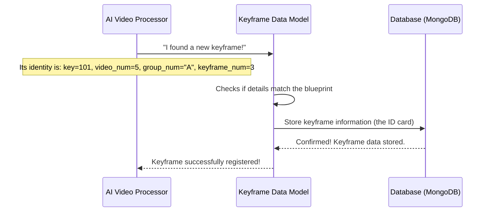

# Chapter 1: Keyframe Data Model

Welcome to the `Image-Retrieval-System-for-AIC2025` project! In this first chapter, we're going to explore the fundamental building block of our system: the **Keyframe Data Model**. Don't worry if these terms sound complex; we'll break everything down into easy-to-understand pieces.

### What Problem Are We Trying to Solve?

Imagine you have a huge collection of videos, like a vast library of movies, security footage, or educational clips. Inside each video are thousands, maybe even millions, of individual images called "frames." If you want to find specific moments, events, or highlights in these videos, searching through every single frame would be incredibly slow and inefficient, like reading every word in every book to find a specific phrase!

This is where **keyframes** come in! A keyframe is like a special, important snapshot that captures the essence or a significant moment of a video segment. Instead of looking at every single frame, we can just look at these special keyframes to quickly understand what's happening in a video. It's like looking at the highlighted sentences in a book to get the main idea.

But how do we *talk about* these keyframes in our computer program? How do we store information about them consistently so that every part of our system understands what a keyframe is?

Think of it like this: If you have a library full of books, each book needs an ID, a title, an author, and a genre. This information helps you find and organize the books. Similarly, each keyframe needs its own "ID card" to describe what it is and where it comes from. This "ID card" is what we call the **Keyframe Data Model**.

### The Blueprint for a Keyframe

Our Keyframe Data Model is simply a blueprint that defines what essential information *every single keyframe* in our system must have. It ensures that whenever we deal with a keyframe, whether we're storing it in a database, searching for it, or displaying it to a user, we all understand its identity in the same, consistent way.

What essential information does our keyframe "ID card" need?

1.  **`key`**: This is the **unique identification number** for *this specific keyframe*. Just like every person has a unique ID, every keyframe needs one so we can distinguish it from all others.
2.  **`video_num`**: This tells us *which video* the keyframe belongs to. A keyframe makes no sense without its original video!
3.  **`group_num`**: Sometimes, videos are organized into larger groups (e.g., "Conference 2024 Videos", "Nature Documentaries"). This number (or name) helps us understand which larger collection of videos the keyframe's video belongs to.
4.  **`keyframe_num`**: Within its particular video, this number tells us the *specific order or position* of this keyframe. For example, it might be the 5th keyframe extracted from `video_num 10`.

These four pieces of information form the core identity of any keyframe in our system.

### How Our System "Thinks" About Keyframes

Let's imagine our system's "brain" (an AI Video Processor) finds a new important moment in a video and identifies it as a keyframe. Here's a simplified look at how the Keyframe Data Model helps ensure this new keyframe's information is handled correctly:



In this diagram, the `Keyframe Data Model` acts as the standard template. The `AI Video Processor` creates keyframe data in this exact format, and the `Database` stores it, ensuring everyone uses the same "language" and structure to describe keyframes.

### Looking at the Code: Defining Our Keyframe

Let's see how this "ID card" for a keyframe is actually defined in our project's code. We use a powerful tool called `Beanie` to help us store Python objects (like our keyframes) directly into a database called MongoDB.

First, take a look at the `app/models/keyframe.py` file:

```python
# File: app/models/keyframe.py
from beanie import Document, Indexed
from typing import Annotated

class Keyframe(Document):
    key: Annotated[int, Indexed(unique=True)]
    video_num: Annotated[int, Indexed()]
    group_num: Annotated[str, Indexed()] # Note: group_num is a string here
    keyframe_num: Annotated[int, Indexed()]

    class Settings:
        name = "keyframes"
```

Let's break this down line by line:

*   **`class Keyframe(Document):`**: This line tells `Beanie` that our `Keyframe` class represents a piece of data that we want to save permanently in our database. `Document` is a special building block from `Beanie` that handles all the complex database interactions for us.
*   **`key: Annotated[int, Indexed(unique=True)]`**: This defines our `key` attribute.
    *   `int`: It means `key` must be an integer (a whole number like 1, 2, 3).
    *   `Indexed(unique=True)`: This is very important! It tells the database that `key` should be "indexed." Think of an index in a book – it helps you find information very, very fast. `unique=True` means that *each key must be completely unique*; no two keyframes can ever have the same `key`.
*   **`video_num: Annotated[int, Indexed()]`**: This defines `video_num`. It's an integer and is also `Indexed()` for quick searching. Unlike `key`, `video_num` doesn't need to be unique (many keyframes can come from the same video).
*   **`group_num: Annotated[str, Indexed()]`**: This defines `group_num`. It's a string (text, like "GroupA" or "SummerVideos") and is also `Indexed()` for quick searching.
*   **`keyframe_num: Annotated[int, Indexed()]`**: This defines `keyframe_num`. It's an integer and is `Indexed()` for fast lookups.
*   **`class Settings: name = "keyframes"`**: This little piece of code tells `Beanie` that when we save our `Keyframe` objects, they should be stored in a special storage area (like a folder) in our MongoDB database called `"keyframes"`.

So, this `Keyframe` class is the actual template for how a keyframe's data will look when it's stored permanently in our database.

### How We Communicate Keyframe Information

Besides storing keyframes, we also need to send and receive keyframe information between different parts of our application, or even to other applications (like a web browser displaying results). For this, we use `Pydantic`, a brilliant library that helps us define exactly how data should look and ensures that any data we receive or send matches that strict structure.

Let's look at `app/schema/interface.py`:

```python
# File: app/schema/interface.py
from pydantic import BaseModel, Field

class KeyframeInterface(BaseModel):
    key: int = Field(..., description="Keyframe key")
    video_num: int = Field(..., description="Video ID")
    group_num: str = Field(..., description="Group ID")
    keyframe_num: int = Field(..., description="Keyframe number")
```

And a small part of `app/schema/response.py`:

```python
# File: app/schema/response.py
from pydantic import BaseModel, Field
from typing import Optional

class KeyframeServiceReponse(BaseModel):
    key: int = Field(..., description="Keyframe key")
    video_num: int = Field(..., description="Video ID")
    group_num: str = Field(..., description="Group ID")
    keyframe_num: int = Field(..., description="Keyframe number")
    confidence_score: float = Field(..., description="Confidence score")
    ocr_text: str = Field(default="", description="OCR text content")
```

What's happening in these files?

*   **`class KeyframeInterface(BaseModel):`**: This defines a "standard message format" for a keyframe. When one part of our application needs to *send* basic keyframe data, or *receive* keyframe data, it should follow this `KeyframeInterface` structure.
    *   `key: int = Field(..., description="Keyframe key")`: Similar to our `Keyframe` database model, but `Field(...)` allows us to add a helpful description for what this field is, which is great for documentation and other developers.
*   **`class KeyframeServiceReponse(BaseModel):`**: This is another "standard message format," specifically for when our service *responds* with keyframe information after processing a request. Notice it's very similar to `KeyframeInterface` but includes extra fields that might be calculated or retrieved during processing:
    *   `confidence_score: float = Field(..., description="Confidence score")`: This might be a score indicating how confident our system is that this is a "good" keyframe, or perhaps its relevance to a search query.
    *   `ocr_text: str = Field(default="", description="OCR text content")`: If we've processed the keyframe image to extract text (using Optical Character Recognition), that text would be included here.

These `Pydantic` models ensure that data is always structured correctly, preventing many common programming errors and making our system more robust. It's like having a strict grammar for how we talk about keyframes, making sure everyone understands each other perfectly.

### Conclusion

In this chapter, we've laid the groundwork for understanding how our project handles keyframes. We learned that the **Keyframe Data Model** is essentially a standardized "ID card" or blueprint for each keyframe, defining its crucial attributes: `key`, `video_num`, `group_num`, and `keyframe_num`.

We explored how this model is used for:

*   **Database Storage**: Using `Beanie` and the `Keyframe` class to define how keyframe data is permanently saved in a MongoDB database.
*   **Data Exchange**: Using `Pydantic` and `KeyframeInterface`/`KeyframeServiceReponse` to ensure consistent and error-free communication of keyframe information throughout our application.

This consistent understanding of a keyframe's identity is vital for everything else we build. Now that we know what a keyframe is and how its data is structured, how do we build the application that can actually process, store, and query these keyframes? That's what we'll begin to explore in the next chapter, where we dive into how our application's configuration and settings are managed.

[Next Chapter: Configuration & Settings](02_configuration___settings_.md)

