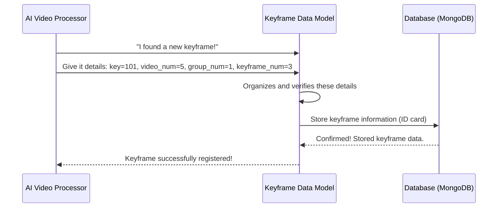

# Chapter 1: Keyframe Data Model

Welcome to the `HCMAI2025_Baseline` project! In this first chapter, we're going to explore the fundamental building block of our system: the **Keyframe Data Model**. Don't worry if these terms sound complex; we'll break everything down into easy-to-understand pieces.

### What Problem Are We Trying to Solve?

Imagine you have a huge collection of videos. Inside each video are thousands, maybe even millions, of individual images called "frames." If you want to find specific moments or highlights in these videos, searching through every single frame would be incredibly slow and inefficient.

This is where **keyframes** come in! A keyframe is like a special snapshot that captures the essence or an important moment of a video segment. Instead of looking at every frame, we can just look at the keyframes to quickly understand what's happening.

But how do we *talk about* these keyframes in our program? How do we store information about them consistently?

Think of it like this: If you have a library full of books, each book needs an ID, a title, an author, and a genre. This information helps you find and organize the books. Similarly, each keyframe needs its own "ID card" to describe what it is and where it comes from. This "ID card" is what we call the **Keyframe Data Model**.

### The Blueprint for a Keyframe

Our Keyframe Data Model is simply a blueprint that defines what information *every single keyframe* in our system must have. It ensures that whenever we deal with a keyframe, whether we're storing it, searching for it, or displaying it, we all understand its identity in the same way.

What essential information does our keyframe "ID card" need?

1.  **`key`**: This is the unique identification number for *this specific keyframe*. Just like every person has a unique ID, every keyframe needs one.
2.  **`video_num`**: This tells us *which video* the keyframe belongs to. A keyframe makes no sense without its original video!
3.  **`group_num`**: Sometimes, videos are organized into larger groups. This number helps us understand which group of videos the keyframe's video belongs to.
4.  **`keyframe_num`**: Within its video, this number tells us the *specific order or position* of this keyframe. For example, it might be the 5th keyframe in `video_num 10`.

These four pieces of information form the core identity of any keyframe in our system.

### How Our System "Thinks" About Keyframes

Let's imagine our system finds a new important moment in a video and identifies it as a keyframe. Here's a simplified look at how the Keyframe Data Model helps:



In this diagram, the `Keyframe Data Model` acts as the standard format. The `AI Video Processor` creates keyframe data in this format, and the `Database` stores it, ensuring everyone uses the same "language" to describe keyframes.

### Looking at the Code: Defining Our Keyframe

Let's see how this "ID card" for a keyframe is defined in our project's code. We use a powerful tool called `Beanie` to help us store Python objects directly into a database called MongoDB.

First, take a look at `app/models/keyframe.py`:

```python
# File: app/models/keyframe.py
from beanie import Document, Indexed
from typing import Annotated # Helps add extra info to types

class Keyframe(Document):
    key: Annotated[int, Indexed(unique=True)]
    video_num: Annotated[int, Indexed()]
    group_num: Annotated[int, Indexed()]
    keyframe_num: Annotated[int, Indexed()]

    class Settings:
        name = "keyframes"
```

Let's break this down:

*   **`class Keyframe(Document):`**: This line tells `Beanie` that our `Keyframe` class represents a piece of data that we want to save in our database. `Document` is a special class from `Beanie` that handles this for us.
*   **`key: Annotated[int, Indexed(unique=True)]`**: This defines our `key` attribute.
    *   `int`: It's an integer (a whole number).
    *   `Indexed(unique=True)`: This is important! It tells the database that `key` should be "indexed" (meaning the database can find it very, very fast, like a book's index) and that *each key must be unique*. No two keyframes can have the same `key`.
*   **`video_num`, `group_num`, `keyframe_num`**: These are also integers and are `Indexed()`. This means they are also set up for quick searching, but they don't have to be unique (many keyframes can come from `video_num 5`).
*   **`class Settings: name = "keyframes"`**: This little piece of code tells `Beanie` that when we save our `Keyframe` objects, they should be stored in a collection (which is like a table in a traditional database) called "keyframes" in our MongoDB database.

So, this `Keyframe` class is the actual template for how a keyframe's data will look when it's stored permanently.

### How We Communicate Keyframe Information

Besides storing keyframes, we also need to send and receive keyframe information between different parts of our application, or even to other applications. For this, we use `Pydantic`, a library that helps us define how data should look and ensures that any data we get or send matches that structure.

Let's look at `app/schema/interface.py`:

```python
# File: app/schema/interface.py
from pydantic import BaseModel, Field

class KeyframeInterface(BaseModel):
    key: int = Field(..., description="Keyframe key")
    video_num: int = Field(..., description="Video ID")
    group_num: int = Field(..., description="Group ID")
    keyframe_num: int = Field(..., description="Keyframe number")

# ... other classes in this file ...
```

And a small part of `app/schema/response.py`:

```python
# File: app/schema/response.py
from pydantic import BaseModel, Field

class KeyframeServiceReponse(BaseModel):
    key: int = Field(..., description="Keyframe key")
    video_num: int = Field(..., description="Video ID")
    group_num: int = Field(..., description="Group ID")
    keyframe_num: int = Field(..., description="Keyframe number")
    confidence_score: float = Field(..., description="Keyframe number")

# ... other classes in this file ...
```

What's happening here?

*   **`class KeyframeInterface(BaseModel):`**: This defines a "standard message format" for a keyframe. When one part of our application asks for keyframe data, or gives keyframe data, it should follow this `KeyframeInterface` structure.
    *   `key: int = Field(..., description="Keyframe key")`: Similar to our `Keyframe` model, but `Field(...)` adds a helpful description for what this field is, which is great for documentation and other developers.
*   **`class KeyframeServiceReponse(BaseModel):`**: This is another "standard message format," specifically for when our service *responds* with keyframe information. Notice it's very similar to `KeyframeInterface` but includes an extra field:
    *   `confidence_score: float = Field(..., description="Keyframe number")`: This might be a score indicating how confident our system is that this is a "good" keyframe, or perhaps its relevance to a search query. This shows that while the core identity (`key`, `video_num`, etc.) remains constant, how we *present* or *augment* keyframe data can change based on the context.

These `Pydantic` models ensure that data is always structured correctly, preventing many common programming errors and making our system more robust. It's like having a strict grammar for how we talk about keyframes.

### Conclusion

In this chapter, we've laid the groundwork for understanding how our project handles keyframes. We learned that the **Keyframe Data Model** is essentially a standardized "ID card" or blueprint for each keyframe, defining its crucial attributes: `key`, `video_num`, `group_num`, and `keyframe_num`.

We explored how this model is used for:
*   **Database Storage**: Using `Beanie` and the `Keyframe` class to define how keyframe data is permanently saved.
*   **Data Exchange**: Using `Pydantic` and `KeyframeInterface`/`KeyframeServiceReponse` to ensure consistent communication of keyframe information throughout our application.

This consistent understanding of a keyframe's identity is vital for everything else we build. Now that we know what a keyframe is, how do we build the application that can actually process, store, and query these keyframes? That's what we'll explore in the next chapter, where we dive into the core of our application!

[Next Chapter: FastAPI Application Core](02_fastapi_application_core_.md)
