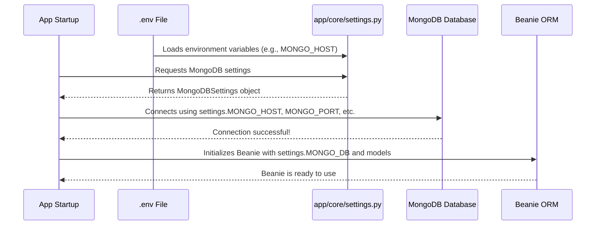

# Chapter 2: Configuration & Settings

Welcome back! In [Chapter 1: Keyframe Data Model](01_keyframe_data_model_.md), we learned about the essential "ID card" for every keyframe, defining its core identity. We saw how this data model ensures consistency when storing keyframes in a database and exchanging their information throughout our system.

But here's a thought: How does our application know *which* database to connect to? Or *what kind* of AI model to use when processing keyframes? And where are the actual keyframe images stored on the server? Just like you wouldn't expect a car to know its destination without a driver entering it, our application needs instructions!

This is where **Configuration & Settings** come in.

### What Problem Are We Trying to Solve?

Imagine our entire `Image-Retrieval-System` is like a sophisticated kitchen. To make a delicious meal, you need:
*   **Ingredients**: Specific types of coffee beans (our AI models for understanding text or images).
*   **Equipment**: A coffee machine (our system's various services).
*   **A Recipe**: The steps to make coffee (our application logic).
*   **Location**: Where to find the water supply, where to store the milk (our database location, image storage paths, etc.).

Now, what if you want to set up this kitchen in a *different* house? The water connection might be in a different spot, you might prefer a different brand of coffee, or you might store your milk in a new fridge. You wouldn't want to rebuild the entire kitchen from scratch every time you move!

This is exactly the problem **Configuration & Settings** solve for our application. Our application needs to know crucial details like:
*   **Database Connection**: What's the address of our MongoDB database (host, port)? What username and password should we use?
*   **AI Model Names**: Which specific AI models should our system use for tasks like understanding text or analyzing images?
*   **Data Paths**: Where are the actual keyframe image files stored on the server? What's the web address (URL) our API will use to serve these images?
*   **Vector Database (Milvus) Details**: If we use a specialized database for searching (like Milvus), where is it and how do we connect?

If we "hardcode" these details directly into our Python files, changing even one small thing (like a database password or a different AI model) would require us to edit the code and redeploy the entire application. That's inefficient, prone to errors, and risky!

**Configuration & Settings** provide a centralized "instruction manual" for our application. It's like having a control panel where you can easily input new settings for your kitchen, allowing the application to adapt to different environments (e.g., your local development machine vs. a powerful production server) without changing its core code.

### Key Concepts for Our Configuration

Our project uses a smart combination of tools to handle configuration:

1.  **Environment Variables**: These are dynamic values set *outside* of our application's code, usually by your operating system or the system running our application (like a Docker container). Think of them as sticky notes attached to our application's container, giving it important instructions. They are often `KEY=VALUE` pairs.

2.  **`.env` Files**: For local development, it can be cumbersome to set many environment variables manually. A `.env` file is a simple text file (`.env`) where we list these `KEY=VALUE` pairs. Our application can then read this file to load these variables, making them available as if they were set directly in the environment. This is super handy for local testing!

3.  **Pydantic Settings**: We use a fantastic library called `Pydantic` (which you briefly met in [Chapter 1: Keyframe Data Model](01_keyframe_data_model_.md)) to elegantly read these environment variables. `Pydantic` helps us define the *structure* and *type* of our settings, making sure we get valid values (e.g., a database port should be a number, not text). It also allows us to set default values or mark settings as required.

4.  **Centralized `config.py`**: For simpler, individual settings that don't need complex validation or grouping, we also use a straightforward `config.py` file. This file directly reads environment variables using Python's built-in `os` module.

Let's start by looking at an example `.env` file, as this is where many of our settings will begin their journey:

```
# File: .env (Example)
# Database Connection Details for MongoDB
MONGO_HOST=localhost
MONGO_PORT=27017
MONGO_DB=aic_db
MONGO_USER=dev_user
MONGO_PASSWORD=secure_password

# Paths and URLs for our application
DATA_FOLDER=/data/images/keyframes
API_BASE_URL=http://localhost:8000

# AI Model Settings
MODEL_NAME=hf-hub:sentence-transformers/all-MiniLM-L6-v2

# Milvus (Vector Database) Settings
MILVUS_HOST=localhost
MILVUS_PORT=19530

# Elasticsearch Settings (for text search)
ES_HOST=localhost
ES_PORT=9200
ES_USER=elastic
ELASTIC_PASSWORD=elastic_pass
ES_OCR_INDEX=ocr_index
ES_ASR_INDEX=asr_index
```
As you can see, this file is just a list of `NAME=VALUE` pairs. Our application will read these values from here.

### How Our Project Handles Settings

Our project organizes its settings mainly in two places: `app/core/settings.py` for structured, validated settings using Pydantic, and `app/config.py` for simpler, direct environment variable access.

#### 1. Structured Settings with Pydantic (`app/core/settings.py`)

This file is where we define clear blueprints for groups of settings. This is ideal for complex settings like database credentials, where you want to ensure all pieces (host, port, user, password) are present and of the correct type.

Here's a simplified look at how `app/core/settings.py` works:

```python
# File: app/core/settings.py (simplified)
from pydantic_settings import BaseSettings
from pydantic import Field
from dotenv import load_dotenv
from pathlib import Path

# IMPORTANT: This line loads variables from your .env file!
load_dotenv()

# We often define a base directory for resolving paths
BASE_DIR = Path(__file__).resolve().parent.parent.parent

class MongoDBSettings(BaseSettings):
    """Blueprint for MongoDB connection settings."""
    MONGO_HOST: str = Field(..., alias='MONGO_HOST')
    MONGO_PORT: int = Field(..., alias='MONGO_PORT')
    MONGO_DB: str = Field(..., alias='MONGO_DB')
    MONGO_USER: str = Field(..., alias='MONGO_USER')
    MONGO_PASSWORD: str = Field(..., alias='MONGO_PASSWORD')

class AppSettings(BaseSettings):
    """Blueprint for general application settings."""
    DATA_FOLDER: str = str(BASE_DIR / "images") # Default value if not found
    MODEL_NAME: str = "default-model-name"
    # ... other app-specific settings ...
```

Let's break down the key parts:

*   **`load_dotenv()`**: This is the magic! When Python runs this file, `load_dotenv()` looks for a `.env` file in the current directory (or parent directories) and loads any `KEY=VALUE` pairs it finds into the program's **environment variables**. This means `MONGO_HOST` from your `.env` is now available to your Python code.
*   **`class MongoDBSettings(BaseSettings):`**: This defines a blueprint for all MongoDB-related settings. `BaseSettings` is a special class from Pydantic that automatically knows how to read environment variables that match its field names.
*   **`MONGO_HOST: str = Field(..., alias='MONGO_HOST')`**: This defines one specific setting:
    *   `MONGO_HOST: str`: It says we expect a setting named `MONGO_HOST`, and it *must* be a string (text).
    *   `Field(..., alias='MONGO_HOST')`: This tells Pydantic to look for an environment variable called `MONGO_HOST`. The `...` (called an "ellipsis") means this field is *required*; our application won't start if this setting isn't found.
*   **`class AppSettings(BaseSettings):`**: Similarly, this defines general application settings.
    *   `DATA_FOLDER: str = str(BASE_DIR / "images")`: Here, if an environment variable `DATA_FOLDER` is *not* found, it will use the default value `BASE_DIR / "images"`. This makes our application more robust, as it can still run even if some non-critical settings are missing.

When our application starts up, it will create instances (copies) of these setting classes. These instances automatically pull values from the environment (which might have been loaded from your `.env` file):

```python
# How settings are used (conceptually)
from app.core.settings import MongoDBSettings, AppSettings

# When this code runs, Pydantic automatically reads from environment variables
mongo_settings = MongoDBSettings()
app_settings = AppSettings()

print(f"MongoDB Host: {mongo_settings.MONGO_HOST}")
print(f"App Data Folder: {app_settings.DATA_FOLDER}")

# Example Output (if .env is used as above):
# MongoDB Host: localhost
# App Data Folder: /data/images/keyframes
```
This is a powerful way to manage complex, type-safe settings, especially for sensitive data like database credentials.

#### 2. Simple Configuration (`app/config.py`)

For simpler, individual values that don't need the full power of Pydantic validation or don't group neatly into classes, we use `app/config.py`. This file directly uses Python's `os.getenv` function to fetch environment variables.

Here's a look at `app/config.py`:

```python
# File: app/config.py (simplified)
import os
from pathlib import Path

# Environment-based configuration
DATA_FOLDER = os.getenv("DATA_FOLDER", "./images")
API_BASE_URL = os.getenv("API_BASE_URL", "http://localhost:8000")
IMAGES_MOUNT_PATH = "/images" # This is a fixed internal path

# Convert DATA_FOLDER to a Path object for easier file operations
DATA_FOLDER_PATH = Path(DATA_FOLDER).resolve()
```

*   **`import os`**: This is a standard Python module that allows us to interact with the operating system, including getting environment variables.
*   **`DATA_FOLDER = os.getenv("DATA_FOLDER", "./images")`**:
    *   `os.getenv("DATA_FOLDER")`: This tries to get the value of the environment variable named `DATA_FOLDER`.
    *   `"./images"`: This is a **default value**. If `DATA_FOLDER` is *not* found in the environment, it will use `"./images"` instead. This makes sure our application always has a value to work with.
*   **`API_BASE_URL = os.getenv("API_BASE_URL", "http://localhost:8000")`**: Similar to `DATA_FOLDER`, this gets our application's base URL for API endpoints, using a default if none is set.
*   **`DATA_FOLDER_PATH = Path(DATA_FOLDER).resolve()`**: This converts the `DATA_FOLDER` string into a `Path` object. `Path` objects are very useful for working with file system paths in Python, making operations like joining paths much cleaner. `.resolve()` converts it into an absolute path.

These variables from `app/config.py` are then directly imported and used by various parts of our application.

### How Configuration Powers Our Application

Let's see where these settings become critical in our application's lifecycle.

#### 1. Application Startup and Database Connection

When our application first starts up, one of the most important things it does is connect to our databases. This process heavily relies on the settings we just discussed.



To illustrate this with a simplified code snippet, imagine a part of our application's startup logic (which we'll explore in detail in [Chapter 7: FastAPI Application Core](07_fastapi_application_core_.md)):

```python
# File: app/core/lifespan.py (simplified conceptual code)
# This file handles application startup/shutdown tasks.
from motor.motor_asyncio import AsyncIOMotorClient
from beanie import init_beanie
from app.core.settings import MongoDBSettings # Our MongoDB settings blueprint
from app.models.keyframe import Keyframe # Our Keyframe data model

# A variable to hold our database connection
mongo_client: AsyncIOMotorClient | None = None

async def connect_to_mongodb():
    global mongo_client
    
    # 1. Load MongoDB settings from environment (or .env file)
    mongo_settings = MongoDBSettings() 
    
    # 2. Use these settings to connect to the database
    mongo_client = AsyncIOMotorClient(
        host=mongo_settings.MONGO_HOST,
        port=mongo_settings.MONGO_PORT,
        username=mongo_settings.MONGO_USER,
        password=mongo_settings.MONGO_PASSWORD
    )
    # Test the connection
    await mongo_client.admin.command('ping')
    print("Successfully connected to MongoDB!")
    
    # 3. Initialize Beanie (our ORM) with the database name from settings
    database = mongo_client[mongo_settings.MONGO_DB]
    await init_beanie(
        database=database,
        document_models=[Keyframe] # Tell Beanie about our Keyframe model
    )
    print("Beanie initialized successfully!")

# Later, our FastAPI app would call connect_to_mongodb() when it starts.
```
Here, `mongo_settings = MongoDBSettings()` is created, and its attributes (like `mongo_settings.MONGO_HOST`) are directly used to establish the database connection and initialize `Beanie`. This means you can change your database server or credentials just by updating your `.env` file (or environment variables) without touching this code!

#### 2. Services Using Settings (e.g., Query Controller)

Many other parts of our application will need access to settings. For example, a component that handles search queries (which we'll cover in [Chapter 6: Query Controller](06_query_controller_.md)) needs to know where to find images and the base URL to construct clickable image links. It gets this information from our configuration.

Let's look at a simplified example of how this could work:

```python
# File: app/controller/query_controller.py (simplified conceptual code)
from pathlib import Path
# We import our data folder path and base URL directly from config.py
from app.config import DATA_FOLDER_PATH, API_BASE_URL 

class QueryController:
    
    def __init__(self):
        # We assign the values imported from config.py to our controller
        self.data_folder = DATA_FOLDER_PATH
        self.base_url = API_BASE_URL
        # ... other setup ...

    def get_image_url(self, relative_path: str) -> str:
        """
        Converts a relative file path (like 'L01/V005/keyframe_001.jpg') 
        into a full HTTP URL (like 'http://localhost:8000/images/L01/V005/keyframe_001.jpg').
        """
        normalized_path = relative_path.replace('\\', '/')
        # Use self.base_url which came from our settings!
        return f"{self.base_url}/images/{normalized_path}"

    # ... other methods to perform searches ...
```
As you can see, `DATA_FOLDER_PATH` and `API_BASE_URL` are imported directly from `app/config.py`. The `QueryController` then uses `self.base_url` in its `get_image_url` method to create the full, clickable links for keyframe images. If `API_BASE_URL` changes in your `.env` file, the `QueryController` will automatically use the new URL without any code changes!

### Conclusion

In this chapter, we've explored the crucial role of **Configuration & Settings** in making our `Image-Retrieval-System-for-AIC2025` project flexible, secure, and easy to manage. We learned that:

*   Configuration provides the "instruction manual" for our application, allowing us to customize parameters like database connections, model names, and data paths without altering the core code.
*   We use **`.env` files** to store these settings locally and **environment variables** in production environments.
*   **Pydantic Settings** (`app/core/settings.py`) give us a structured, type-safe way to read and validate groups of settings, ensuring our application gets correct values.
*   A simpler **`app/config.py`** provides direct access to individual environment variables for common parameters with sensible default values.
*   These settings are used extensively during application startup (to connect to databases and initialize services) and by various components (like a future Query Controller) to construct URLs and manage resources.

This robust configuration system ensures our application can adapt to different environments and requirements with ease. Now that our application knows what a keyframe is ([Chapter 1: Keyframe Data Model](01_keyframe_data_model_.md)) and how to get its "instructions" for operation, the next step is to understand how our application talks to the database to actually store and retrieve keyframes. This brings us to the **Data Access Layer (Repositories)**!

[Next Chapter: Data Access Layer (Repositories)](03_data_access_layer__repositories__.md)
