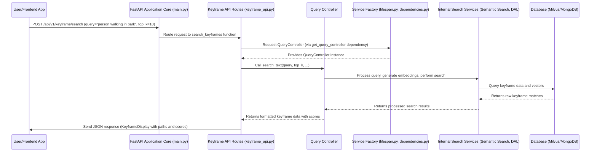

# Chapter 2: FastAPI Application Core

Welcome back! In [Chapter 1: Keyframe Data Model](01_keyframe_data_model_.md), we learned about the fundamental "ID card" for our keyframes, defining what information each keyframe holds. We now have a clear way to *describe* a keyframe. But how do we actually *do anything* with these keyframes? How do we allow a user, or another part of our system, to search for them?

This is where the **FastAPI Application Core** comes in! Think of it as the main control center, or the brain, of our entire web service. It's the part that listens for requests (like a user asking "find me keyframes of a person walking in the park"), processes them, and sends back the answers.

### What Problem Are We Trying to Solve?

Imagine you've built a fantastic system that understands and stores millions of keyframes. Now, you want to let a website or a mobile app access this amazing search capability. How do you create a "doorway" for them to interact with your system?

This "doorway" is called an **API** (Application Programming Interface), and our FastAPI Application Core is responsible for building and managing it.

It's like this:
*   Your kitchen has all the ingredients (keyframes) and recipes (search logic).
*   A customer (another application or a user) wants a specific dish (search results).
*   FastAPI is the *waiter* and the *menu*. It takes the order, sends it to the kitchen, gets the cooked dish, and brings it back to the customer. It also ensures the kitchen is set up properly before customers arrive.

The FastAPI Application Core is like the city's main traffic controller. It sets up the roads (API endpoints), defines the rules for traffic (handles requests), and directs all vehicles (incoming requests) to their correct destinations (specific search functions), ensuring the whole city runs smoothly.

### Key Concepts of Our Application Core

Let's break down how this "traffic controller" works.

#### 1. What is FastAPI?

FastAPI is a modern, super-fast Python framework designed specifically for building web APIs. It's chosen for its speed, ease of use, and because it automatically generates beautiful interactive documentation for your API – which is incredibly helpful for other developers (and for you!).

#### 2. APIs and Routes (The Menu and the Dishes)

An **API** is simply a set of rules and tools that lets different software applications talk to each other. When you use an app on your phone that shows the weather, it's talking to a weather API somewhere on the internet!

In FastAPI, we define specific "routes" or "endpoints" which are like specific dishes on a restaurant menu. Each route is a unique URL path that performs a particular action.

For example:
*   `/` (the root path) might show general API info.
*   `/health` might check if the service is running.
*   `/api/v1/keyframe/search` (our main use case!) is the specific "dish" for searching keyframes.

#### 3. Requests and Responses (Orders and Served Food)

When a client (like a web browser) wants to interact with our API, it sends a **request**. This request contains information, like "what do you want to search for?" or "what are your search settings?".

Our FastAPI core then processes this request, uses our internal logic (which we'll explore in later chapters), and sends back a **response**. The response contains the answer, like a list of matching keyframes, or an error message if something went wrong.

### Setting Up Our Main Application (app/main.py)

The very heart of our FastAPI application is defined in the `app/main.py` file. This file creates our `FastAPI` application instance and sets up the foundational elements.

Here's a simplified look at the main setup:

```python
# File: app/main.py (simplified)
from fastapi import FastAPI
from fastapi.middleware.cors import CORSMiddleware
from fastapi.staticfiles import StaticFiles # To serve images

# ... (imports and other settings) ...

app = FastAPI(
    title="Keyframe Search API",
    description="""
    ## Keyframe Search API
    A powerful semantic search API for video keyframes...
    """,
    version="1.0.0",
    lifespan=lifespan # Special function for startup/shutdown
)

# Allow other websites to talk to our API (CORS)
app.add_middleware(
    CORSMiddleware,
    allow_origins=["*"], # Allow all origins for simplicity
    allow_methods=["*"],
    allow_headers=["*"],
)

# Include our keyframe specific routes
from router import keyframe_api
app.include_router(keyframe_api.router, prefix="/api/v1")

# Serve actual keyframe images from a folder
app.mount("/images", StaticFiles(directory="path/to/your/images"), name="images")

@app.get("/") # Defines a route for the root URL
async def root():
    return {"message": "Keyframe Search API is running!"}

@app.get("/health") # Defines a route for health check
async def health():
    return {"status": "healthy"}

# ... (other code for running the app) ...
```

Let's break it down:

*   **`app = FastAPI(...)`**: This creates the main FastAPI application. We give it a `title`, `description`, and `version`, which FastAPI automatically uses to build nice documentation pages for us! The `lifespan` parameter is crucial for initializing our database and services, which we'll discuss next.
*   **`app.add_middleware(CORSMiddleware, ...)`**: This is like putting a "welcome mat" at our API's front door. It handles **CORS (Cross-Origin Resource Sharing)**, allowing web browsers from other domains (e.g., your frontend website hosted at a different address) to safely request data from our API.
*   **`app.include_router(keyframe_api.router, prefix="/api/v1")`**: This is how we organize our API. Instead of putting *all* our routes directly in `main.py`, we group related routes (like all keyframe-related ones) into separate files called "routers" (like `keyframe_api.py`). The `prefix="/api/v1"` means all routes defined in `keyframe_api.router` will automatically start with `/api/v1/`. So `/search` becomes `/api/v1/keyframe/search`.
*   **`app.mount("/images", StaticFiles(...), name="images")`**: This tells FastAPI to "mount" or connect a folder on our server (`path/to/your/images`) to a URL path (`/images`). This allows users to directly access keyframe image files via URLs like `http://localhost:8000/images/L06/V013/00015158.webp`.
*   **`@app.get("/")` and `@app.get("/health")`**: These are simple examples of how we define routes. The `@app.get` (or `@app.post`, `@app.put`, etc.) is a "decorator" that tells FastAPI: "when a GET request comes to this URL path, run the function below it."

### Application Startup and Shutdown (app/core/lifespan.py)

Before our application can handle any requests, it needs to get ready. It needs to connect to databases, load models, and prepare services. Similarly, when it shuts down, it should gracefully close connections. This is managed by a special FastAPI feature called "lifespan events".

In our project, the `lifespan` function in `app/core/lifespan.py` takes care of this:

```python
# File: app/core/lifespan.py (simplified)
from contextlib import asynccontextmanager
from fastapi import FastAPI
from motor.motor_asyncio import AsyncIOMotorClient # For async MongoDB
from beanie import init_beanie # For our Keyframe Data Model

# ... (other imports) ...
from models.keyframe import Keyframe # Our Keyframe model from Chapter 1
from factory.factory import ServiceFactory # For managing services

mongo_client: AsyncIOMotorClient = None
service_factory: ServiceFactory = None

@asynccontextmanager
async def lifespan(app: FastAPI):
    """
    FastAPI lifespan context manager for startup and shutdown events
    """
    logger.info("Starting up application...")
    try:
        # 1. Connect to MongoDB
        # ... (connection string setup) ...
        global mongo_client
        mongo_client = AsyncIOMotorClient("your_mongo_connection_string")
        await mongo_client.admin.command('ping')
        logger.info("Successfully connected to MongoDB")
        
        # 2. Initialize Beanie with our Keyframe model
        database = mongo_client["your_database_name"]
        await init_beanie(
            database=database,
            document_models=[Keyframe] # Tell Beanie about our Keyframe data model!
        )
        logger.info("Beanie initialized successfully")
        
        # 3. Initialize the Service Factory (more on this in Chapter 7)
        global service_factory
        service_factory = ServiceFactory(
            # ... (settings for Milvus, models, and MongoDB) ...
            mongo_collection=Keyframe # Pass our Keyframe model here
        )
        logger.info("Service factory initialized successfully")
        
        # Store factory and client in app state for later access
        app.state.service_factory = service_factory
        app.state.mongo_client = mongo_client
        
        logger.info("Application startup completed successfully")
        
    except Exception as e:
        logger.error(f"Failed to start application: {e}")
        raise
    
    yield # Application runs here
    
    logger.info("Shutting down application...")
    try:
        if mongo_client:
            mongo_client.close() # Close MongoDB connection
            logger.info("MongoDB connection closed")
        logger.info("Application shutdown completed successfully")
    except Exception as e:
        logger.error(f"Error during shutdown: {e}")
```

*   **`@asynccontextmanager def lifespan(app: FastAPI):`**: This special function wraps our startup and shutdown logic.
*   **Startup (`try` block before `yield`)**:
    *   It connects to our MongoDB database using `AsyncIOMotorClient`.
    *   It initializes `Beanie` ([Chapter 1: Keyframe Data Model](01_keyframe_data_model_.md)) with our `Keyframe` model, telling it which database and "collection" (like a table) to use for our keyframes.
    *   It creates a `ServiceFactory` ([Chapter 7: Service Factory & Dependency Management](07_service_factory___dependency_management_.md)), which is a smart way to create and manage all the other services our application needs (like the search service).
    *   It stores `service_factory` and `mongo_client` in `app.state` so that other parts of the application can easily access them later.
*   **`yield`**: This is where the actual FastAPI application runs and handles requests.
*   **Shutdown (`try` block after `yield`)**: When the application stops, it ensures that the MongoDB connection is properly closed.

### Defining Our Keyframe Search Routes (app/router/keyframe_api.py)

Now that our core application is set up and initialized, let's look at how we define the actual API routes for searching keyframes. This happens in `app/router/keyframe_api.py`.

```python
# File: app/router/keyframe_api.py (simplified for basic search)
from fastapi import APIRouter, Depends
from schema.request import TextSearchRequest # Input data structure
from schema.response import KeyframeDisplay, SingleKeyframeDisplay # Output data structure
from controller.query_controller import QueryController # To handle search logic
from core.dependencies import get_query_controller # How to get the controller

router = APIRouter(
    prefix="/keyframe",
    tags=["keyframe"],
)

@router.post(
    "/search", # This route will be /api/v1/keyframe/search
    response_model=KeyframeDisplay, # What kind of data we return
    summary="Simple text search for keyframes"
)
async def search_keyframes(
    request: TextSearchRequest, # The input data (query, top_k, threshold)
    controller: QueryController = Depends(get_query_controller) # Get our Query Controller
):
    """Search for keyframes using text query with semantic similarity."""
    logger.info(f"Text search request: query='{request.query}'")
    
    # Use the controller to perform the actual search
    results = await controller.search_text(
        query=request.query,
        top_k=request.top_k,
        score_threshold=request.score_threshold
    )
    
    # Format results for display
    display_results = []
    for result in results:
        display_data = controller.convert_to_display_result(result)
        display_results.append(SingleKeyframeDisplay(
            path=display_data["path"],
            score=display_data["score"]
        ))
    
    return KeyframeDisplay(results=display_results)

# ... (other search routes) ...
```

*   **`router = APIRouter(...)`**: This creates a mini-FastAPI application, just for keyframe-related routes. `prefix="/keyframe"` means all routes in this router will start with `/keyframe` (which, combined with `main.py`'s `/api/v1` prefix, becomes `/api/v1/keyframe/...`).
*   **`@router.post("/search", ...)`**: This defines our specific search endpoint.
    *   `@router.post` means it expects a `POST` request (often used for sending data to the server).
    *   `"/search"` is the path (making the full path `/api/v1/keyframe/search`).
    *   `response_model=KeyframeDisplay` tells FastAPI what the *output* data will look like. FastAPI uses this to automatically validate our responses and generate API documentation.
*   **`async def search_keyframes(...)`**: This is the function that runs when a request hits this endpoint.
    *   `request: TextSearchRequest`: This tells FastAPI that the incoming request body should match the structure defined by our `TextSearchRequest` model (a [Pydantic](https://pydantic-docs.helpmanual.io/) model, similar to those in [Chapter 1: Keyframe Data Model](01_keyframe_data_model_.md)). FastAPI automatically validates the incoming data against this model!
    *   `controller: QueryController = Depends(get_query_controller)`: This is FastAPI's powerful **dependency injection**. It means: "Before running this function, please get me an instance of the `QueryController`. You can get it by calling the `get_query_controller` function." This is super important for keeping our code organized and testable. We'll dive deeper into the `QueryController` in the next chapter.
*   **`results = await controller.search_text(...)`**: Here, our FastAPI route hands over the actual search logic to the `controller`. This keeps our API code clean and focused on *receiving* and *sending* requests, not on the complex search implementation.
*   **Formatting Results**: The code then takes the raw results from the `controller` and formats them into `SingleKeyframeDisplay` objects, which are then collected into a `KeyframeDisplay` object before being returned. These `KeyframeDisplay` and `SingleKeyframeDisplay` are the structures defined in `app/schema/response.py` to ensure consistent output.

### How a Search Request Flows Through Our Application

Let's trace what happens when a user or another application sends a request to `/api/v1/keyframe/search` with a query like "person walking in park".



1.  **Client Request**: A user (or a frontend application) sends a `POST` request to our server at `/api/v1/keyframe/search`. This request includes the search text and other parameters.
2.  **FastAPI Core Receives**: The `FastAPI_Core` (from `main.py`) receives this request.
3.  **Route Matching**: It looks at the URL path (`/api/v1/keyframe/search`) and figures out that it needs to send this request to the `search_keyframes` function within the `Keyframe_Router`.
4.  **Dependency Injection**: Before `search_keyframes` can run, FastAPI sees that it `Depends(get_query_controller)`. It then calls `get_query_controller` (which uses the `Service_Factory`) to get a ready-to-use `QueryController`.
5.  **Controller Takes Over**: The `search_keyframes` function then calls a method on the `Query_Controller` (e.g., `controller.search_text`) and passes along the user's query and other settings.
6.  **Internal Search Logic**: The `Query_Controller` (which we'll explore in detail next!) handles the actual intelligence. It uses `Internal_Services` (like a semantic search service and data access layer) to convert the text query into a "vector" (a mathematical representation) and then searches the `Database` (which stores our [Keyframe Data Model](01_keyframe_data_model_.md) and their vectors).
7.  **Results Return**: The `Database` sends back matching keyframes. The `Internal_Services` and `Query_Controller` process and format these results.
8.  **FastAPI Responds**: Finally, the `Keyframe_Router` receives the beautifully formatted keyframe results and sends them back to the `Client` as a JSON response.

### Conclusion

In this chapter, we've brought our `HCMAI2025_Baseline` project to life by introducing the **FastAPI Application Core**. We've seen how it acts as the "traffic controller" for our web service, handling incoming requests and sending out responses.

We explored:
*   The role of `app/main.py` in setting up the core FastAPI application, handling CORS, and mounting our keyframe image directory.
*   The importance of `app/core/lifespan.py` for managing application startup (connecting to MongoDB, initializing Beanie with our [Keyframe Data Model](01_keyframe_data_model_.md), and setting up the Service Factory).
*   How `app/router/keyframe_api.py` defines specific API routes like `/api/v1/keyframe/search` and uses FastAPI's dependency injection to get necessary services.
*   The overall flow of a search request from a client, through FastAPI, and to our internal logic before returning a response.

Now that we understand how requests are received and directed, the next logical step is to dive into the "brain" that actually processes these search requests: the [Query Controller](03_query_controller_.md)!

[Next Chapter: Query Controller](03_query_controller_.md)
