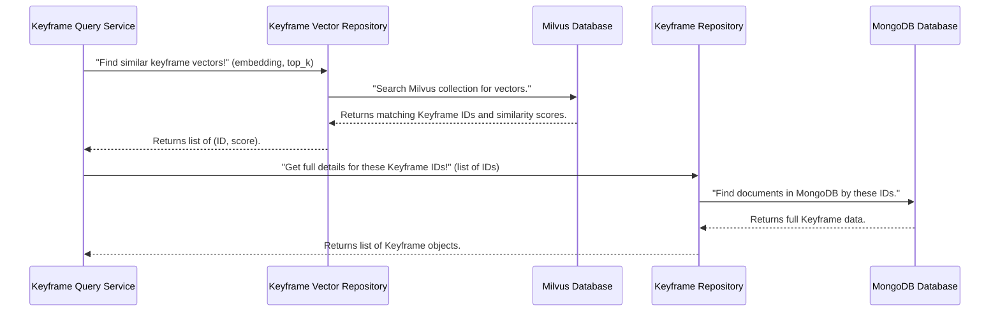

# Chapter 3: Data Access Layer (Repositories)

Welcome back! In [Chapter 1: Keyframe Data Model](01_keyframe_data_model_.md), we established the "ID card" for our keyframes, defining their essential structure. Then, in [Chapter 2: Configuration & Settings](02_configuration___settings_.md), we learned how our application gets its "instructions" for things like connecting to databases.

Now, imagine our application needs to actually *use* those instructions to talk to a database. How does it fetch a keyframe's details? Or store a new keyframe? How does it search for keyframes that look similar to each other?

This is where the **Data Access Layer (Repositories)** comes in!

### What Problem Are We Trying to Solve?

Imagine our `Image-Retrieval-System` is a bustling library with different types of archives:

*   **MongoDB Archive**: Stores all the basic "ID card" details about our keyframes (like `key`, `video_num`, `group_num`).
*   **Milvus Archive**: Stores the "visual descriptions" (called **vector embeddings**) of keyframes, which help us find similar images.
*   **Elasticsearch Archive**: Stores any text extracted from keyframes (like text from OCR or spoken words from ASR).

Now, let's say a central part of our application (a "Search Expert") wants to find keyframes. It needs information from *all* these different archives!

If our Search Expert had to directly learn the complex rules and "languages" for talking to each database (MongoDB, Milvus, Elasticsearch), its job would be extremely difficult. Its code would become long, messy, and hard to manage. What if we wanted to switch from Milvus to a different vector database? We'd have to rewrite all the Search Expert's code!

This is where the **Data Access Layer (DAL)**, specifically **Repositories**, steps in to simplify everything.

Think of Repositories as **specialized librarians**. Instead of the Search Expert directly interacting with the different archives, it simply talks to these librarians:

*   **`KeyframeRepository` (MongoDB Librarian)**: Knows exactly how to get, save, or update a keyframe's basic metadata in the MongoDB Archive.
*   **`KeyframeVectorRepository` (Milvus Librarian)**: Knows exactly how to search for similar keyframe vectors or fetch a keyframe's vector from the Milvus Archive.
*   **`OcrRepository` (OCR Text Librarian)**: Knows how to store and search for text extracted from keyframe images in the Elasticsearch Archive.
*   **`AsrRepository` (ASR Text Librarian)**: Knows how to store and search for text transcribed from audio in the Elasticsearch Archive.

The Search Expert doesn't care *how* these librarians do their job; it just tells them *what* information it needs. This makes our application much cleaner, easier to understand, and more flexible!

### Key Concepts

Our Data Access Layer is built around these core ideas:

1.  **Data Access Layer (DAL)**: This is the general term for the part of our application that handles *all* communication with our databases. It's the "bridge" between our application's logic and where our data is permanently stored.
2.  **Repositories**: These are specific classes within the DAL. Each repository manages data for a particular type of information (like `Keyframe` metadata or `Keyframe` vectors) and usually interacts with a specific database technology.
3.  **Databases**:
    *   **MongoDB**: Stores structured metadata for keyframes.
    *   **Milvus**: Stores high-dimensional vector embeddings for semantic search.
    *   **Elasticsearch**: Stores and searches text content (like OCR and ASR).

### How Repositories are Used (The Client's View)

Let's look at how a service that performs searches (like our future `Semantic Search Services` in [Chapter 4: Semantic Search Services](04_semantic_search_services_.md)) would use these repositories. It's simple: the service asks the right librarian for the information it needs.

Imagine our `KeyframeQueryService` needs to perform a semantic search. It would be given access to these "librarians" when it starts up:

```python
# File: app/service/search_service.py (simplified)
from app.repository.milvus import KeyframeVectorRepository # Milvus Librarian
from app.repository.mongo import KeyframeRepository # MongoDB Librarian
from app.repository.elasticsearch import OcrRepository # OCR Text Librarian

class KeyframeQueryService:
    def __init__(
            self,
            keyframe_vector_repo: KeyframeVectorRepository,
            keyframe_mongo_repo: KeyframeRepository,
            ocr_repo: OcrRepository
        ):
        self.keyframe_vector_repo = keyframe_vector_repo
        self.keyframe_mongo_repo = keyframe_mongo_repo
        self.ocr_repo = ocr_repo
```
Notice how the `KeyframeQueryService` doesn't worry about *connecting* to Milvus or MongoDB. It just receives the already-prepared `KeyframeVectorRepository` and `KeyframeRepository` objects. This approach is called **dependency injection**, which we'll explore in [Chapter 5: Service Factory & Dependency Management](05_service_factory___dependency_management_.md).

Now, let's see how this service might use a repository to search for similar keyframes:

```python
# File: app/service/search_service.py (simplified, inside KeyframeQueryService)

    async def find_similar_keyframes(
        self,
        query_embedding: list[float], # A numerical "visual description" of what we're looking for
        max_results: int,
    ):
        # 1. Ask the Milvus Librarian to find keyframe IDs with similar visual descriptions
        #    We first create a "search request" object
        milvus_request = self.keyframe_vector_repo.create_search_request(
            embedding=query_embedding,
            top_k=max_results
        )
        # Then, we send the request to the Milvus Librarian
        milvus_response = await self.keyframe_vector_repo.search_by_embedding(milvus_request)

        # 2. Extract the keyframe IDs from the Milvus results
        found_key_ids = [result.id_ for result in milvus_response.results]

        # 3. Ask the MongoDB Librarian to get the full details for those keyframe IDs
        keyframe_details = await self.keyframe_mongo_repo.get_keyframe_by_list_of_keys(found_key_ids)

        # 4. Combine and return the results
        return keyframe_details
```
As you can see, the `KeyframeQueryService` makes clear, simple requests (`search_by_embedding`, `get_keyframe_by_list_of_keys`). It doesn't need to know the complex database-specific code hiding inside those repository methods. This keeps the service's code focused and easy to understand!

### Inside the Data Access Layer (How the Librarians Work)

Let's peek behind the curtain to see how these specialized librarians (repositories) are built and how they actually talk to their respective databases.

When our `KeyframeQueryService` needs data, here's a simplified sequence of what happens:



Our project uses a few different types of repositories to talk to our various databases:

| Repository Name             | Database       | Role                                                  |
| :-------------------------- | :------------- | :---------------------------------------------------- |
| `KeyframeRepository`        | MongoDB        | Manages basic keyframe info (ID, video number, group) |
| `KeyframeVectorRepository`  | Milvus         | Manages keyframe visual descriptions (embeddings)     |
| `OcrRepository`             | Elasticsearch  | Manages text extracted from keyframes (OCR)           |
| `AsrRepository`             | Elasticsearch  | Manages text transcribed from audio (ASR)             |

Let's dive into the code for a couple of these "librarians."

#### 1. Generic MongoDB Repository (`app/common/repository/base.py`)

To avoid writing the same basic MongoDB connection code repeatedly, we have a general helper class called `MongoBaseRepository`. This is like a "general librarian assistant" who knows how to do basic tasks in *any* part of the MongoDB archive.

```python
# File: app/common/repository/base.py (simplified)
from beanie import Document
from typing import Type, List, Generic, TypeVar

# BeanieDocument can be any class that we want to store in MongoDB
BeanieDocument = TypeVar('BeanieDocument', bound=Document)

class MongoBaseRepository(Generic[BeanieDocument]):
    def __init__(self, collection: Type[BeanieDocument]):
        # 'collection' will be our specific Keyframe model from Chapter 1
        self.collection = collection

    async def find(self, *args, **kwargs) -> list[BeanieDocument]:
        """
        Finds documents in the MongoDB collection based on provided rules.
        Example: await repo.find({"video_num": 10})
        """
        # This uses Beanie (our MongoDB helper) to talk to the database
        return await self.collection.find(*args, **kwargs).to_list(length=None)

    # ... other generic methods for MongoDB ...
```
*   `class MongoBaseRepository(Generic[BeanieDocument]):`: This makes our repository "generic." It can work with *any* `BeanieDocument` (like our `Keyframe` model).
*   `__init__(self, collection: Type[BeanieDocument])`: When we create a `MongoBaseRepository`, we tell it *which specific type of document* (e.g., `Keyframe`) it should manage.
*   `async def find(...)`: This method directly calls `Beanie`'s `find` method, which then handles the communication with MongoDB.

#### 2. Specific MongoDB Keyframe Repository (`app/repository/mongo.py`)

Now, we create our specialized `KeyframeRepository`. This class knows *only* about `Keyframe` data and provides methods designed specifically for keyframes. This is our dedicated "Keyframe Librarian."

```python
# File: app/repository/mongo.py (simplified)
from app.models.keyframe import Keyframe # Our Keyframe model from Chapter 1
from app.common.repository.base import MongoBaseRepository
from app.schema.interface import KeyframeInterface # Output format

class KeyframeRepository(MongoBaseRepository[Keyframe]):
    def __init__(self):
        # We tell the base class that this repository works with our Keyframe model
        super().__init__(Keyframe)

    async def get_keyframe_by_list_of_keys(self, keys: list[int]):
        """
        Finds keyframe documents in MongoDB using a list of their unique 'key' IDs.
        Example: await repo.get_keyframe_by_list_of_keys([101, 105, 203])
        """
        # Uses the 'find' method from our base MongoBaseRepository
        result = await self.find({"key": {"$in": keys}}) # MongoDB query to find keys

        # Convert the raw database results into a clean KeyframeInterface format
        return [
            KeyframeInterface(
                key=k.key, video_num=k.video_num,
                group_num=k.group_num, keyframe_num=k.keyframe_num
            ) for k in result
        ]
    # ... other specific methods like get_keyframe_by_video_num ...
```
*   `class KeyframeRepository(MongoBaseRepository[Keyframe]):`: This line shows that our `KeyframeRepository` *inherits* from `MongoBaseRepository`, specializing it for `Keyframe` documents.
*   `__init__(self):`: We call `super().__init__(Keyframe)` to initialize the base class with our `Keyframe` model.
*   `async def get_keyframe_by_list_of_keys(...)`: This is a custom method. It uses the `self.find` method (from `MongoBaseRepository`) with a special MongoDB filter (`{"key": {"$in": keys}}`) to retrieve only the keyframes whose `key` is in the provided list.
*   Finally, it converts the raw `Keyframe` database objects into cleaner `KeyframeInterface` objects, ensuring a consistent output format for the services.

#### 3. Generic Milvus Repository (`app/common/repository/base.py`)

Just like MongoDB, we have a base class for interacting with Milvus. This `MilvusBaseRepository` provides the basic tools for any Milvus collection. This is our "general Vector Librarian Assistant."

```python
# File: app/common/repository/base.py (simplified)
from abc import ABC # Helps define abstract classes
from pymilvus import Collection as MilvusCollection # Milvus library

class MilvusBaseRepository(ABC): # ABC means this is an abstract class, not meant to be used directly
    def __init__(self, collection: MilvusCollection):
        # 'collection' will be our specific Milvus collection object (e.g., 'keyframes_vectors')
        self.collection = collection
```
*   `class MilvusBaseRepository(ABC):`: `ABC` means this class is a blueprint; you can't create an object directly from it. You must create a more specific class that inherits from it.
*   `__init__(self, collection: MilvusCollection)`: When a Milvus repository is created, it's given the actual `MilvusCollection` object, which represents our direct connection to a specific collection in the Milvus database.

#### 4. Specific Milvus Keyframe Vector Repository (`app/repository/milvus.py`)

Our `KeyframeVectorRepository` is the dedicated "Keyframe Vector Librarian." It extends `MilvusBaseRepository` and provides methods to search and retrieve keyframe vectors in Milvus.

```python
# File: app/repository/milvus.py (simplified)
from app.common.repository.base import MilvusBaseRepository
from pymilvus import Collection as MilvusCollection
from app.schema.interface import MilvusSearchRequest, MilvusSearchResponse # Data structures

class KeyframeVectorRepository(MilvusBaseRepository):
    def __init__(self, collection: MilvusCollection, search_params: dict):
        super().__init__(collection) # Initialize the base class
        self.search_params = search_params # Milvus search settings

    async def search_by_embedding(
        self,
        request: MilvusSearchRequest # Contains the query vector, how many results (top_k), etc.
    ) -> MilvusSearchResponse:
        """
        Performs a vector similarity search in Milvus to find similar keyframes.
        Example: await repo.search_by_embedding(my_search_request)
        """
        # This is the actual call to Milvus to perform the search!
        search_results = self.collection.search(
            data=[request.embedding], # The numerical query (our "visual description")
            anns_field="embedding", # The field in Milvus that stores vectors
            param=self.search_params, # Milvus search parameters (e.g., algorithm to use)
            limit=request.top_k, # How many results to return
            output_fields=["id", "embedding"], # What information to get back
        )

        # Process Milvus's raw search results into our structured MilvusSearchResponse
        results = []
        for hits in search_results:
            for hit in hits:
                results.append(
                    MilvusSearchResult(
                        id_=hit.id,
                        distance=hit.distance, # How similar it is (lower is better)
                        embedding=hit.entity.get("embedding")
                    )
                )
        return MilvusSearchResponse(results=results, total_found=len(results))
```
*   `class KeyframeVectorRepository(MilvusBaseRepository):`: Inherits from `MilvusBaseRepository`.
*   `__init__(self, collection: MilvusCollection, search_params: dict)`: It takes the specific Milvus `collection` object and some `search_params` (configuration for how Milvus should search).
*   `async def search_by_embedding(...)`: This is the core method. It takes a `MilvusSearchRequest` (which includes the query vector from our `Semantic Search Services`) and then directly calls `self.collection.search(...)` to interact with the Milvus database.
*   The raw results from Milvus are then neatly packaged into our custom `MilvusSearchResponse` objects, making them easy for services to use.

#### 5. Elasticsearch Repositories (`app/repository/elasticsearch.py` and `app/repository/asr.py`)

We also have specialized repositories for text searching using Elasticsearch. These "librarians" know how to store and retrieve text-based information.

Here's a look at the OCR text librarian:

```python
# File: app/repository/elasticsearch.py (simplified)
from elasticsearch import AsyncElasticsearch # Elasticsearch library

class OcrRepository:
    def __init__(self, client: AsyncElasticsearch, index_name: str):
        self.client = client # The Elasticsearch connection
        self.index_name = index_name # The specific "folder" in Elasticsearch

    async def search(self, query: str, top_k: int) -> list[dict]:
        """
        Performs a text search in Elasticsearch for OCR content.
        Example: await repo.search("stop sign", 5)
        """
        resp = await self.client.search(
            index=self.index_name,
            query={"match": {"text": {"query": query, "analyzer": "vi_analyzer"}}},
            size=top_k
        )
        results = []
        for hit in resp['hits']['hits']:
            # Extract relevant info from Elasticsearch's response
            results.append({
                "id": int(hit['_id']),
                "score": hit['_score'],
                "text": hit['_source'].get('text', '')
            })
        return results
```
*   `OcrRepository`: This class takes an Elasticsearch client and an `index_name` (like a collection in MongoDB).
*   `async def search(...)`: It uses the `self.client.search` method to query Elasticsearch, looking for `query` text within the `text` field, and specifies how many `top_k` results to return.

The `AsrRepository` (for text from audio) works in a very similar way, just targeting a different "index" (folder) in Elasticsearch:

```python
# File: app/repository/asr.py (simplified)
from elasticsearch import AsyncElasticsearch

class AsrRepository:
    def __init__(self, client: AsyncElasticsearch, index_name: str):
        self.client = client
        self.index_name = index_name

    async def search(self, query: str, top_k: int) -> list[dict]:
        """
        Performs a text search in Elasticsearch for ASR (audio-to-text) content.
        """
        resp = await self.client.search(
            index=self.index_name,
            query={"match": {"text": {"query": query, "analyzer": "vi_analyzer"}}},
            size=top_k
        )
        results = []
        for hit in resp['hits']['hits']:
            source = hit['_source']
            source['score'] = hit['_score']
            results.append(source)
        return results
```
As you can see, both Elasticsearch repositories follow a similar pattern, providing a clean interface for services to perform text searches without worrying about the underlying Elasticsearch query language.

### Conclusion

In this chapter, we've explored the crucial **Data Access Layer (Repositories)**, which is responsible for all interactions with our databases. We learned that:

*   Repositories act as **specialized librarians** for our data, abstracting away the complexities of specific database technologies (MongoDB for metadata, Milvus for vector embeddings, Elasticsearch for text search).
*   This abstraction keeps our application's `Semantic Search Services` (which we'll cover next!) focused on their core logic, making the code cleaner, more maintainable, and easier to adapt to future database changes.
*   We use generic base classes like `MongoBaseRepository` and `MilvusBaseRepository` to provide common operations, and then specialized `KeyframeRepository`, `KeyframeVectorRepository`, `OcrRepository`, and `AsrRepository` classes for our specific data needs.

Now that we understand how our application talks to its databases, the next step is to combine this with our Keyframe Data Model and Configuration to build the intelligent services that actually perform the semantic search!

[Next Chapter: Semantic Search Services](04_semantic_search_services_.md)
