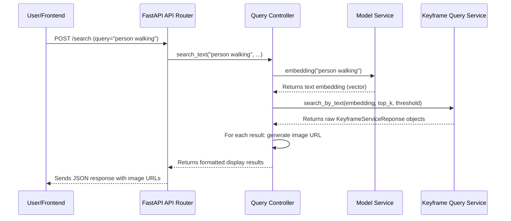

# Chapter 3: Query Controller

Welcome back! In [Chapter 2: FastAPI Application Core](02_fastapi_application_core_.md), we learned how our FastAPI application acts as the main "traffic controller," receiving requests from clients and directing them to the correct "route" (like `/api/v1/keyframe/search`). But once a request arrives at its destination route, what happens next? Who actually takes that search query and figures out how to find the keyframes?

This is where the **Query Controller** comes in! It's the central brain for processing your search requests, acting as a smart intermediary between the incoming API request and the complex internal search services.

### What Problem Are We Trying to Solve?

Imagine you send a request to our API: "Find me keyframes of a person walking in the park."

The FastAPI router (`keyframe_api.py`) knows it's a search request, but it doesn't know *how* to search. It needs to:
1.  Understand your query ("person walking in the park").
2.  Pass this query to a special "search service" that can actually look through millions of keyframes.
3.  Receive the raw, technical results from that search service (e.g., just key IDs and a score).
4.  Transform these technical results into something useful and user-friendly, like a list of image URLs and scores.

The `QueryController` handles all these steps. Think of it like a **hotel concierge**. When you ask the concierge for a restaurant recommendation:
*   You make a request ("Where can I find a good Italian restaurant?").
*   The concierge understands your request.
*   They don't cook the food themselves, but they know exactly which restaurants (search services) can fulfill your request. They might even call a few to check availability.
*   They get the information back.
*   Then, they present it to you in a clear, easy-to-understand way, perhaps with directions and a brief description (formatted response with image URLs).

The `QueryController` does exactly this for our keyframe search!

### The Query Controller's Main Jobs

The `QueryController` has three primary responsibilities:

1.  **Translating API Requests**: It takes the plain text search query (and other parameters like `top_k` or `score_threshold`) from the API route and prepares it for the actual search services.
2.  **Orchestrating Search**: It knows which specialized services to call (e.g., a service to convert text to a "semantic embedding," and another service to search keyframes using that embedding). It coordinates these calls.
3.  **Formatting Results**: Once the raw keyframe data is found, the controller takes this data and makes it "pretty" for the client. This includes generating the correct **image URLs** for each keyframe and ensuring the final response matches the structure our API expects.

### How Our API Router Uses the Query Controller

Let's revisit a simplified version of our `app/router/keyframe_api.py` file from the previous chapter. Notice how it relies heavily on the `QueryController`:

```python
# File: app/router/keyframe_api.py (simplified)
from fastapi import APIRouter, Depends
from schema.request import TextSearchRequest
from schema.response import KeyframeDisplay, SingleKeyframeDisplay
from controller.query_controller import QueryController # Our Query Controller!
from core.dependencies import get_query_controller # How to get it

router = APIRouter(...)

@router.post("/search", response_model=KeyframeDisplay)
async def search_keyframes(
    request: TextSearchRequest,
    controller: QueryController = Depends(get_query_controller) # FastAPI gives us the controller
):
    # 1. Controller handles the actual search logic
    results = await controller.search_text(
        query=request.query,
        top_k=request.top_k,
        score_threshold=request.score_threshold
    )
    
    # 2. Controller helps format each raw result into a displayable item
    display_results = []
    for result in results:
        display_data = controller.convert_to_display_result(result)
        display_results.append(SingleKeyframeDisplay(
            path=display_data["path"],
            score=display_data["score"]
        ))
    
    return KeyframeDisplay(results=display_results)
```

In this code:
*   `controller: QueryController = Depends(get_query_controller)`: This line is magic! FastAPI automatically provides an instance of our `QueryController` to our search function. This is an example of **dependency injection**, a powerful pattern that keeps our code organized. (You'll learn more about `get_query_controller` and dependency management in [Chapter 7: Service Factory & Dependency Management](07_service_factory___dependency_management_.md)).
*   `results = await controller.search_text(...)`: The router doesn't know *how* to search. It just tells the `controller` to do it. The controller will then talk to other specialized services behind the scenes.
*   `display_data = controller.convert_to_display_result(result)`: After getting the raw search results, the router asks the `controller` to format each one into something ready for display, specifically generating the correct image URL.

### What Happens Inside the Query Controller?

Let's peek behind the scenes to see how our "concierge" (`QueryController`) handles a simple text search request.

#### Step-by-Step Flow for a Text Search

When you ask the `QueryController` to `search_text("person walking", 10, 0.5)`:

1.  **Receive Request**: The `QueryController` receives your text query and search parameters.
2.  **Get "Meaning" of Query**: It can't search directly with text. It first needs to understand the *meaning* or *essence* of "person walking." It sends your text query to a special `ModelService` (a text-to-embedding model). This service converts your text into a numerical "vector" (a list of numbers) that represents its semantic meaning.
3.  **Perform Keyframe Search**: Now, with this numerical vector, the `QueryController` asks the `KeyframeQueryService` (our actual search engine) to find the keyframes that have similar numerical vectors. It tells the service: "Find me the top 10 keyframes that are most similar to this vector, and only if their similarity score is above 0.5."
4.  **Get Raw Results**: The `KeyframeQueryService` returns a list of raw `KeyframeServiceReponse` objects. These contain the keyframe's `key`, `video_num`, `group_num`, `keyframe_num`, and a `confidence_score` (as we saw in [Chapter 1: Keyframe Data Model](01_keyframe_data_model_.md)).
5.  **Format for Display**: For each raw keyframe result, the `QueryController` then generates the correct **image path** on the server and converts it into a full **HTTP URL** that a web browser can use to display the image. It also adds other useful information like video and group IDs.
6.  **Return Formatted Results**: Finally, it returns a list of these beautifully formatted results back to the `FastAPI router`, which then sends them to the client.

Here's a simplified diagram of this process:



#### Diving into the Query Controller Code (`app/controller/query_controller.py`)

Let's look at the key parts of `app/controller/query_controller.py`:

**1. The `QueryController` Blueprint**

First, the `QueryController` needs to be "built" or "initialized" with the tools it needs to do its job.

```python
# File: app/controller/query_controller.py (simplified)
from pathlib import Path
import json
# ... other imports ...

from service import ModelService, KeyframeQueryService
from config import DATA_FOLDER_PATH, API_BASE_URL

class QueryController:
    
    def __init__(
        self,
        data_folder: Path, # Path to where images are stored
        id2index_path: Path, # A mapping file
        model_service: ModelService, # To get text embeddings
        keyframe_service: KeyframeQueryService, # To search keyframes
        base_url: str = "http://localhost:8000" # Base URL for images
    ):
        self.data_folder = DATA_FOLDER_PATH
        self.id2index = json.load(open(id2index_path, 'r')) # Loads a dictionary
        self.model_service = model_service # Store the ModelService
        self.keyframe_service = keyframe_service # Store the KeyframeQueryService
        self.base_url = API_BASE_URL
```

*   **`__init__`**: This is a special Python method that runs when a `QueryController` object is created. It takes in various pieces of information and other services (`ModelService`, `KeyframeQueryService`) that it will need later. This is how it gets its "tools" to work.
*   `ModelService` and `KeyframeQueryService`: These are the specialized "departments" that the concierge (`QueryController`) will talk to. We'll explore them in more detail in [Chapter 5: Semantic Search Services](05_semantic_search_services_.md).

**2. Handling a Text Search**

This is the core method that performs the search orchestration:

```python
# File: app/controller/query_controller.py (simplified)
# ... (inside QueryController class) ...

    async def search_text(
        self, 
        query: str, # The text you want to search for
        top_k: int, # How many results you want
        score_threshold: float # Minimum relevance score
    ):
        # 1. Convert text query into a numerical vector (embedding)
        embedding = self.model_service.embedding(query).tolist()[0]
        
        # 2. Use the KeyframeQueryService to find similar keyframes
        raw_result = await self.keyframe_service.search_by_text(
            embedding, top_k, score_threshold
        )
        
        # 3. Return the raw search results (list of KeyframeServiceReponse objects)
        return raw_result
```

*   `embedding = self.model_service.embedding(query).tolist()[0]`: Here, the controller asks the `model_service` to convert the `query` text into an "embedding" (a list of numbers).
*   `raw_result = await self.keyframe_service.search_by_text(...)`: With the embedding ready, the controller then calls the `keyframe_service` to perform the actual search. Notice the `await` keyword, indicating these are asynchronous operations – they might take some time, and our application can do other things while waiting.

**3. Formatting Results and Generating Image URLs**

After `search_text` returns the raw `KeyframeServiceReponse` objects, the `QueryController` also has methods to format them into displayable information, including generating the image URLs.

```python
# File: app/controller/query_controller.py (simplified)
# ... (inside QueryController class) ...

    def get_image_url(self, relative_path: str) -> str:
        """Convert a relative file path (like 'L01/V005/...') into a full HTTP URL."""
        normalized_path = relative_path.replace('\\', '/') # Fix path separators
        # Combines base URL (e.g., http://localhost:8000) with /images and the path
        return f"{self.base_url}/images/{normalized_path}"
    
    def convert_to_display_result(self, model: KeyframeServiceReponse) -> dict:
        """Converts a raw KeyframeServiceReponse into a dictionary ready for display."""
        # Example: L02/V005/00012345.webp
        relative_path = (
            f"L{model.group_num:02d}/V{model.video_num:03d}/{model.keyframe_num:08d}.webp"
        )
        
        return {
            "path": self.get_image_url(relative_path), # This calls the function above!
            "score": model.confidence_score,
            "video_id": model.video_num,
            "group_id": model.group_num,
            "keyframe_id": model.keyframe_num
        }
```

*   `get_image_url`: This method is crucial. It takes a relative path (like "L01/V005/00012345.webp") and combines it with our `base_url` (e.g., `http://localhost:8000`) and the `/images` prefix (which we set up in [Chapter 2: FastAPI Application Core](02_fastapi_application_core_.md) to serve static files). The result is a full URL like `http://localhost:8000/images/L01/V005/00012345.webp`, which a web browser can use to fetch and display the actual keyframe image.
*   `convert_to_display_result`: This method uses the information from the `KeyframeServiceReponse` object to build the `relative_path` and then uses `get_image_url` to get the final displayable path. It then packages all relevant information into a dictionary, ready to be sent back to the client.

### Conclusion

In this chapter, we've explored the vital role of the **Query Controller** in our `HCMAI2025_Baseline` project. We learned that it acts as the "concierge" of our search system, elegantly bridging the gap between raw API requests and the complex logic of our internal search services.

Specifically, the `QueryController` is responsible for:
*   Translating incoming API requests into a format understood by our search services.
*   Orchestrating the search process by calling specialized services like the `ModelService` and `KeyframeQueryService`.
*   Formatting the raw search results into a clean, user-friendly response, including generating the correct image URLs.

This clear separation of concerns keeps our API routes simple and makes our core search logic manageable and easy to understand. Now that we understand how requests are processed, the next crucial step is to understand how our application gets all its necessary information, like database connection strings or image paths. This is what we'll explore in the next chapter, where we dive into **Configuration & Settings**!

[Next Chapter: Configuration & Settings](04_configuration___settings_.md)

---

Generated by [AI Codebase Knowledge Builder](https://github.com/The-Pocket/Tutorial-Codebase-Knowledge)