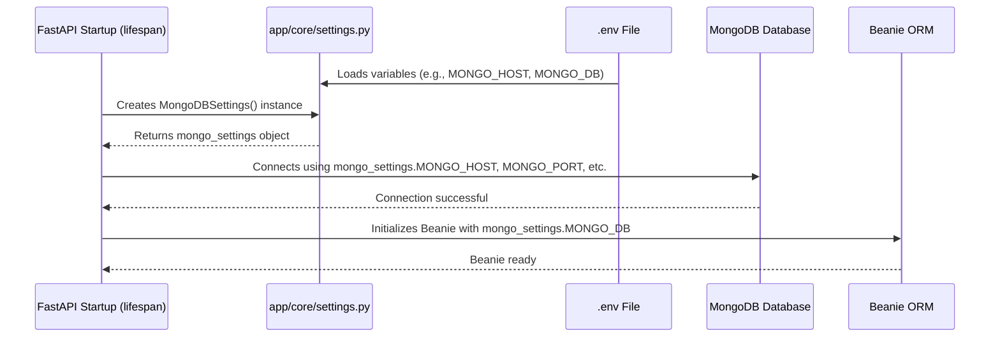

# Chapter 4: Configuration & Settings

Welcome back! In [Chapter 3: Query Controller](03_query_controller_.md), we saw how our `QueryController` acts as a smart "concierge," orchestrating the search for keyframes. It knows *what* services to call (like our `ModelService` and `KeyframeQueryService`) to turn your text query into actual search results.

But how does this "concierge" know where to find these services? How does it know which database to connect to, what specific AI model to use, or where the actual keyframe image files are stored on the server? It needs a set of instructions!

This is where **Configuration & Settings** come in.

### What Problem Are We Trying to Solve?

Imagine you have a complex machine, like a professional coffee maker. To make coffee, it needs several things:
*   **Power**: It needs to be plugged into an outlet (our database connection).
*   **Ingredients**: It needs coffee beans (our AI model files, like the one that understands text).
*   **Storage**: It needs a place to store water and milk (our data folders for keyframe images).

Now, what if you move this coffee maker to a different kitchen? The power outlet might be different, you might want to use a different brand of coffee beans, or the water dispenser location could change. You wouldn't want to rewire the entire machine every time you move it!

This is exactly the problem **Configuration & Settings** solve for our application. Our application needs to know:
*   **Database Credentials**: Where is the MongoDB database located? What's the username and password to connect to it?
*   **AI Model Name**: Which specific AI model should be used to understand text queries?
*   **Data Paths**: Where are the keyframe images saved on the server? What's the base URL for accessing them through the API?
*   **Milvus Details**: If we're using a vector database like Milvus, where is it and how do we connect?

If we hardcode all these details directly into our Python files, changing even one small thing (like a database password) would require us to edit the code and redeploy the entire application. That's inefficient and risky!

**Configuration & Settings** provide a centralized "instruction manual" for our application, allowing us to change these parameters easily without touching the core code. It's like having a control panel where you can input new settings for your coffee maker.

### Key Concepts

Our project uses a combination of techniques for configuration:

1.  **Environment Variables**: These are dynamic values that are set outside of our application's code, usually by the operating system or the deployment environment. Think of them as sticky notes attached to our application container, telling it important things.
2.  **`.env` Files**: For local development, typing out many environment variables can be tedious. A `.env` file is a simple text file where we list these `KEY=VALUE` pairs. Our application can then read this file to load the variables as if they were set in the environment.
3.  **Pydantic Settings**: We use a powerful library called `Pydantic` (which we briefly met in [Chapter 1: Keyframe Data Model](01_keyframe_data_model_.md)) to elegantly read these environment variables. `Pydantic` helps us define the *structure* and *type* of our settings, making sure we get valid values (e.g., a database port should be a number, not text).
4.  **Centralized `config.py`**: For very simple, direct environment variables that don't need Pydantic's validation, we use a straightforward `config.py` file.

Let's look at an example `.env` file first, as this is where many of our settings will originate:

```
# File: .env (Example)
# Database Connection Details
MONGO_HOST=localhost
MONGO_PORT=27017
MONGO_DB=hcmai_db
MONGO_USER=admin
MONGO_PASSWORD=supersecretkey

# Paths and URLs
DATA_FOLDER=/app/data/images
API_BASE_URL=http://localhost:8000

# AI Model Settings
MODEL_NAME=hf-hub:sentence-transformers/all-MiniLM-L6-v2

# Milvus (Vector Database) Settings
MILVUS_HOST=localhost
MILVUS_PORT=19530
```

Notice that these are just key-value pairs. Our application will read these.

### How Our Project Handles Settings

Our project organizes its settings mainly in two places: `app/core/settings.py` for structured, validated settings and `app/config.py` for simpler, direct environment variable access.

#### 1. Structured Settings with Pydantic (`app/core/settings.py`)

This file uses `Pydantic` to define classes that represent groups of settings. This is great for complex settings like database credentials, where you want to ensure all pieces are present and of the correct type.

Here's a simplified look at `app/core/settings.py`:

```python
# File: app/core/settings.py (simplified)
from pydantic_settings import BaseSettings
from pydantic import Field
from dotenv import load_dotenv

load_dotenv() # IMPORTANT: This loads variables from your .env file!

class MongoDBSettings(BaseSettings):
    """Settings for MongoDB connection."""
    MONGO_HOST: str = Field(..., alias='MONGO_HOST')
    MONGO_PORT: int = Field(..., alias='MONGO_PORT')
    MONGO_DB: str = Field(..., alias='MONGO_DB')
    # ... more fields for user, password ...

class AppSettings(BaseSettings):
    """General application settings."""
    DATA_FOLDER: str = "/default/path/to/data" # Default value if not found
    MODEL_NAME: str = "default-model-name"
    # ... more fields ...

class KeyFrameIndexMilvusSetting(BaseSettings):
    """Settings for Milvus vector database."""
    HOST: str = 'localhost'
    PORT: str = '19530'
    # ... more fields ...

# We might also create an instance of these settings classes at the module level
# mongo_settings = MongoDBSettings()
# app_settings = AppSettings()
```

Let's break down the key parts:

*   **`from dotenv import load_dotenv` and `load_dotenv()`**: This is the magic line! When Python runs this file, `load_dotenv()` looks for a `.env` file in the current directory (or parent directories) and loads any `KEY=VALUE` pairs it finds into the program's **environment variables**. This means `MONGO_HOST` from your `.env` is now available to your Python code.
*   **`class MongoDBSettings(BaseSettings):`**: This defines a group of settings specifically for MongoDB. `BaseSettings` is a special class from Pydantic that knows how to read environment variables.
*   **`MONGO_HOST: str = Field(..., alias='MONGO_HOST')`**: This defines one specific setting:
    *   `MONGO_HOST: str`: It says we expect a setting named `MONGO_HOST` and it must be a string (text).
    *   `Field(..., alias='MONGO_HOST')`: This tells Pydantic to look for an environment variable called `MONGO_HOST`. The `...` means this field is required (it *must* be present).
*   **`class AppSettings(BaseSettings):`**: Similarly, this defines general application settings.
    *   `DATA_FOLDER: str = "/default/path/to/data"`: Here, if an environment variable `DATA_FOLDER` is *not* found, it will use the default value `"/default/path/to/data"`. This makes our application more robust.

When our application starts up, it will create instances of these setting classes, which automatically pull values from the environment (potentially loaded from `.env`):

```python
# How settings are used (conceptually)
from app.core.settings import MongoDBSettings, AppSettings

# When this code runs, Pydantic automatically reads from environment variables
mongo_settings = MongoDBSettings()
app_settings = AppSettings()

print(f"MongoDB Host: {mongo_settings.MONGO_HOST}")
print(f"App Data Folder: {app_settings.DATA_FOLDER}")
# Output (if .env is used):
# MongoDB Host: localhost
# App Data Folder: /app/data/images
```
This is a powerful way to manage complex, type-safe settings, especially for sensitive data like database credentials.

#### 2. Simple Configuration (`app/config.py`)

For simpler values that don't need the full `Pydantic` validation or don't group neatly into classes, we have `app/config.py`. This file directly uses `os.getenv` to fetch environment variables.

Here's a look at `app/config.py`:

```python
# File: app/config.py (simplified)
import os
from pathlib import Path

# Environment-based configuration
DATA_FOLDER = os.getenv("DATA_FOLDER", "./data/images")
API_BASE_URL = os.getenv("API_BASE_URL", "http://localhost:8000")
IMAGES_MOUNT_PATH = "/images" # This is a fixed path within the app

# Convert to Path object for easier file operations
DATA_FOLDER_PATH = Path(DATA_FOLDER).resolve()

# We might also load the .env here if app/core/settings.py isn't enough
# from dotenv import load_dotenv
# load_dotenv()
```

*   **`import os`**: This standard Python module allows us to interact with the operating system, including getting environment variables.
*   **`DATA_FOLDER = os.getenv("DATA_FOLDER", "./data/images")`**:
    *   `os.getenv("DATA_FOLDER")`: Tries to get the value of the environment variable `DATA_FOLDER`.
    *   `"./data/images"`: If `DATA_FOLDER` is *not* set in the environment, it uses `"./data/images"` as a default.
*   **`API_BASE_URL = os.getenv("API_BASE_URL", "http://localhost:8000")`**: Similar to `DATA_FOLDER`, this gets our application's base URL for API endpoints.
*   **`DATA_FOLDER_PATH = Path(DATA_FOLDER).resolve()`**: This converts the `DATA_FOLDER` string into a `Path` object, which is very useful for working with file system paths in Python. `.resolve()` makes sure it's an absolute path.

These variables from `app/config.py` are then directly imported and used by various parts of our application.

### How Configuration Powers Our Application

Let's revisit our application flow and see where these settings become critical.

#### 1. Application Startup (Lifespan)

Remember from [Chapter 2: FastAPI Application Core](02_fastapi_application_core_.md) that our `lifespan` function (in `app/core/lifespan.py`) handles preparing the application. This is a prime place where settings are used.



Simplified code from `app/core/lifespan.py`:

```python
# File: app/core/lifespan.py (simplified)
from fastapi import FastAPI
from motor.motor_asyncio import AsyncIOMotorClient
from beanie import init_beanie
from app.core.settings import MongoDBSettings # Our MongoDB settings class
# ... other imports ...

mongo_client: AsyncIOMotorClient = None

@asynccontextmanager
async def lifespan(app: FastAPI):
    logger.info("Starting up application...")
    try:
        # Load MongoDB settings
        mongo_settings = MongoDBSettings() # Reads from environment/dotenv
        
        # 1. Connect to MongoDB using our settings
        global mongo_client
        mongo_client = AsyncIOMotorClient(
            host=mongo_settings.MONGO_HOST,
            port=mongo_settings.MONGO_PORT,
            username=mongo_settings.MONGO_USER,
            password=mongo_settings.MONGO_PASSWORD
        )
        await mongo_client.admin.command('ping')
        logger.info("Successfully connected to MongoDB")
        
        # 2. Initialize Beanie with the database name from settings
        database = mongo_client[mongo_settings.MONGO_DB]
        await init_beanie(
            database=database,
            document_models=[Keyframe]
        )
        logger.info("Beanie initialized successfully")
        
        # Store settings objects in app state for later access
        app.state.mongo_settings = mongo_settings
        # ... other settings like AppSettings, MilvusSettings ...
        
        yield # Application runs
        
    finally:
        if mongo_client:
            mongo_client.close()
            logger.info("MongoDB connection closed")
```

Here, `mongo_settings = MongoDBSettings()` is created, and its attributes (like `mongo_settings.MONGO_HOST`) are directly used to establish the database connection and initialize `Beanie`. This means you can change your database server or credentials just by updating your `.env` file!

#### 2. Query Controller Using Settings

Our `QueryController` (from [Chapter 3: Query Controller](03_query_controller_.md)) needs to know where to find images and the base URL to construct image links. It gets this information from our configuration.

Let's look at a simplified `__init__` method of the `QueryController`:

```python
# File: app/controller/query_controller.py (simplified)
from pathlib import Path
import json

from service import ModelService, KeyframeQueryService
from config import DATA_FOLDER_PATH, API_BASE_URL # <-- We import these directly!

class QueryController:
    
    def __init__(
        self,
        # ... other services like model_service, keyframe_service ...
    ):
        # We assign the values imported from config.py
        self.data_folder = DATA_FOLDER_PATH
        self.base_url = API_BASE_URL
        # ... and use them later to generate image URLs ...

    def get_image_url(self, relative_path: str) -> str:
        """Convert a relative file path (like 'L01/V005/...') into a full HTTP URL."""
        normalized_path = relative_path.replace('\\', '/')
        return f"{self.base_url}/images/{normalized_path}"

    # ... other methods ...
```

As you can see, `DATA_FOLDER_PATH` and `API_BASE_URL` are imported directly from `app/config.py`. The `QueryController` then uses `self.base_url` in its `get_image_url` method to create the full, clickable links for keyframe images. If `API_BASE_URL` changes in your `.env` file, the `QueryController` will automatically use the new URL without any code changes!

### Conclusion

In this chapter, we've uncovered the crucial role of **Configuration & Settings** in making our `HCMAI2025_Baseline` project flexible, secure, and easy to manage. We learned that:

*   Configuration provides the "instruction manual" for our application, allowing us to customize parameters like database connections, model names, and data paths without altering the core code.
*   We use **`.env` files** to store these settings locally and **environment variables** in production.
*   **Pydantic Settings** (`app/core/settings.py`) give us a structured, type-safe way to read and validate groups of settings.
*   A simpler **`app/config.py`** provides direct access to individual environment variables for common parameters.
*   These settings are used during application startup (in `lifespan.py`) to connect to databases and initialize services, and by components like the `QueryController` to construct image URLs.

This robust configuration system ensures our application can adapt to different environments and requirements with ease. Now that our application knows *what* to search for (from [Chapter 1: Keyframe Data Model](01_keyframe_data_model_.md)) and *how* to process queries (from [Chapter 3: Query Controller](03_query_controller_.md)), and *how* to configure itself, the next step is to understand the actual "brain" that performs the intelligent search: the **Semantic Search Services**!

[Next Chapter: Semantic Search Services](05_semantic_search_services_.md)
