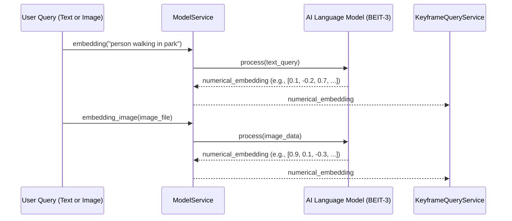
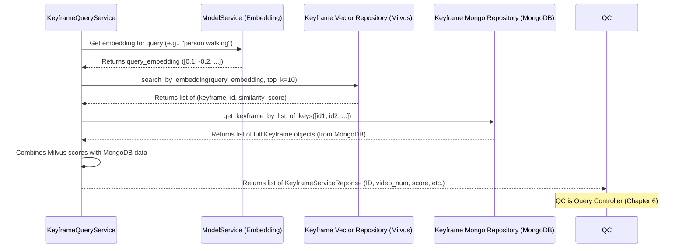
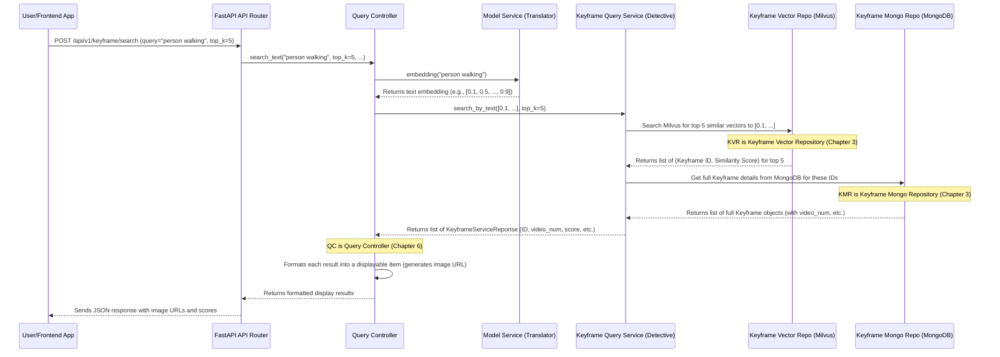

# Chapter 4: Semantic Search Services

Welcome back! In [Chapter 3: Data Access Layer (Repositories)](03_data_access_layer__repositories__.md), we learned how our application efficiently talks to different databases to store and retrieve specific types of data, like keyframe metadata from MongoDB or vector embeddings from Milvus. This was all about *how* to fetch data.

But here's the big question: how does our system get smart enough to understand *what you mean* when you type a search query like "a person walking in the park"? It's not just about matching words anymore; it's about matching *ideas*.

This is where our **Semantic Search Services** come in! These are the "brains" of the intelligent search, allowing the system to understand the *meaning* of your words, not just look for keywords. These services are crucial for transforming a simple text query into a powerful, insightful search that can find relevant keyframes even if the exact words aren't present.

### What Problem Are We Trying to Solve?

Imagine you have a huge library of video keyframes. If you search for "a car" using traditional search methods, you might only find keyframes where the word "car" is explicitly mentioned in some tag. But what if a keyframe shows "an automobile" or "a vehicle"? A traditional search might miss these.

Now, imagine you want to search for something more complex, like "a person smiling at a camera." A keyword search would be very difficult here!

This is where **semantic search** shines. Instead of just looking for matching words, semantic search tries to understand the *meaning* or *intent* behind your query. It's like asking a friend who understands context, rather than just flipping through a dictionary.

Our project uses two main services to achieve this magic:

*   **`ModelService`**: This service is like a brilliant **translator**. You give it a natural language query (like "person walking in park"), and it translates that into a special numerical "language" that computers can understand – a **vector embedding**. It can also do this for images!
*   **`KeyframeQueryService`**: This service is like an **expert detective**. It takes the numerical translation (the vector embedding) from the `ModelService` and uses it to quickly sift through millions of clues (other keyframe embeddings) to find the keyframes that are *most similar* in meaning. It then retrieves all the detailed information about those keyframes from our metadata database.

Together, these two services form the core intelligence of our search functionality.

### Key Concepts

Before we dive into the services, let's understand a couple of core ideas:

#### 1. Vector Embeddings: The Computer's "Language of Meaning"

Think of a **vector embedding** as a long list of numbers (like `[0.1, -0.5, 0.9, ..., 0.2]`). Each list of numbers represents the *meaning* or *essence* of something – it could be a word, a sentence, or even an image.

*   **Similar meanings have similar vectors**: If two sentences have very similar meanings (e.g., "a dog barking" and "a canine making noise"), their vector embeddings will be very "close" to each other in a mathematical sense.
*   **Different meanings have different vectors**: A sentence like "a cat sleeping" will have a vector far away from "a dog barking."

Our `ModelService`'s job is to create these magical numerical translations for your text queries and images.

#### 2. Similarity Search: Finding "Close" Meanings

Once everything is turned into numerical vectors, finding "similar" items becomes a mathematical problem: find vectors that are numerically "close" to each other.

Imagine plotting these vectors on a giant, multi-dimensional graph. When you search, you create a "query vector," and then the system finds all the other vectors that are physically closest to your query vector. This is called **similarity search**, and our `KeyframeQueryService` performs this very quickly using a specialized vector database called Milvus.

### The ModelService: Our Text/Image Translator

The `ModelService` is responsible for taking your human-readable text query (or an image) and converting it into a numerical vector embedding. It uses a powerful AI model (often a "transformer" model like BEIT-3) trained to understand language and images.

#### How the ModelService Works (High-Level)

You give it a sentence like "a car driving on a highway."
The service uses its internal AI model to process this sentence.
It then outputs a list of numbers (our vector embedding) that represents the semantic meaning of "a car driving on a highway."



#### Inside the Code: `app/service/model_service.py`

Let's look at a simplified version of `app/service/model_service.py`:

```python
# File: app/service/model_service.py (simplified)
import numpy as np
import torch
from typing import List
from PIL import Image

class ModelService:
    def __init__(self, model, processor, device):
        # The AI model and a 'processor' (for text/image prep) are given
        self.model = model.to(device)
        self.processor = processor
        self.device = device
        self.model.eval() # Set model to inference mode

    def embedding(self, query_text: str) -> List[float]:
        """
        Converts natural language text into a numerical vector embedding.
        Example: "person walking in park" -> [0.1, -0.2, 0.7, ...]
        """
        with torch.no_grad():
            # 1. Prepare text for the AI model
            text_tokens, padding_mask, _ = self.processor.get_text_segment(query_text)
            
            # 2. Ask the AI model to create the embedding
            _, query_embedding = self.model(
                text_description=text_tokens.to(self.device),
                padding_mask=padding_mask.to(self.device),
                only_infer=True
            )
            # 3. Normalize the vector (important for similarity)
            query_embedding = query_embedding / query_embedding.norm(dim=-1, keepdim=True)
        
        return query_embedding.squeeze(0).detach().cpu().float().ravel().tolist()

    def embedding_image(self, image: Image.Image) -> list[float]:
        """
        Converts a PIL image object into a numerical vector embedding.
        """
        with torch.no_grad():
            # 1. Prepare image for the AI model
            processed_image = self.processor.image_processor(image.convert("RGB")).unsqueeze(0).to(self.device)
            
            # 2. Ask the AI model to create the embedding
            image_features, _ = self.model(image=processed_image, only_infer=True)
            
            # 3. Normalize the vector
            image_embedding = image_features / image_features.norm(dim=-1, keepdim=True)
            
        return image_embedding.squeeze(0).cpu().float().ravel().tolist()
```

**Explanation:**
*   **`__init__`**: When `ModelService` is created, it's given the actual AI `model` (like the BEIT-3 model) and a `processor`. The `processor` helps convert raw text or images into a format the AI model can understand (e.g., tokenizing text into numbers or resizing images). The `model` itself is moved to the `device` (like a powerful GPU, if you have one).
*   **`embedding(self, query_text: str)`**: This method translates text. It first uses the `processor` to turn your `query_text` into a numerical format (`text_tokens`). Then, it feeds these tokens to `self.model.encode_text` (or `self.model` directly for BEIT-3) to get the vector embedding. Finally, it normalizes this vector, which helps in comparing its "direction" for similarity.
*   **`embedding_image(self, image: Image.Image)`**: This method works similarly for images. It processes the image, feeds it to the model, and normalizes the resulting image embedding.

The output of `ModelService.embedding()` (or `embedding_image()`) is a list of numbers – your query, now translated into the computer's "language of meaning"!

### The KeyframeQueryService: Our Expert Detective

The `KeyframeQueryService` is the heart of our semantic search. It takes the vector embedding (from `ModelService`) and actually performs the search. It works with two types of databases, primarily through the repositories we discussed in [Chapter 3: Data Access Layer (Repositories)](03_data_access_layer__repositories__.md):

1.  **Milvus**: A super-fast **vector database** that specializes in storing and quickly searching through millions (or billions!) of vector embeddings. It's designed for "similarity search."
2.  **MongoDB**: Our regular database that stores the rich metadata for each keyframe (like `video_num`, `group_num`, `keyframe_num` as defined in [Chapter 1: Keyframe Data Model](01_keyframe_data_model_.md)). Milvus only stores the ID and the vector, so MongoDB holds the human-readable details.

#### How the KeyframeQueryService Works (High-Level)

1.  **Receive Embedding**: The service gets a numerical vector (the "meaning" of your query).
2.  **Search Vector Database (Milvus)**: It sends this vector to Milvus (via `KeyframeVectorRepository`). Milvus quickly finds the `top_k` (e.g., 10) keyframe IDs whose embeddings are most similar to your query vector. It also returns a "distance" or "score" indicating how similar they are.
3.  **Retrieve Metadata (MongoDB)**: Milvus only gave us IDs. To get the full details (like video paths and actual numbers), the service takes these IDs and asks MongoDB (via `KeyframeRepository`) for the corresponding keyframe data.
4.  **Format Results**: It combines the similarity score from Milvus with the detailed metadata from MongoDB to create a list of meaningful search results, each wrapped in a `KeyframeServiceReponse` object ([Chapter 1: Keyframe Data Model](01_keyframe_data_model_.md)).



#### Inside the Code: `app/service/search_service.py`

Let's simplify `app/service/search_service.py`. This service relies on **repositories** to interact with the databases, as we learned in [Chapter 3: Data Access Layer (Repositories)](03_data_access_layer__repositories__.md).

**1. The `KeyframeQueryService` Blueprint**

```python
# File: app/service/search_service.py (simplified)
from repository.milvus import KeyframeVectorRepository # For vector database access
from repository.mongo import KeyframeRepository # For MongoDB access
from schema.response import KeyframeServiceReponse # For our output structure

class KeyframeQueryService:
    def __init__(
            self, 
            keyframe_vector_repo: KeyframeVectorRepository, # Milvus access
            keyframe_mongo_repo: KeyframeRepository, # MongoDB access
        ):
        # We store references to the repositories to use them later
        self.keyframe_vector_repo = keyframe_vector_repo
        self.keyframe_mongo_repo = keyframe_mongo_repo
```

**Explanation:**
*   `__init__`: The `KeyframeQueryService` doesn't directly connect to Milvus or MongoDB. Instead, it's given specialized "repository" objects (`KeyframeVectorRepository` and `KeyframeRepository`). This is a design pattern called "dependency injection," which helps keep our code clean and makes it easier to test or swap out databases later if needed. We'll explore this more in [Chapter 5: Service Factory & Dependency Management](05_service_factory___dependency_management_.md).

**2. The Main Search Method (`search_by_text`)**

This is the method that an external component, like the `QueryController` ([Chapter 6: Query Controller](06_query_controller_.md)), would call.

```python
# File: app/service/search_service.py (simplified)
# ... (inside KeyframeQueryService class) ...

    async def search_by_text(
        self,
        text_embedding: list[float], # The vector from ModelService
        top_k: int, # How many results to return
        score_threshold: float | None = 0.5, # Minimum similarity score
    ) -> list[KeyframeServiceReponse]:
        """
        Main method to search keyframes using a text embedding.
        It calls an internal helper method to do the actual work.
        """
        # _search_keyframes performs the actual database interactions
        return await self._search_keyframes(text_embedding, top_k, score_threshold, None)
```

**Explanation:**
*   `search_by_text`: This is the public entry point. It takes the `text_embedding` (our numerical query), `top_k` (how many results we want), and an optional `score_threshold` (only show results more similar than this value). It then calls an internal helper method `_search_keyframes` to do the heavy lifting, keeping the public method simple.

**3. The Internal Search Logic (`_search_keyframes`)**

This is where the actual "detective work" happens:

```python
# File: app/service/search_service.py (simplified)
# ... (inside KeyframeQueryService class) ...

    async def _search_keyframes(
        self,
        query_embedding: list[float], # Renamed from text_embedding for clarity
        top_k: int,
        score_threshold: float | None = None,
        exclude_indices: list[int] | None = None
    ) -> list[KeyframeServiceReponse]:
        
        # 1. Ask the Milvus repository to prepare a search request
        search_request = self.keyframe_vector_repo.create_search_request(
            embedding=query_embedding,
            top_k=top_k,
            exclude_ids=exclude_indices
        )

        # 2. Perform the actual vector similarity search in Milvus
        search_response = await self.keyframe_vector_repo.search_by_embedding(search_request)

        # 3. Filter results based on confidence score (distance) and sort them
        filtered_results = [
            result for result in search_response.results
            if score_threshold is None or result.distance > score_threshold
        ]
        sorted_results = sorted(filtered_results, key=lambda r: r.distance, reverse=True)
        sorted_ids = [result.id_ for result in sorted_results] # Get just the IDs

        # 4. Retrieve full keyframe metadata from MongoDB using the IDs
        #    _retrieve_keyframes is another helper method that uses self.keyframe_mongo_repo
        keyframes_from_mongo = await self._retrieve_keyframes(sorted_ids)

        # 5. Create a map for quick lookup from ID to full Keyframe object
        keyframe_map = {k.key: k for k in keyframes_from_mongo}
        
        # 6. Build the final response list (KeyframeServiceReponse objects)
        response = []
        for result in sorted_results:
            keyframe = keyframe_map.get(result.id_) # Get full data from map
            if keyframe: # If we found its details in MongoDB
                response.append(
                    KeyframeServiceReponse(
                        key=keyframe.key,
                        video_num=keyframe.video_num,
                        group_num=keyframe.group_num,
                        keyframe_num=keyframe.keyframe_num,
                        confidence_score=result.distance # Add Milvus score
                    )
                )
        return response
```

**Explanation:**
*   **`search_request = self.keyframe_vector_repo.create_search_request(...)`**: This line uses our `KeyframeVectorRepository` to create a special object (`MilvusSearchRequest`) that describes what we want to search for in Milvus. It includes our `query_embedding` and how many `top_k` results we want.
*   **`search_response = await self.keyframe_vector_repo.search_by_embedding(search_request)`**: This is where the magic happens! The `KeyframeVectorRepository` talks directly to Milvus and performs the fast similarity search. It returns a `MilvusSearchResponse` object containing a list of matching keyframe IDs and their similarity `distance` (which we use as a confidence score; higher distance means more similar in this context).
*   **Filtering and Sorting**: We then filter these results to ensure they meet our `score_threshold` and sort them by relevance (highest `distance`).
*   **`keyframes_from_mongo = await self._retrieve_keyframes(sorted_ids)`**: Now that we have the IDs of the relevant keyframes from Milvus, we need their full details. This line calls another helper method (`_retrieve_keyframes`, which uses `self.keyframe_mongo_repo`) to fetch the rich metadata for each of those IDs from MongoDB. This is important because Milvus only stores IDs and vectors, not video numbers, group numbers, or other details defined in our [Keyframe Data Model](01_keyframe_data_model_.md).
*   **Building the `response`**: Finally, we loop through the sorted Milvus results and combine them with the full keyframe data retrieved from MongoDB. For each result, we create a `KeyframeServiceReponse` object, including the similarity `confidence_score`. This is the list of fully detailed, semantically relevant keyframes that will be returned to the `QueryController`.

### Other Semantic Search Services

While `ModelService` and `KeyframeQueryService` are the core of general semantic search, our system also has other specialized services that leverage similar principles for different types of queries:

*   **`OcrQueryService` (`app/service/ocr_service.py`)**: This service is for searching keyframes based on **text content found *within* the keyframe images** (using Optical Character Recognition, or OCR). It uses an `OcrRepository` to search in Elasticsearch for matching text and then retrieves keyframe metadata from MongoDB.
*   **`AsrQueryService` (`app/service/asr_service.py`)**: Similar to `OcrQueryService`, but it searches for keyframes based on **text transcribed from the video's audio** (using Automatic Speech Recognition, or ASR). It uses an `AsrRepository` to search Elasticsearch and `KeyframeRepository` for metadata.
*   **`VideoRankingService` (`app/service/video_ranking_service.py`)**: This is an advanced service that takes a *sequence* of events (e.g., "person enters room", "sits down", "starts talking") and ranks entire videos based on how well their keyframes align with this event sequence. It uses `ModelService` to embed the event descriptions and then applies a dynamic programming (DP) algorithm, efficiently leveraging Milvus and MongoDB.

These services demonstrate how the combination of our `ModelService` for embedding and our Data Access Layer for querying different types of databases (vector, text, metadata) creates a powerful and versatile search system.

### How Semantic Search Services Fit into the Bigger Picture

Let's put it all together by recalling the flow and expanding the "intelligent services" part:



This diagram shows how your natural language query travels through the system: from the API, to the `QueryController` ([Chapter 6: Query Controller](06_query_controller_.md)), then through the `ModelService` for translation, to the `KeyframeQueryService` for the actual detective work in Milvus (via `KeyframeVectorRepository`) and MongoDB (via `KeyframeRepository`), and finally back to you as relevant search results.

### Conclusion

In this chapter, we've explored the intelligent core of our `Image-Retrieval-System-for-AIC2025` project: the **Semantic Search Services**. We learned that:

*   **Semantic search** allows our system to understand the *meaning* of your queries, not just keywords.
*   The **`ModelService`** acts as a translator, converting natural language text or images into numerical **vector embeddings** that represent their semantic meaning.
*   The **`KeyframeQueryService`** acts as an expert detective, taking these embeddings to perform **similarity searches** in Milvus (our vector database, via `KeyframeVectorRepository`) and retrieving detailed metadata from MongoDB (via `KeyframeRepository`).
*   Other services like `OcrQueryService`, `AsrQueryService`, and `VideoRankingService` extend these principles for specialized search needs.

These services are crucial for providing a powerful and intuitive search experience. Now that we understand *what* services we have and *how* they perform intelligent searches, the next logical step is to understand *how these services are created and managed* within our application. This brings us to **Service Factory & Dependency Management**!

[Next Chapter: Service Factory & Dependency Management](05_service_factory___dependency_management_.md)
