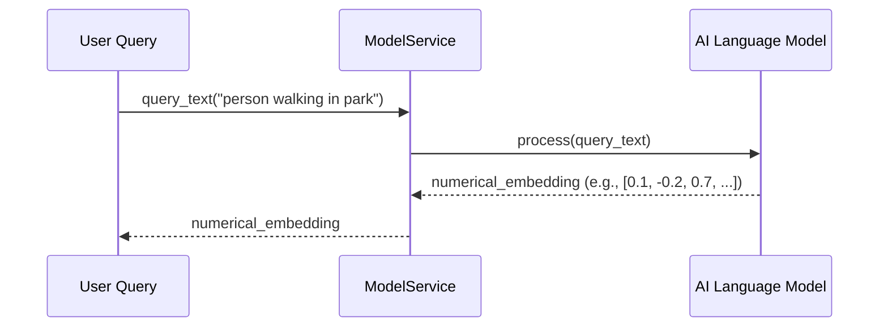
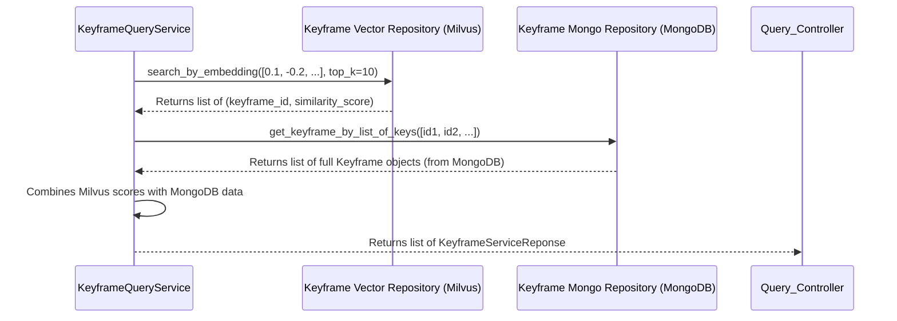
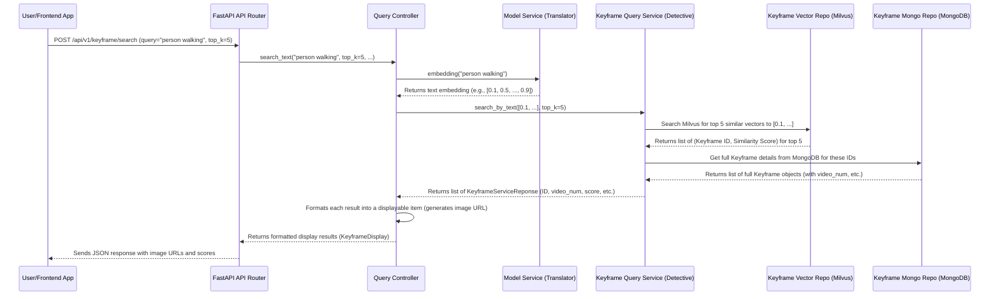

# Chapter 5: Semantic Search Services

Welcome back! In [Chapter 4: Configuration & Settings](04_configuration___settings_.md), we learned how our application gets its "instructions" – things like where databases are located or what AI model to use. Before that, in [Chapter 3: Query Controller](03_query_controller_.md), we saw how the `QueryController` acts as a "concierge," taking your search request and coordinating various internal services to get you results.

But what *are* these "internal services"? Who actually performs the clever, intelligent part of finding keyframes based on your natural language query like "a person walking in the park"?

This is where our **Semantic Search Services** come in! These are the true "brains" behind the intelligent search functionality, allowing our system to understand the *meaning* of your words, not just match exact keywords.

### What Problem Are We Trying to Solve?

Imagine you have a huge library of video keyframes. If you search for "a car" using traditional search methods, you might only find keyframes where the word "car" is explicitly mentioned in some tag. But what if a keyframe shows "an automobile" or "a vehicle"? A traditional search might miss these.

Now, imagine you want to search for something more complex, like "a person smiling at a camera." A keyword search would be very difficult here!

This is where **semantic search** shines. Instead of just looking for matching words, semantic search tries to understand the *meaning* or *intent* behind your query. It's like asking a friend who understands context, rather than just flipping through a dictionary.

Our `HCMAI2025_Baseline` project uses two main services to achieve this magic:

*   **`ModelService`**: This service is like a brilliant **translator**. You give it a natural language query (like "person walking in park"), and it translates that into a special numerical "language" that computers can understand – a **vector embedding**.
*   **`KeyframeQueryService`**: This service is like an **expert detective**. It takes the numerical translation (the vector embedding) from the `ModelService` and uses it to quickly sift through millions of clues (other keyframe embeddings) to find the keyframes that are *most similar* in meaning. It then retrieves all the detailed information about those keyframes.

Together, these two services form the core intelligence of our search functionality.

### Key Concepts

Before we dive into the services, let's understand a couple of core ideas:

#### 1. Vector Embeddings: The Computer's "Language of Meaning"

Think of a **vector embedding** as a long list of numbers (like `[0.1, -0.5, 0.9, ..., 0.2]`). Each list of numbers represents the *meaning* or *essence* of something – it could be a word, a sentence, or even an image.

*   **Similar meanings have similar vectors**: If two sentences have very similar meanings (e.g., "a dog barking" and "a canine making noise"), their vector embeddings will be very "close" to each other in a mathematical sense.
*   **Different meanings have different vectors**: A sentence like "a cat sleeping" will have a vector far away from "a dog barking."

Our `ModelService`'s job is to create these magical numerical translations for your text queries.

#### 2. Similarity Search: Finding "Close" Meanings

Once everything is turned into numerical vectors, finding "similar" items becomes a mathematical problem: find vectors that are numerically "close" to each other.

Imagine plotting these vectors on a giant, multi-dimensional graph. When you search, you create a "query vector," and then the system finds all the other vectors that are physically closest to your query vector. This is called **similarity search**, and our `KeyframeQueryService` performs this very quickly using a specialized database.

### The ModelService: Our Text Translator

The `ModelService` is responsible for taking your human-readable text query and converting it into a numerical vector embedding. It uses a powerful AI model (often a "transformer" model) trained to understand language.

#### How the ModelService Works (High-Level)

You give it a sentence like "a car driving on a highway."
The service uses its internal AI model to process this sentence.
It then outputs a list of numbers (our vector embedding) that represents the semantic meaning of "a car driving on a highway."



#### Inside the Code: `app/service/model_service.py`

Let's look at a simplified version of `app/service/model_service.py`:

```python
# File: app/service/model_service.py (simplified)
import numpy as np # For numerical arrays
import torch # For AI model operations

class ModelService:
    def __init__(
        self,
        model, # The actual AI model
        preprocess, # (Ignored for text here, but needed for images)
        tokenizer, # Converts text to numbers for the model
        device: str = 'cuda' # Where the model runs (CPU or GPU)
    ):
        self.model = model.to(device) # Move model to GPU if available
        self.tokenizer = tokenizer # Store the tokenizer
        self.device = device
        self.model.eval() # Set model to evaluation mode

    def embedding(self, query_text: str) -> np.ndarray:
        """
        Converts natural language text into a numerical vector embedding.
        Example: "person walking in park" -> [0.1, -0.2, 0.7, ...]
        """
        with torch.no_grad(): # Don't track changes for efficiency
            # Convert text into numbers the model understands
            text_tokens = self.tokenizer([query_text]).to(self.device)
            
            # Ask the AI model to encode the text into an embedding
            query_embedding = self.model.encode_text(text_tokens) \
                                   .cpu().detach().numpy().astype(np.float32)
        return query_embedding
```

**Explanation:**
*   **`__init__`**: When `ModelService` is created, it's given the actual AI `model` and a `tokenizer`. The `tokenizer` is like a dictionary that converts words into numbers that the AI model can understand. The `model` itself is moved to the `device` (like a powerful GPU, if you have one, indicated by `'cuda'`).
*   **`embedding(self, query_text: str)`**: This is the key method.
    *   `with torch.no_grad()`: This is a performance trick for PyTorch models. We're just *using* the model to get an embedding, not training it, so we don't need to track gradients (calculations for learning).
    *   `text_tokens = self.tokenizer([query_text]).to(self.device)`: The `tokenizer` converts your `query_text` into a numerical format that the AI model can understand.
    *   `query_embedding = self.model.encode_text(text_tokens)...`: The AI `model` then takes these tokens and generates the vector embedding. We move it to the CPU (`.cpu()`) and convert it to a `numpy` array (`.numpy()`) for easier use in Python.

The output of `ModelService.embedding()` is a `numpy` array – your query, now translated into the computer's "language of meaning"!

### The KeyframeQueryService: Our Expert Detective

The `KeyframeQueryService` is the heart of our semantic search. It takes the vector embedding (from `ModelService`) and actually performs the search. It works with two types of databases:

1.  **Milvus**: A super-fast **vector database** that specializes in storing and quickly searching through millions (or billions!) of vector embeddings. It's designed for "similarity search."
2.  **MongoDB**: Our regular database that stores the rich metadata for each keyframe (like `video_num`, `group_num`, `keyframe_num` as defined in [Chapter 1: Keyframe Data Model](01_keyframe_data_model_.md)). Milvus only stores the ID and the vector, so MongoDB holds the human-readable details.

#### How the KeyframeQueryService Works (High-Level)

1.  **Receive Embedding**: The service gets a numerical vector (the "meaning" of your query).
2.  **Search Vector Database (Milvus)**: It sends this vector to Milvus. Milvus quickly finds the `top_k` (e.g., 10) keyframe IDs whose embeddings are most similar to your query vector. It also returns a "distance" or "score" indicating how similar they are.
3.  **Retrieve Metadata (MongoDB)**: Milvus only gave us IDs. To get the full details (like video paths and actual numbers), the service takes these IDs and asks MongoDB for the corresponding keyframe data.
4.  **Format Results**: It combines the similarity score from Milvus with the detailed metadata from MongoDB to create a list of meaningful search results, each wrapped in a `KeyframeServiceReponse` object ([Chapter 1: Keyframe Data Model](01_keyframe_data_model_.md)).



#### Inside the Code: `app/service/search_service.py`

Let's simplify `app/service/search_service.py`. This service relies on **repositories** to interact with the databases. We'll dive deeper into repositories in [Chapter 6: Data Access Layer (Repositories)](06_data_access_layer__repositories__.md).

**1. The `KeyframeQueryService` Blueprint**

```python
# File: app/service/search_service.py (simplified)
from repository.milvus import KeyframeVectorRepository # For vector database
from repository.mongo import KeyframeRepository # For MongoDB
from schema.response import KeyframeServiceReponse # For our output structure

class KeyframeQueryService:
    def __init__(
            self, 
            keyframe_vector_repo: KeyframeVectorRepository, # Milvus access
            keyframe_mongo_repo: KeyframeRepository, # MongoDB access
        ):
        self.keyframe_vector_repo = keyframe_vector_repo
        self.keyframe_mongo_repo = keyframe_mongo_repo
```

**Explanation:**
*   `__init__`: The `KeyframeQueryService` doesn't talk directly to Milvus or MongoDB. Instead, it uses specialized "repository" objects (`KeyframeVectorRepository` and `KeyframeRepository`). This is a good practice that keeps the code organized! It makes it easier to swap out databases later if needed.

**2. The Main Search Method (`search_by_text`)**

```python
# File: app/service/search_service.py (simplified)
# ... (inside KeyframeQueryService class) ...

    async def search_by_text(
        self,
        text_embedding: list[float], # The vector from ModelService
        top_k: int, # How many results to return
        score_threshold: float | None = 0.5, # Minimum similarity score
    ) -> list[KeyframeServiceReponse]:
        """
        Main method to search keyframes using a text embedding.
        It calls an internal helper method to do the actual work.
        """
        return await self._search_keyframes(text_embedding, top_k, score_threshold, None)
```

**Explanation:**
*   `search_by_text`: This is the public method that the `QueryController` calls. It takes the `text_embedding` (our numerical query), `top_k` (how many results we want), and a `score_threshold` (only show results more similar than this value). It then calls a more detailed internal method `_search_keyframes` to do the heavy lifting.

**3. The Internal Search Logic (`_search_keyframes`)**

```python
# File: app/service/search_service.py (simplified)
# ... (inside KeyframeQueryService class) ...

    async def _search_keyframes(
        self,
        text_embedding: list[float],
        top_k: int,
        score_threshold: float | None = None,
        exclude_indices: list[int] | None = None
    ) -> list[KeyframeServiceReponse]:
        
        # 1. Prepare search request for Milvus (our vector database)
        search_request = self.keyframe_vector_repo.create_search_request(
            embedding=text_embedding,
            top_k=top_k,
            exclude_ids=exclude_indices
        )

        # 2. Perform the actual vector similarity search in Milvus
        search_response = await self.keyframe_vector_repo.search_by_embedding(search_request)

        # 3. Filter results based on confidence score (distance)
        filtered_results = [
            result for result in search_response.results
            if score_threshold is None or result.distance > score_threshold
        ]
        sorted_results = sorted(filtered_results, key=lambda r: r.distance, reverse=True)
        sorted_ids = [result.id_ for result in sorted_results] # Get just the IDs

        # 4. Retrieve full keyframe metadata from MongoDB using the IDs
        keyframes_from_mongo = await self.keyframe_mongo_repo.get_keyframe_by_list_of_keys(sorted_ids)

        # 5. Create a map for quick lookup from ID to full Keyframe object
        keyframe_map = {k.key: k for k in keyframes_from_mongo}
        
        # 6. Build the final response list (KeyframeServiceReponse objects)
        response = []
        for result in sorted_results:
            keyframe = keyframe_map.get(result.id_) # Get full data from map
            if keyframe: # If we found it in MongoDB
                response.append(
                    KeyframeServiceReponse(
                        key=keyframe.key,
                        video_num=keyframe.video_num,
                        group_num=keyframe.group_num,
                        keyframe_num=keyframe.keyframe_num,
                        confidence_score=result.distance # Add Milvus score
                    )
                )
        return response
```

**Explanation:**
*   **`search_request = self.keyframe_vector_repo.create_search_request(...)`**: Creates a special object to tell Milvus what to search for.
*   **`search_response = await self.keyframe_vector_repo.search_by_embedding(search_request)`**: This is where the magic happens! The `KeyframeVectorRepository` talks to Milvus and performs the fast similarity search. It returns a list of matching keyframe IDs and their similarity `distance` (our confidence score).
*   **Filtering and Sorting**: We then filter these results to ensure they meet our `score_threshold` and sort them by relevance.
*   **`keyframes_from_mongo = await self.keyframe_mongo_repo.get_keyframe_by_list_of_keys(sorted_ids)`**: Now that we have the IDs of the relevant keyframes from Milvus, we ask our `KeyframeRepository` (which talks to MongoDB) to fetch the full details for each of those IDs. This is important because Milvus only stores IDs and vectors, not video numbers or group numbers.
*   **Building the `response`**: Finally, we loop through the sorted Milvus results and combine them with the full keyframe data from MongoDB. For each result, we create a `KeyframeServiceReponse` object, including the similarity `confidence_score`. This is the list of fully detailed, semantically relevant keyframes that will be returned.

### How Semantic Search Services Fit into the Bigger Picture

Let's put it all together by recalling the flow from [Chapter 3: Query Controller](03_query_controller_.md) and expanding the "Internal Services" part:



This diagram shows how your natural language query travels through the system: from the API, to the `QueryController`, then through the `ModelService` for translation, to the `KeyframeQueryService` for the actual detective work in Milvus and MongoDB, and finally back to you as relevant search results with images.

### Conclusion

In this chapter, we've explored the intelligent core of our `HCMAI2025_Baseline` project: the **Semantic Search Services**. We learned that:

*   **Semantic search** allows our system to understand the *meaning* of your queries, not just keywords.
*   The **`ModelService`** acts as a translator, converting natural language text into numerical **vector embeddings** that represent meaning.
*   The **`KeyframeQueryService`** acts as an expert detective, taking these embeddings to perform **similarity searches** in Milvus (our vector database) and retrieving detailed metadata from MongoDB.

These services are crucial for providing a powerful and intuitive search experience. Now that we understand how the intelligent search is performed, the next logical step is to dive into how these services actually talk to the databases. This is what we'll explore in the next chapter, where we discuss the **Data Access Layer (Repositories)**!

[Next Chapter: Data Access Layer (Repositories)](06_data_access_layer__repositories__.md)
