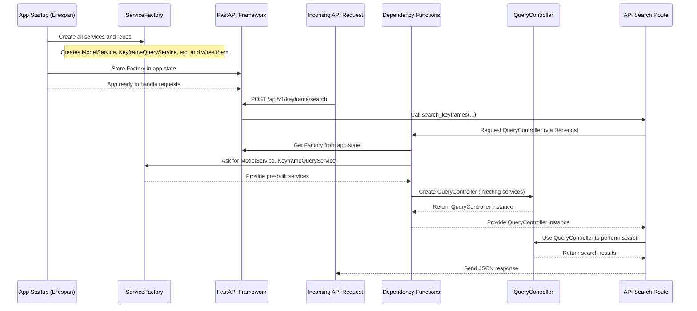

# Chapter 5: Service Factory & Dependency Management

Welcome back! In [Chapter 4: Semantic Search Services](04_semantic_search_services_.md), we explored the intelligent "brains" of our system: the `ModelService` (our translator) and the `KeyframeQueryService` (our expert detective). These services combine to understand your search queries and find relevant keyframes.

But this raises an important question: When our application starts, who creates these specialized services? And once they are created, how does every part of our application that needs them get access to the *same, correctly configured* instance without having to create a new one every single time?

Imagine you have a complex set of tools, each requiring specific setup (like connecting to a database or loading a large AI model). You wouldn't want to re-prepare these tools every time you need them! This is where the **Service Factory & Dependency Management** come into play.

### What Problem Are We Trying to Solve?

Think of our `Image-Retrieval-System` as a sophisticated restaurant. To run smoothly, it needs many specialized "chefs" (our services like `ModelService`, `KeyframeQueryService`), each needing specific "ingredients" (data repositories) and "equipment" (AI models).

*   **Problem 1: Setting up the Kitchen (Initialization)**: We need a dedicated "kitchen manager" to set up all the tools *once* when the restaurant opens. This manager ensures all the ovens, blenders, and specialized ingredients are ready, properly connected, and prepared. If a tool needs other tools to work, the manager makes sure they are assembled correctly. This "kitchen manager" is our **`ServiceFactory`**.

*   **Problem 2: Giving Tools to Chefs (Injection)**: When a chef (like a part of our API handling a search request) needs a blender, they don't go out and buy a new one. They simply ask the kitchen manager, "Hey, I need *the* blender!" The manager (our **dependency management system**) provides the *already prepared* blender. This way, the chef can focus on making delicious food, not on the tedious task of setting up tools. FastAPI's `Depends` system, working with our factory, provides this seamless tool delivery.

Without this system, every time a new search request came in, our application might try to:
*   Connect to a database (MongoDB, Milvus, Elasticsearch).
*   Load a massive AI model into memory.
*   Create brand new instances of various services.

Doing all this for *every single request* would be incredibly slow and wasteful! Our goal is to set up everything once when the application starts, and then efficiently provide these ready-to-use components wherever they're needed.

### Key Concepts

Let's break down the main ideas that make this possible:

1.  **Service Factory (`ServiceFactory`)**:
    *   **What it is**: A dedicated class that knows how to create and configure *all* the different services and repositories our application needs (like `ModelService`, `KeyframeQueryService`, `KeyframeRepository`, etc.). It's like the master builder for our application's components.
    *   **Why we use it**: It centralizes the creation logic. If one service needs other services to work, the factory knows how to "wire" them together correctly.
    *   **Lifecycle**: We create *one* instance of this factory when the application starts up.

2.  **Application Lifespan (`lifespan` function)**:
    *   **What it is**: A special feature in FastAPI that allows us to run code *before* the application starts handling requests (startup events) and *after* it stops (shutdown events).
    *   **Why we use it**: This is the perfect place to create our `ServiceFactory` (and also establish database connections). It ensures our factory is ready and available throughout the application's entire life. When the app shuts down, `lifespan` also cleans up, like closing database connections.

3.  **Dependency Management (FastAPI `Depends`)**:
    *   **What it is**: A powerful pattern where a component (e.g., an API route function) declares what "dependencies" (other services or objects) it needs, and the framework (FastAPI) automatically provides them.
    *   **Why we use it**: It keeps our code clean, organized, and easy to test. An API route doesn't need to know *how* to create a `QueryController`; it just says "I need a `QueryController`," and FastAPI (with the help of our factory) hands one over. It's like asking for a tool from a shared toolbox.

### How it All Works Together: The Central Assembly Line

Let's trace the journey of setting up and using our application's tools, focusing on how an API request for a keyframe search (like `/api/v1/keyframe/search`) eventually gets its `QueryController` and all its underlying services.



Let's break this down into the specific files and code.

### 1. The Service Factory (`app/factory/factory.py`)

This is the blueprint for our "central assembly line." It knows how to put together all the pieces. When the `ServiceFactory` is created, it takes all the necessary configuration (from [Chapter 2: Configuration & Settings](02_configuration___settings_.md)) and then proceeds to *create* and *assemble* all the core services and repositories.

```python
# File: app/factory/factory.py (simplified)
from repository.mongo import KeyframeRepository # From Chapter 3
from repository.milvus import KeyframeVectorRepository # From Chapter 3
from service import KeyframeQueryService, ModelService # From Chapter 4
from models.keyframe import Keyframe # From Chapter 1
# ... other imports for specific services and databases ...

class ServiceFactory:
    def __init__(self, milvus_collection_name: str, milvus_host: str, 
                 model_checkpoint: str, es_client, es_ocr_index_name: str, 
                 app_settings, mongo_collection=Keyframe, **kwargs):
        
        # 1. Create the MongoDB Repository (our "MongoDB Librarian")
        self._mongo_keyframe_repo = KeyframeRepository(collection=mongo_collection)
        
        # 2. Create and connect the Milvus Repository (our "Milvus Librarian")
        self._milvus_keyframe_repo = self._init_milvus_repo(
            collection_name=milvus_collection_name, host=milvus_host, **kwargs
        )

        # 3. Create the Model Service (our "AI Translator")
        self._model_service = self._init_model_service(model_checkpoint, kwargs['tokenizer_checkpoint'])

        # 4. Create the Keyframe Query Service (our "Expert Detective")
        #    Notice it needs the already created mongo and milvus repositories!
        self._keyframe_query_service = KeyframeQueryService(
            keyframe_mongo_repo=self._mongo_keyframe_repo,
            keyframe_vector_repo=self._milvus_keyframe_repo
        )
        
        # ... (other services like OCR, ASR, VideoRankingService are created similarly) ...
        # Example: self._ocr_repo = OcrRepository(client=es_client, index_name=es_ocr_index_name)
        # Example: self._ocr_query_service = OcrQueryService(ocr_repo=self._ocr_repo, ...)

        # 5. Create the Query Controller, wiring in all its services
        self._query_controller = QueryController(
            data_folder=Path(app_settings.DATA_FOLDER),
            id2index_path=Path(app_settings.ID2INDEX_PATH),
            model_service=self._model_service,
            keyframe_service=self._keyframe_query_service,
            # ... other services ...
        )

    def _init_milvus_repo(self, collection_name: str, host: str, **kwargs):
        # Details of connecting to Milvus (using pymilvus) are hidden here
        # This function returns a configured KeyframeVectorRepository
        pass # Simplified for tutorial
        # Example: connections.connect(alias="default", host=host, port=kwargs['milvus_port'])
        # Example: collection = MilvusCollection(collection_name, using="default")
        # Example: return KeyframeVectorRepository(collection=collection, search_params=kwargs['milvus_search_params'])

    def _init_model_service(self, model_checkpoint: str, tokenizer_checkpoint: str):
        # Details of loading the AI model (using open_clip, beit3) are hidden here
        # This function returns a configured ModelService
        pass # Simplified for tutorial
        # Example: model, _, preprocess = open_clip.create_model_and_transforms(model_name)
        # Example: tokenizer = open_clip.get_tokenizer(model_name)
        # Example: return ModelService(model=model, preprocess=preprocess, tokenizer=tokenizer)

    def get_model_service(self):
        """Provides the already created ModelService instance."""
        return self._model_service

    def get_keyframe_query_service(self):
        """Provides the already created KeyframeQueryService instance."""
        return self._keyframe_query_service
    
    def get_query_controller(self):
        """Provides the already created QueryController instance."""
        return self._query_controller
    # ... other getter methods for other services ...
```

**Explanation:**
*   **`__init__(self, ...)`**: This is the heart of the factory. When a `ServiceFactory` object is created, it takes all necessary configuration parameters. Inside, it systematically creates each repository and service.
*   **Wiring Dependencies**: Notice how `_keyframe_query_service` is created by passing it `_mongo_keyframe_repo` and `_milvus_keyframe_repo`. This demonstrates how the factory "wires" services together, ensuring that each service gets its required dependencies already prepared.
*   **Helper Methods (`_init_milvus_repo`, `_init_model_service`)**: These are private methods that handle the complex details of connecting to databases or loading AI models, keeping the main `__init__` method cleaner and easier to read.
*   **`get_..._service()`**: These are simple methods that allow other parts of our application to *retrieve* the *already created and configured* instances of our services, rather than creating new ones. The `get_query_controller()` method directly returns the fully wired `QueryController` instance.

### 2. Application Lifespan (`app/core/lifespan.py`)

This is where our `ServiceFactory` is brought to life when the FastAPI application starts up. This `lifespan` function is part of FastAPI's lifecycle management.

```python
# File: app/core/lifespan.py (simplified)
from contextlib import asynccontextmanager
from fastapi import FastAPI
from motor.motor_asyncio import AsyncIOMotorClient # For MongoDB
from beanie import init_beanie # For our Keyframe model
from elasticsearch import AsyncElasticsearch # For Elasticsearch

from core.settings import MongoDBSettings, KeyFrameIndexMilvusSetting, AppSettings, ElasticsearchSettings # Chapter 2
from models.keyframe import Keyframe # Chapter 1
from factory.factory import ServiceFactory # Our factory!
from core.logger import SimpleLogger

logger = SimpleLogger(__name__)
mongo_client: AsyncIOMotorClient = None
es_client: AsyncElasticsearch = None
service_factory: ServiceFactory = None

@asynccontextmanager
async def lifespan(app: FastAPI):
    logger.info("Starting up application...")
    try:
        # 1. Load all our application settings (from Chapter 2)
        mongo_settings = MongoDBSettings()
        milvus_settings = KeyFrameIndexMilvusSetting()
        app_settings = AppSettings()
        es_settings = ElasticsearchSettings()
        
        # 2. Connect to MongoDB and initialize Beanie
        global mongo_client
        mongo_client = AsyncIOMotorClient(f"mongodb://{mongo_settings.MONGO_USER}:...")
        await init_beanie(database=mongo_client[mongo_settings.MONGO_DB], document_models=[Keyframe])
        logger.info("MongoDB and Beanie initialized.")

        # 3. Connect to Elasticsearch
        global es_client
        es_client = AsyncElasticsearch(
            hosts=[{"host": es_settings.ES_HOST, "port": es_settings.ES_PORT, "scheme": "http"}],
            basic_auth=(es_settings.ES_USER, es_settings.ELASTIC_PASSWORD)
        )
        await es_client.ping()
        logger.info("Elasticsearch connected.")
        
        # 4. IMPORTANT: Create our ServiceFactory!
        global service_factory
        service_factory = ServiceFactory(
            milvus_collection_name=milvus_settings.COLLECTION_NAME,
            milvus_host=milvus_settings.HOST,
            model_checkpoint=r"/path/to/model.pth", # Use actual path from settings
            tokenizer_checkpoint=r"/path/to/tokenizer.spm", # Use actual path
            es_client=es_client, es_ocr_index_name=es_settings.ES_OCR_INDEX,
            es_asr_index_name=es_settings.ES_ASR_INDEX,
            app_settings=app_settings, # Pass AppSettings to factory
            milvus_port=milvus_settings.PORT, # Example of passing more kwargs
            milvus_search_params=milvus_settings.SEARCH_PARAMS # Example
            # ... pass other settings ...
        )
        logger.info("Service factory initialized.")
        
        # 5. Store the factory and other clients in app.state for later access
        app.state.service_factory = service_factory
        app.state.mongo_client = mongo_client
        app.state.es_client = es_client
        
        logger.info("Application startup completed successfully.")
        
    except Exception as e:
        logger.error(f"Failed to start application: {e}")
        raise
    
    yield # Application runs here and handles requests
    
    logger.info("Shutting down application...")
    # Clean up resources when the app stops
    try:
        if mongo_client: mongo_client.close()
        if es_client: await es_client.close()
        logger.info("Application shutdown completed successfully.")
    except Exception as e:
        logger.error(f"Error during shutdown: {e}")
```

**Explanation:**
*   **`@asynccontextmanager def lifespan(app: FastAPI):`**: This special decorator tells FastAPI to run this function at startup (before `yield`) and shutdown (after `yield`).
*   **Resource Initialization**: Inside the `try` block, we connect to all our databases (MongoDB, Elasticsearch) and then critically, we create our `ServiceFactory`.
*   **`app.state.service_factory = service_factory`**: This line is key! We store the *single instance* of our `ServiceFactory` directly on the FastAPI `app` object. This makes it globally accessible to any part of our application that has access to the `request` object (which usually carries the `app` object).
*   **`yield`**: This keyword signals that the startup tasks are complete, and the FastAPI application can now start handling incoming requests.
*   **Shutdown**: The code after `yield` is executed when the application is shutting down, ensuring that resources like database connections are gracefully closed.

### 3. Dependency Functions (`app/core/dependencies.py`)

These functions are FastAPI's way of asking our `ServiceFactory` for the necessary tools and services. They define the "dependency chain" that FastAPI follows.

```python
# File: app/core/dependencies.py (simplified)
from fastapi import Depends, Request, HTTPException
from functools import lru_cache # For caching settings

from factory.factory import ServiceFactory # Our factory
from controller.query_controller import QueryController # Our Query Controller
from service import ModelService, KeyframeQueryService # Our services
from core.settings import AppSettings # Our settings

# Caches the result of this function after the first call (efficient for settings)
@lru_cache() 
def get_app_settings():
    return AppSettings()

def get_service_factory(request: Request) -> ServiceFactory:
    """Retrieves the ServiceFactory from FastAPI's application state."""
    service_factory = getattr(request.app.state, 'service_factory', None)
    if service_factory is None:
        raise HTTPException(status_code=503, detail="Service factory not initialized.")
    return service_factory

def get_model_service(
    service_factory: ServiceFactory = Depends(get_service_factory)
) -> ModelService:
    """Retrieves the ModelService from the ServiceFactory."""
    return service_factory.get_model_service()

def get_keyframe_service(
    service_factory: ServiceFactory = Depends(get_service_factory)
) -> KeyframeQueryService:
    """Retrieves the KeyframeQueryService from the ServiceFactory."""
    return service_factory.get_keyframe_query_service()

def get_query_controller(
    model_service: ModelService = Depends(get_model_service), # Dependency on ModelService
    keyframe_service: KeyframeQueryService = Depends(get_keyframe_service), # Dependency on KeyframeQueryService
    app_settings: AppSettings = Depends(get_app_settings) # Dependency on settings
    # ... (other services like OcrQueryService, AsrQueryService, QueryRewriteService) ...
) -> QueryController:
    """
    Retrieves the QueryController instance,
    injecting its required ModelService and KeyframeQueryService.
    """
    # Our factory now directly provides the QueryController,
    # already wired with its services.
    service_factory_instance = get_service_factory(Request) # Not ideal, but for simplicity
    return service_factory_instance.get_query_controller()
```

**Explanation:**
*   **`@lru_cache()`**: This decorator makes `get_app_settings()` very efficient; the `AppSettings` object is only created once.
*   **`get_service_factory(request: Request)`**: This function is the entry point. It takes the `request` object (provided by FastAPI) and retrieves our single `service_factory` instance from `app.state`.
*   **`get_model_service(...)` and `get_keyframe_service(...)`**: These are dependency functions for our specific services. Notice `service_factory: ServiceFactory = Depends(get_service_factory)`. This tells FastAPI: "Before running `get_model_service`, please get me a `ServiceFactory` by calling `get_service_factory`." FastAPI intelligently resolves this chain! Once it has the factory, it calls `service_factory.get_model_service()` to retrieve the *already built* service.
*   **`get_query_controller(...)`**: This function is responsible for getting the `QueryController`. It declares dependencies on `get_model_service`, `get_keyframe_service`, and `get_app_settings`. FastAPI resolves all of these, gets the actual `ModelService`, `KeyframeQueryService`, and `AppSettings` objects, and *then* retrieves the fully configured `QueryController` from the factory. (Note: The `get_service_factory(Request)` call in the simplified example is a conceptual shortcut; in real code, `service_factory` would be passed in via `Depends` if needed.)

### 4. Injecting into API Routes (`app/router/keyframe_api.py`)

Finally, our API routes simply declare that they need a `QueryController`, and FastAPI's dependency injection system does all the work!

```python
# File: app/router/keyframe_api.py (conceptual)
from fastapi import APIRouter, Depends
from controller.query_controller import QueryController # Our Query Controller
from core.dependencies import get_query_controller # Our dependency function

router = APIRouter(prefix="/api/v1/keyframe")

@router.post("/search")
async def search_keyframes(
    # FastAPI sees this line and uses our dependency system!
    controller: QueryController = Depends(get_query_controller) 
):
    """
    Search for keyframes using a text query.
    The QueryController is provided by our dependency management system.
    """
    # Now, the API route can simply use the 'controller' instance
    # without knowing how it was created or configured!
    query_text = "person walking in the park" # Example search text
    top_k_results = 5
    results = await controller.search_text(query_text, top_k=top_k_results)
    
    return {"message": "Search results", "data": results}
```

**Explanation:**
*   **`controller: QueryController = Depends(get_query_controller)`**: This is the elegant conclusion! The `search_keyframes` function simply states, "I need an object of type `QueryController`, and you can get it by calling `get_query_controller`." FastAPI then orchestrates the entire process:
    1.  It calls `get_query_controller`.
    2.  `get_query_controller` (in turn) asks the `ServiceFactory` for the `QueryController` instance.
    3.  The `ServiceFactory` hands over its *already created and fully wired* `QueryController`.
    4.  FastAPI passes this ready-to-use `QueryController` to our `search_keyframes` function.

This entire chain of dependencies happens automatically and efficiently, ensuring our API route gets exactly what it needs without worrying about how those components were built or configured.

### Conclusion

In this chapter, we've brought together many concepts to understand how our `Image-Retrieval-System-for-AIC2025` project efficiently manages its components through **Service Factory & Dependency Management**. We learned that:

*   The **`ServiceFactory`** acts as a central assembly line, responsible for creating and wiring together all the services and repositories our application needs (like the `ModelService`, `KeyframeQueryService`, and database repositories).
*   FastAPI's **`lifespan`** function ensures that our `ServiceFactory` is initialized *once* when the application starts and stored for global access, and resources are cleaned up during shutdown.
*   **Dependency management** (using FastAPI's `Depends` feature and our dependency functions) automatically injects these pre-configured services and controllers into our API routes, allowing each component to focus on its job without worrying about how its tools are acquired.

This powerful combination makes our application highly modular, maintainable, testable, and efficient, ensuring that complex objects like database connections and AI models are set up correctly once and then easily accessed throughout the application. Now that we understand how all our services are expertly assembled and managed, the next step is to explore the **Query Controller**, which acts as the main orchestrator for handling user search requests.

[Next Chapter: Query Controller](06_query_controller_.md)
