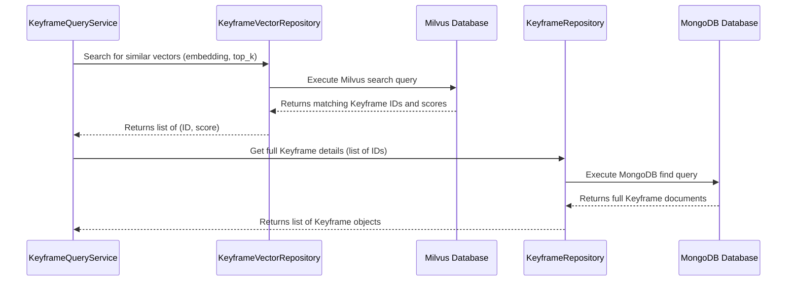

# Chapter 6: Data Access Layer (Repositories)

Welcome back! In [Chapter 5: Semantic Search Services](05_semantic_search_services_.md), we explored the intelligent core of our application: the `ModelService` that translates text into numerical "vectors" (embeddings), and the `KeyframeQueryService` that uses these vectors to perform a clever search in our databases.

But how do these services actually *talk* to the databases? How does the `KeyframeQueryService` ask MongoDB for keyframe details or Milvus for similar vectors without getting bogged down in the technical details of *how* to connect and query each specific database?

This is where the **Data Access Layer (Repositories)** comes in!

### What Problem Are We Trying to Solve?

Imagine our `KeyframeQueryService` (the "Expert Detective" from the last chapter) needs to get keyframe metadata from MongoDB and vector embeddings from Milvus.

If the `KeyframeQueryService` had to directly write all the complex database queries and connection logic for both MongoDB and Milvus, its code would become very long, messy, and hard to understand. It would also be a huge problem if we ever wanted to switch to a different database technology (e.g., a different vector database or a different document database) – we'd have to rewrite large parts of our `KeyframeQueryService`!

This is where the **Data Access Layer (DAL)**, specifically **Repositories**, steps in to save the day.

Think of it like this:
*   Your `KeyframeQueryService` (the Detective) needs specific types of information (keyframe metadata, keyframe vectors).
*   Instead of going directly to two different archives (MongoDB and Milvus), the Detective calls two **specialized librarians**:
    *   One librarian (`KeyframeRepository`) knows *everything* about fetching text-based descriptions and metadata from the **MongoDB Archive**.
    *   Another librarian (`KeyframeVectorRepository`) knows *everything* about fetching numerical "visual descriptions" (vector embeddings) from the **Milvus Archive**.

The Detective doesn't care *how* these librarians do their job (what kind of filing system they use, what language they speak to the archive). It just tells them *what* information it needs, and they bring it back. This keeps the Detective's job focused on *detecting*, not *archiving*.

The **Data Access Layer (Repositories)** provides a clean, organized way for our application to interact with databases without knowing their internal complexities. It acts as an intermediary, abstracting away the specifics of database technologies.

### Key Concepts

Our Data Access Layer is built around a few important ideas:

1.  **Data Access Layer (DAL)**: This is the general term for the part of our application that handles all communications with our databases. It's the "bridge" between our application's logic and the persistent storage.
2.  **Repositories**: These are specific classes within the DAL. Each repository is responsible for managing data for a particular "entity" (like `Keyframe` metadata or `Keyframe` vectors) and usually for a specific database technology.
    *   **`KeyframeRepository`**: Deals with `Keyframe` metadata stored in **MongoDB**.
    *   **`KeyframeVectorRepository`**: Deals with `Keyframe` vector embeddings stored in **Milvus**.
3.  **MongoDB**: As discussed in [Chapter 1: Keyframe Data Model](01_keyframe_data_model_.md), this is where we store the structured information about each keyframe (its `key`, `video_num`, `group_num`, `keyframe_num`).
4.  **Milvus**: As introduced in [Chapter 5: Semantic Search Services](05_semantic_search_services_.md), this is our specialized vector database where we store the numerical vector embeddings that represent the "meaning" of each keyframe.

### How Repositories Power Semantic Search

Let's revisit the `KeyframeQueryService` from the previous chapter. It's the primary "client" of our repositories.

Recall this snippet from `app/service/search_service.py`:

```python
# File: app/service/search_service.py (simplified)
from repository.milvus import KeyframeVectorRepository # For vector database
from repository.mongo import KeyframeRepository # For MongoDB

class KeyframeQueryService:
    def __init__(
            self, 
            keyframe_vector_repo: KeyframeVectorRepository, # Milvus access
            keyframe_mongo_repo: KeyframeRepository, # MongoDB access
        ):
        self.keyframe_vector_repo = keyframe_vector_repo
        self.keyframe_mongo_repo = keyframe_mongo_repo
```
Here, the `KeyframeQueryService` doesn't *create* the database connections itself. Instead, it *receives* ready-to-use `KeyframeVectorRepository` and `KeyframeRepository` objects when it's initialized. This is a classic example of **dependency injection**, which we'll cover in [Chapter 7: Service Factory & Dependency Management](07_service_factory___dependency_management_.md).

Now, let's look at how the `KeyframeQueryService` uses these repositories to perform a search:

```python
# File: app/service/search_service.py (simplified)
# ... (inside KeyframeQueryService class) ...

    async def _search_keyframes(
        self,
        text_embedding: list[float], # The numerical query
        top_k: int,
        score_threshold: float | None = None,
        exclude_indices: list[int] | None = None
    ):
        # 1. Ask the Milvus repository to search for similar vectors
        search_request = self.keyframe_vector_repo.create_search_request(
            embedding=text_embedding,
            top_k=top_k,
            exclude_ids=exclude_indices
        )
        search_response = await self.keyframe_vector_repo.search_by_embedding(search_request)

        # ... (filtering results) ...
        sorted_ids = [result.id_ for result in sorted_results] # Extract key IDs from Milvus results

        # 2. Ask the MongoDB repository to fetch full metadata for those key IDs
        keyframes_from_mongo = await self.keyframe_mongo_repo.get_keyframe_by_list_of_keys(sorted_ids)
        
        # ... (combining results and returning) ...
        return formatted_results_list
```

Notice how `self.keyframe_vector_repo.search_by_embedding(...)` and `self.keyframe_mongo_repo.get_keyframe_by_list_of_keys(...)` are simple, high-level calls. The `KeyframeQueryService` doesn't know (or care) about the `pymilvus` or `beanie` (our MongoDB ORM) specific code underneath. It just asks the repositories for data, and they handle the database interaction.

### Inside the Data Access Layer

Let's dive a little deeper into how these repositories are built.

#### The Flow of Data Access for a Search

When the `KeyframeQueryService` needs data, here's what happens at a high level:



#### 1. Generic MongoDB Repository (`app/common/repository/base.py`)

First, we have a base class, `MongoBaseRepository`, which provides common operations for *any* MongoDB collection. This is like a generic "librarian assistant" who knows how to do basic tasks like "find books by title" or "list all books" for any section of the library.

```python
# File: app/common/repository/base.py (simplified)
from beanie import Document 
from typing import Type, List, Generic, TypeVar

# BeanieDocument is a placeholder for any class that extends Beanie's Document
BeanieDocument = TypeVar('BeanieDocument', bound=Document)

class MongoBaseRepository(Generic[BeanieDocument]):
    def __init__(self, collection: Type[BeanieDocument]):
        self.collection = collection # This holds the Beanie model (e.g., Keyframe)

    async def find(self, *args, **kwargs) -> list[BeanieDocument]:
        """
        Find documents in the collection based on criteria.
        Example: await repo.find({"video_num": 10})
        """
        # This calls Beanie's find method on our specific Keyframe collection
        return await self.collection.find(*args, **kwargs).to_list(length=None)
    
    # ... (other generic methods like get_all, find_pipeline) ...
```
*   `class MongoBaseRepository(Generic[BeanieDocument]):`: This makes it a "generic" class. `BeanieDocument` means it can work with any `Document` model from `Beanie`.
*   `__init__(self, collection: Type[BeanieDocument])`: When we create a `MongoBaseRepository`, we tell it *which* `Beanie` model (like our `Keyframe` model from [Chapter 1: Keyframe Data Model](01_keyframe_data_model_.md)) it will be working with.
*   `async def find(...)`: This method uses the `self.collection` (which is our `Keyframe` model) to perform a `find` operation directly with `Beanie`, which then talks to MongoDB. The `to_list(length=None)` gets all results.

#### 2. Specific MongoDB Keyframe Repository (`app/repository/mongo.py`)

Building on the generic `MongoBaseRepository`, we create our specific `KeyframeRepository`. This class focuses *only* on `Keyframe` data and provides methods tailored to keyframe-specific queries. This is our "Keyframe Librarian."

```python
# File: app/repository/mongo.py (simplified)
from models.keyframe import Keyframe # Our Keyframe model from Chapter 1
from common.repository import MongoBaseRepository
from schema.interface import KeyframeInterface # Output structure

class KeyframeRepository(MongoBaseRepository[Keyframe]):
    def __init__(self, collection: type[Keyframe]):
        super().__init__(collection) # Initialize the base class with our Keyframe model

    async def get_keyframe_by_list_of_keys(self, keys: list[int]):
        """
        Finds keyframe documents in MongoDB by a list of 'key' IDs.
        Example: await repo.get_keyframe_by_list_of_keys([101, 105, 203])
        """
        # Uses the 'find' method from the base MongoBaseRepository
        result = await self.find({"key": {"$in": keys}})
        
        # Converts the raw Beanie Keyframe documents into our structured KeyframeInterface
        return [
            KeyframeInterface(
                key=keyframe.key,
                video_num=keyframe.video_num,
                group_num=keyframe.group_num,
                keyframe_num=keyframe.keyframe_num
            ) for keyframe in result
        ]

    # ... (other specific methods like get_keyframe_by_video_num) ...
```
*   `class KeyframeRepository(MongoBaseRepository[Keyframe]):`: This line shows that `KeyframeRepository` *inherits* from `MongoBaseRepository`, and it specifies that it will work with the `Keyframe` model.
*   `__init__(self, collection: type[Keyframe]):`: It takes the `Keyframe` model and passes it up to the `MongoBaseRepository`'s `__init__` method.
*   `async def get_keyframe_by_list_of_keys(self, keys: list[int]):`: This is a custom method specifically designed for our `Keyframe` needs. It calls `self.find(...)` (which comes from `MongoBaseRepository`) with a MongoDB query to fetch keyframes whose `key` field is in the provided `keys` list.
*   It then converts the `Beanie` `Keyframe` objects into `KeyframeInterface` objects ([Chapter 1: Keyframe Data Model](01_keyframe_data_model_.md)), ensuring a consistent output format.

#### 3. Generic Milvus Repository (`app/common/repository/base.py`)

Similar to MongoDB, we have a base class for Milvus interactions. This `MilvusBaseRepository` provides the foundation for any Milvus collection. This is a generic "Vector Librarian Assistant."

```python
# File: app/common/repository/base.py (simplified)
from abc import ABC # For abstract base classes
from pymilvus import Collection as MilvusCollection # Milvus library

class MilvusBaseRepository(ABC): # ABC means this is an abstract class, not meant to be used directly
    
    def __init__(
        self,
        collection: MilvusCollection, # The actual Milvus collection object
    ):
        self.collection = collection # Store the Milvus collection
```
*   `class MilvusBaseRepository(ABC):`: `ABC` (Abstract Base Class) means this class can't be used directly. You *must* create a more specific class that inherits from it.
*   `__init__(self, collection: MilvusCollection)`: When a Milvus repository is created, it's given the actual `MilvusCollection` object, which is our direct connection to a specific collection (like our "keyframes_vectors" collection) in the Milvus database.

#### 4. Specific Milvus Keyframe Vector Repository (`app/repository/milvus.py`)

Finally, our `KeyframeVectorRepository` is the specific "Keyframe Vector Librarian." It extends `MilvusBaseRepository` and provides methods to interact with Milvus for keyframe vectors.

```python
# File: app/repository/milvus.py (simplified)
from common.repository import MilvusBaseRepository
from pymilvus import Collection as MilvusCollection
from schema.interface import MilvusSearchRequest, MilvusSearchResponse # Data structures

class KeyframeVectorRepository(MilvusBaseRepository):
    def __init__(
        self, 
        collection: MilvusCollection,
        search_params: dict # Milvus search configuration
    ):
        super().__init__(collection) # Initialize the base class with our Milvus collection
        self.search_params = search_params # Store search configuration

    async def search_by_embedding(
        self,
        request: MilvusSearchRequest # Contains embedding, top_k, etc.
    ) -> MilvusSearchResponse:
        """
        Performs a vector similarity search in Milvus.
        Example: await repo.search_by_embedding(my_search_request)
        """
        # Build an expression to exclude certain keyframe IDs if provided
        expr = f"id not in {request.exclude_ids}" if request.exclude_ids else None
        
        # This is the actual call to Milvus!
        search_results = self.collection.search(
            data=[request.embedding], # The query vector
            anns_field="embedding", # The field in Milvus that stores vectors
            param=self.search_params, # Milvus search parameters (e.g., algorithm)
            limit=request.top_k, # How many results to return
            expr=expr, # Our exclusion filter
            output_fields=["id", "embedding"], # What fields to get back
            _async=False # Run synchronously for simplicity here, can be async
        )

        # Process Milvus's raw search results into our structured MilvusSearchResult
        results = []
        for hits in search_results: # Milvus returns results in a nested structure
            for hit in hits:
                results.append(
                    MilvusSearchResult(
                        id_=hit.id,
                        distance=hit.distance,
                        embedding=hit.entity.get("embedding") if hasattr(hit, 'entity') else None
                    )
                )
        
        return MilvusSearchResponse(results=results, total_found=len(results))
```
*   `class KeyframeVectorRepository(MilvusBaseRepository):`: Inherits from `MilvusBaseRepository`.
*   `__init__(self, collection: MilvusCollection, search_params: dict)`: It takes the specific Milvus `collection` and `search_params` (configuration for how Milvus should search, e.g., which algorithm to use).
*   `async def search_by_embedding(...)`: This is the core method. It constructs the Milvus query using the `request` data (which includes our `embedding` from `ModelService`) and then calls `self.collection.search(...)`. This is the direct interaction with the Milvus database.
*   The raw results from Milvus are then transformed into our structured `MilvusSearchResponse` and `MilvusSearchResult` objects, which are easier for the `KeyframeQueryService` to work with.

### Conclusion

In this chapter, we've explored the crucial **Data Access Layer (Repositories)**, which is responsible for all interactions with our databases. We learned that:

*   Repositories act as **specialized librarians** for our data, abstracting away the complexities of specific database technologies (MongoDB for metadata, Milvus for vector embeddings).
*   This abstraction keeps our `Semantic Search Services` focused on their core logic, making the code cleaner, more maintainable, and easier to adapt to future database changes.
*   We use generic `MongoBaseRepository` and `MilvusBaseRepository` classes to provide common database operations, and then specialized `KeyframeRepository` and `KeyframeVectorRepository` classes for our specific keyframe data needs.

Now that we understand how our services get data from the databases, the final piece of the puzzle is to understand how all these services and repositories are created and managed efficiently throughout our application. That's what we'll explore in the next chapter: [Service Factory & Dependency Management](07_service_factory___dependency_management_.md)!

[Next Chapter: Service Factory & Dependency Management](07_service_factory___dependency_management_.md)
