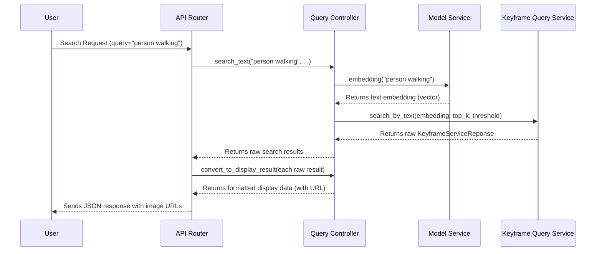

# Chapter 6: Query Controller

Welcome back! In [Chapter 5: Service Factory & Dependency Management](05_service_factory___dependency_management_.md), we learned how our application efficiently creates and manages all its specialized services and tools, ensuring they are ready to go when needed. We saw how a `ServiceFactory` acts as a master builder and how FastAPI's dependency system seamlessly hands these tools to different parts of our application.

Now, imagine a user wants to search for something in our system. They type a search query like "a person walking in the park" into a web interface. This request hits our API (which we'll cover in [Chapter 7: FastAPI Application Core](07_fastapi_application_core_.md)). But once the request arrives, who takes it, understands it, and coordinates the entire search process? Who makes sure the results are not just technical data, but actual image links the user can see?

This is where the **Query Controller** comes in! It's the central "concierge" or "project manager" of our search system. When a user sends a search request, the Query Controller steps up to orchestrate the entire process from start to finish.

### What Problem Are We Trying to Solve?

Think of our `Image-Retrieval-System` like a bustling hotel. You, the user, walk up to the **Concierge Desk** (our Query Controller) and say, "I'd like to find all the keyframes of 'a person walking in the park'."

If there were no concierge, you'd have to:
1.  **Translate your request**: Figure out how to turn "a person walking in the park" into a computer-readable "vector embedding" (a list of numbers), which is a complex AI task.
2.  **Talk to various departments**: Directly interact with the "AI Model Department" to get the embedding, then the "Keyframe Storage Department" (Milvus database) to search for similar vectors, and finally the "Keyframe Details Department" (MongoDB database) to get full information.
3.  **Assemble raw information**: Take the technical IDs and scores from the databases and figure out how to generate a usable web link for each image.

That sounds like a lot of work for you! The **Query Controller** solves this problem by acting as a single, friendly point of contact. You just tell the controller what you want, and it handles all the complex steps behind the scenes, presenting you with a clear, ready-to-use answer.

### The Query Controller's Main Jobs

Our Query Controller has three primary responsibilities, just like a good concierge:

1.  **Understanding & Translating Requests**: It takes your plain text search (e.g., "a dog running") and prepares it for the internal services. It knows how to route different types of searches (semantic, OCR, ASR, image-to-image).
2.  **Orchestrating the Search**: It knows which specialized "departments" or "services" to call in what order. For example, it might first call the `ModelService` (our AI translator, from [Chapter 4: Semantic Search Services](04_semantic_search_services_.md)) to get an embedding, and then the `KeyframeQueryService` (our expert detective, also from [Chapter 4: Semantic Search Services](04_semantic_search_services_.md)) to perform the actual search in the databases.
3.  **Formatting Results for the User**: Once the raw technical search results are found, the controller transforms them into a user-friendly format. This is crucial for generating direct **image URLs** that a web browser can display, along with other helpful details.

### How Our API Router Uses the Query Controller

Let's look at how an incoming search request from a user is handled by our API, specifically how it interacts with the `QueryController`. The API router (from `app/router/keyframe_api.py`) doesn't do the searching itself; it delegates that task to the `QueryController`.

```python
# File: app/router/keyframe_api.py (simplified)
from fastapi import APIRouter, Depends
from schema.request import TextSearchRequest
from schema.response import KeyframeDisplay, SingleKeyframeDisplay
from controller.query_controller import QueryController
from core.dependencies import get_query_controller # From Chapter 5

router = APIRouter(...)

@router.post("/search", response_model=KeyframeDisplay, summary="Simple Semantic Search")
async def search_keyframes(
    request: TextSearchRequest,
    controller: QueryController = Depends(get_query_controller), # FastAPI provides the controller!
):
    # 1. Ask the controller to perform the search
    results = await controller.search_text(
        query=request.query,
        top_k=request.top_k,
        score_threshold=request.score_threshold
    )
    
    # 2. Ask the controller to format each raw result for display
    display_results = [
        SingleKeyframeDisplay(**controller.convert_to_display_result(result))
        for result in results
    ]
    
    return KeyframeDisplay(results=display_results)
```

**Explanation:**
*   **`controller: QueryController = Depends(get_query_controller)`**: This line is a prime example of FastAPI's **dependency injection** (as discussed in [Chapter 5: Service Factory & Dependency Management](05_service_factory___dependency_management_.md)). When an API request comes in, FastAPI automatically calls `get_query_controller` (which, in turn, gets a pre-built `QueryController` from our `ServiceFactory`). This way, our `search_keyframes` function gets a fully configured `controller` object without worrying about how it was created.
*   **`results = await controller.search_text(...)`**: The API route simply tells the `controller` to `search_text` with the user's query and parameters. It doesn't need to know the complex steps involved in semantic search.
*   **`controller.convert_to_display_result(result)`**: After getting the raw technical results from `controller.search_text`, the API route then asks the `controller` to format each result into a `SingleKeyframeDisplay` object, which includes a user-friendly image URL.

### What Happens Inside the Query Controller?

Let's look behind the scenes and trace the steps the `QueryController` takes when asked to perform a `search_text` operation.

#### Step-by-Step Flow for a Text Search

When the `search_keyframes` API route calls `controller.search_text("person walking", 10, 0.5)`:

1.  **Receive Query**: The `QueryController` receives the text query, `top_k` (number of results), and `score_threshold` (minimum relevance).
2.  **Translate Query**: It knows that to search for meaning, it first needs to turn the text into a numerical vector. It asks its `ModelService` (the AI translator) to do this.
3.  **Perform Core Search**: Once it has the numerical vector, it passes this vector along with `top_k` and `score_threshold` to its `KeyframeQueryService` (the expert detective). This service handles the actual database queries (Milvus for vector search, MongoDB for details, as discussed in [Chapter 3: Data Access Layer (Repositories)](03_data_access_layer__repositories__.md) and [Chapter 4: Semantic Search Services](04_semantic_search_services_.md)).
4.  **Get Raw Results**: The `KeyframeQueryService` returns a list of raw `KeyframeServiceReponse` objects (as defined in [Chapter 1: Keyframe Data Model](01_keyframe_data_model_.md)), containing `key`, `video_num`, `group_num`, `keyframe_num`, and a `confidence_score`.
5.  **Return Raw Results**: The `search_text` method in the `QueryController` returns these raw results back to the API route.
6.  **Format Results**: The API route then calls `controller.convert_to_display_result` for *each* of these raw results. Inside this method, the controller figures out the correct image file path and generates a full HTTP URL for each keyframe.
7.  **Return Formatted Results**: Finally, the API route sends these beautifully formatted results back to the user/client.

Here's a simplified diagram of this process:



#### Diving into the Query Controller Code (`app/controller/query_controller.py`)

Let's examine the essential parts of the `QueryController`'s implementation.

**1. Initializing the Concierge (The `__init__` Method)**

When our `ServiceFactory` (from [Chapter 5: Service Factory & Dependency Management](05_service_factory___dependency_management_.md)) creates the `QueryController`, it hands over all the tools and helpers the controller will need.

```python
# File: app/controller/query_controller.py (simplified)
from pathlib import Path
import json
from service import ModelService, KeyframeQueryService, OcrQueryService, AsrQueryService
from config import DATA_FOLDER_PATH, API_BASE_URL # From Chapter 2

class QueryController:
    def __init__(
        self,
        data_folder: Path,         # Path to where keyframe images are stored
        id2index_path: Path,       # A mapping file for keyframe IDs to paths
        model_service: ModelService, # Our AI translator
        keyframe_service: KeyframeQueryService, # Our expert detective
        ocr_service: OcrQueryService, # For OCR text searches
        asr_service: AsrQueryService, # For ASR text searches
        base_url: str = "http://localhost:8000" # Base URL for generating image links
    ):
        self.data_folder = DATA_FOLDER_PATH
        self.id2index = json.load(open(id2index_path, 'r')) # Load a dictionary mapping IDs to paths
        self.model_service = model_service
        self.keyframe_service = keyframe_service
        self.ocr_service = ocr_service
        self.asr_service = asr_service
        self.base_url = API_BASE_URL
        # print(f"QueryController initialized with data_folder: {self.data_folder}")
```

**Explanation:**
*   **`__init__(self, ...)`**: This is the "constructor" method that runs when a `QueryController` object is first created. It receives pre-configured instances of other crucial services (`ModelService`, `KeyframeQueryService`, `OcrQueryService`, `AsrQueryService`) and important settings (`data_folder`, `base_url`, `id2index_path`).
*   **`self.model_service = model_service`**: This line stores the `ModelService` instance within the controller. Now, whenever the controller needs to convert text to an embedding, it can simply call `self.model_service.embedding()`. The same applies to other services. This is how the "concierge" (`QueryController`) gets access to its "departments" (the specialized services).

**2. Orchestrating a Semantic Text Search (`search_text`)**

This method shows how the controller uses its `ModelService` and `KeyframeQueryService` to fulfill a semantic text search request.

```python
# File: app/controller/query_controller.py (simplified, inside QueryController class)

    async def search_text(
        self,
        query: str, # The user's text query (e.g., "a person walking")
        top_k: int, # Max number of results to return
        score_threshold: float, # Minimum similarity score for results
    ):
        # 1. Ask the ModelService to translate the text query into a numerical vector embedding.
        embedding = self.model_service.embedding(query)
        
        # 2. Ask the KeyframeQueryService (our search engine) to find similar keyframes
        #    using the generated embedding.
        raw_result = await self.keyframe_service.search_by_text(
            text_embedding=embedding, # The numerical query
            top_k=top_k,
            score_threshold=score_threshold
        )
        
        # 3. Return the raw KeyframeServiceReponse objects.
        #    Formatting to image URLs happens later in convert_to_display_result.
        return raw_result
```

**Explanation:**
*   **`embedding = self.model_service.embedding(query)`**: This is the first crucial step. The `QueryController` passes the user's `query` to its `model_service` (the AI translator) to get the numerical vector embedding.
*   **`raw_result = await self.keyframe_service.search_by_text(...)`**: Once the embedding is obtained, the `QueryController` passes it to its `keyframe_service` (the expert detective) to perform the actual vector similarity search in the databases. The `await` keyword indicates that these are "asynchronous" operations, meaning the controller can wait for them to finish without blocking the entire application.
*   The method then returns `raw_result`, which is a list of `KeyframeServiceReponse` objects. These objects contain all the necessary data about the keyframes (like `key`, `video_num`, `group_num`, `keyframe_num`, `confidence_score`), but not yet a ready-to-use image URL.

**3. Generating Image URLs and Formatting Results (`get_image_url`, `convert_to_display_result`)**

After `search_text` returns the raw data, the API route needs to format it nicely for the user. The `QueryController` provides helper methods for this.

```python
# File: app/controller/query_controller.py (simplified, inside QueryController class)

    # Helper function to figure out the right folder prefix (e.g., "K0", "L")
    def _prefix_from_group(self, group_num) -> str:
        # Simplified logic: In actual code, group_num is parsed to determine prefix
        try:
            g = int(group_num)
        except (TypeError, ValueError):
            g = 999999 # Treat as 'L'
        if g <= 9: return "K0"
        elif g <= 20: return "K"
        else: return "L"

    def get_image_url(self, relative_path: str) -> str:
        """
        Converts a relative file path (like 'L1/V005/123.webp') 
        into a full HTTP URL (like 'http://localhost:8000/images/L1/V005/123.webp').
        """
        normalized_path = relative_path.replace('\\', '/') # Ensure correct path separators
        # Combines the base URL (from settings) with a fixed '/images' prefix
        # and the calculated relative path.
        return f"{self.base_url}/images/{normalized_path}"

    def convert_to_display_result(self, model_or_doc) -> dict:
        """
        Takes a raw keyframe object (from service) and converts it into a dictionary 
        that's ready for display in the frontend. This includes generating the image URL.
        """
        # Extract necessary fields from the input object (can be Pydantic or dict)
        key = model_or_doc.key if hasattr(model_or_doc, 'key') else model_or_doc.get('key')
        group_num = model_or_doc.group_num if hasattr(model_or_doc, 'group_num') else model_or_doc.get('group_num')
        video_num = model_or_doc.video_num if hasattr(model_or_doc, 'video_num') else model_or_doc.get('video_num')
        keyframe_num = model_or_doc.keyframe_num if hasattr(model_or_doc, 'keyframe_num') else model_or_doc.get('keyframe_num')
        score = model_or_doc.confidence_score if hasattr(model_or_doc, 'confidence_score') else model_or_doc.get('score', 1.0)
        
        # Construct the relative path to the image file
        prefix = self._prefix_from_group(group_num)
        g = int(str(group_num).replace(prefix, '')) if str(group_num).startswith(prefix) else int(group_num) # Extract numeric group
        v = int(video_num)
        kf = int(keyframe_num)
        
        # Example path: "L1/V005/123.webp"
        relative_path = f"{prefix}{g}/V{v:03d}/{kf}.webp"
        
        # Generate the full, clickable image URL
        full_image_url = self.get_image_url(relative_path)
        
        return {
            "key": str(key),
            "path": full_image_url,
            "video_name": f"{prefix}{g}_V{v:03d}", # E.g., "L1_V005"
            "name_img": str(kf),
            "score": score,
            # "ocr_text": ocr_text, # Other fields might be added here
        }
```

**Explanation:**
*   **`_prefix_from_group(self, group_num)`**: This small helper determines the correct folder prefix (`K0`, `K`, or `L`) based on the `group_num`. This is part of our project's specific file organization.
*   **`get_image_url(self, relative_path: str)`**: This is a core utility method. It takes a partial file path (like `L1/V005/123.webp`) and combines it with the `self.base_url` (e.g., `http://localhost:8000`, obtained from our configuration in [Chapter 2: Configuration & Settings](02_configuration___settings_.md)) and the `/images` prefix. The result is a full, clickable URL (e.g., `http://localhost:8000/images/L1/V005/123.webp`) that a web browser can use to display the actual keyframe image.
*   **`convert_to_display_result(self, model_or_doc)`**: This method takes a raw keyframe object (from `KeyframeServiceReponse`) and transforms it into a more user-friendly dictionary. It carefully reconstructs the `relative_path` using `group_num`, `video_num`, and `keyframe_num` (which are part of our [Keyframe Data Model](01_keyframe_data_model_.md)). It then calls `self.get_image_url` to obtain the final web link. This dictionary is then used by the API route to build the final JSON response.

### Other Search Types Orchestrated by Query Controller

The `QueryController` isn't just for semantic text search. It also orchestrates other types of searches by calling different specialized services:

*   **Image-to-Image Search (`search_similar_images`, `search_similar_by_upload`)**: If you want to find images visually similar to an existing keyframe (by its `key`) or an uploaded image, the `QueryController` calls the `ModelService` to get the image's embedding and then the `KeyframeQueryService` to find similar keyframes.
*   **OCR Text Search (`search_ocr`)**: If you want to search for text *within* the keyframe images (Optical Character Recognition), the `QueryController` calls its `OcrQueryService`.
*   **ASR Text Search (`search_asr`)**: For searching text transcribed from the video's audio (Automatic Speech Recognition), the `QueryController` calls its `AsrQueryService`.
*   **Filtered Searches**: The controller also handles more complex searches where you want to include or exclude specific video groups or videos, passing these filtering instructions to the underlying services.

In all these cases, the `QueryController` acts as the central hub, simplifying the interaction for the API and ensuring that the right services are called in the right sequence, and results are formatted consistently.

### Conclusion

In this chapter, we've explored the crucial role of the **Query Controller** in our `Image-Retrieval-System-for-AIC2025` project. We learned that it acts as the "concierge" of our search system, elegantly bridging the gap between user search requests and the complex internal search logic.

Specifically, the `QueryController` is responsible for:
*   **Translating incoming API requests** into a format understood by our specialized search services.
*   **Orchestrating the entire search process** by calling services like the `ModelService` (for embeddings) and `KeyframeQueryService` (for actual search).
*   **Transforming raw technical results** into a clean, user-friendly response, which crucially includes generating direct **image URLs** for display.

This clear separation of concerns keeps our API routes simple and makes our core search logic manageable and easy to understand. Now that we understand how requests are processed from the API down to the `QueryController` and its services, the final piece of the puzzle is to see how everything is put together into a running web application. This brings us to **FastAPI Application Core**!

[Next Chapter: FastAPI Application Core](07_fastapi_application_core_.md)
