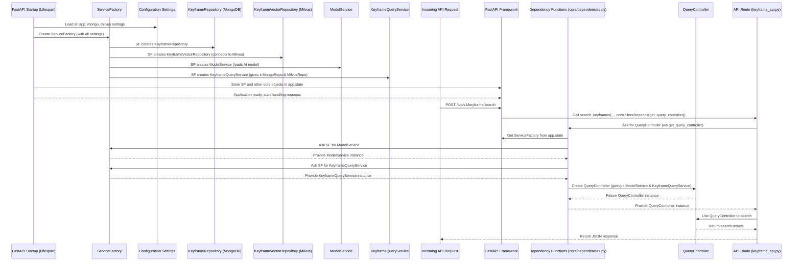

# Chapter 7: Service Factory & Dependency Management

Welcome back! In [Chapter 6: Data Access Layer (Repositories)](06_data_access_layer__repositories__.md), we saw how our repositories act as specialized librarians, neatly handling all interactions with our MongoDB and Milvus databases. We learned that the `KeyframeQueryService` (our "Expert Detective") asks these repositories for data without needing to know *how* they talk to the databases.

But this raises an important question: When our application starts, who creates these "librarians" (`KeyframeRepository`, `KeyframeVectorRepository`), the "translator" (`ModelService`), the "detective" (`KeyframeQueryService`), and the "concierge" (`QueryController`)? And once they are created, how does every part of our application that needs them get access to the *same, correctly configured* instance without having to create a new one every single time?

This is where the **Service Factory & Dependency Management** come into play!

### What Problem Are We Trying to Solve?

Imagine you're running a busy restaurant. You need many specialized tools: ovens, blenders, knives, and various ingredients.

*   **Problem 1: Setting up the Kitchen**: You don't want chefs to build an oven from scratch every time they need to bake something. You need a central **factory** or a **kitchen manager** to ensure all the right tools are purchased, assembled, and ready *before* the restaurant opens. This is what our `ServiceFactory` does for our application.
*   **Problem 2: Giving Tools to Chefs**: When a chef (our API route or controller) needs a blender, they don't go buy one themselves. They just ask the kitchen manager, "Hey, I need the blender for this soup!" The kitchen manager (our **dependency management system**) provides the *already prepared* blender. The chef can then focus on making soup, not on finding and setting up tools. This is what FastAPI's `Depends` system and our `ServiceFactory` together enable.

Without this system, every time an API request comes in, our application might try to:
*   Connect to a database.
*   Load an AI model into memory.
*   Create new instances of services.

Doing this for *every single request* would be incredibly slow and wasteful! Our goal is to set up everything once when the application starts and then efficiently provide these ready-to-use components wherever they're needed.

### Key Concepts

Let's break down the main ideas:

1.  **Service Factory (`ServiceFactory`)**:
    *   **What it is**: A dedicated class that knows how to create and configure *all* the different services and repositories our application needs (like `ModelService`, `KeyframeQueryService`, `KeyframeRepository`, etc.).
    *   **Why we use it**: It centralizes the creation logic. If a service needs other services to work, the factory knows how to put them together correctly. It's like the master builder for our application's components.
    *   **Lifecycle**: We create *one* instance of this factory when the application starts up.

2.  **Lifespan (`lifespan` function)**:
    *   **What it is**: A special feature in FastAPI that allows us to run code *before* the application starts handling requests (startup events) and *after* it stops (shutdown events).
    *   **Why we use it**: This is the perfect place to create our `ServiceFactory` (and also establish database connections). It ensures our factory is ready and available throughout the application's entire life. When the app shuts down, `lifespan` also cleans up, like closing database connections.

3.  **Dependency Management (FastAPI `Depends`)**:
    *   **What it is**: A powerful pattern where a component (e.g., an API route function) declares what "dependencies" (other services or objects) it needs, and the framework (FastAPI) automatically provides them.
    *   **Why we use it**: It keeps our code clean, organized, and easy to test. An API route doesn't need to know *how* to create a `QueryController`; it just says "I need a `QueryController`," and FastAPI (with the help of our factory) hands one over. It's like asking for a tool from a shared toolbox.

### How it All Works Together: The Central Assembly Line

Let's trace the journey of setting up and using our application's tools, focusing on how an API request for a keyframe search (like `/api/v1/keyframe/search`) eventually gets its `QueryController` and all its underlying services.



Let's break this down into the specific files and code.

### 1. The Service Factory (`app/factory/factory.py`)

This is the blueprint for our "central assembly line." It knows how to put together all the pieces.

```python
# File: app/factory/factory.py (simplified)
import open_clip
from pymilvus import connections, Collection as MilvusCollection
# ... other imports for services and repositories ...

from repository.mongo import KeyframeRepository
from repository.milvus import KeyframeVectorRepository
from service import KeyframeQueryService, ModelService
from models.keyframe import Keyframe # From Chapter 1

class ServiceFactory:
    def __init__(
        self,
        milvus_collection_name: str,
        milvus_host: str,
        milvus_port: str,
        model_name: str,
        mongo_collection=Keyframe,
        # ... other settings like milvus_search_params, user, password ...
    ):
        # 1. Create the MongoDB Repository (needs the Keyframe model)
        self._mongo_keyframe_repo = KeyframeRepository(collection=mongo_collection)
        
        # 2. Create and connect the Milvus Repository
        self._milvus_keyframe_repo = self._init_milvus_repo(
            collection_name=milvus_collection_name,
            host=milvus_host,
            port=milvus_port,
            # ... pass other milvus settings ...
        )

        # 3. Create the Model Service (loads the AI model for embeddings)
        self._model_service = self._init_model_service(model_name)

        # 4. Create the Keyframe Query Service (needs both repositories)
        self._keyframe_query_service = KeyframeQueryService(
            keyframe_mongo_repo=self._mongo_keyframe_repo,
            keyframe_vector_repo=self._milvus_keyframe_repo
        )

    def _init_milvus_repo(
        self, collection_name: str, host: str, port: str, # ...
    ):
        # Connect to Milvus database using configuration
        connections.connect(alias="default", host=host, port=port)
        # Get the specific Milvus collection
        collection = MilvusCollection(collection_name, using="default")
        # Return our Milvus Repository
        return KeyframeVectorRepository(collection=collection, search_params={})

    def _init_model_service(self, model_name: str):
        # Load the AI model and tokenizer
        model, _, preprocess = open_clip.create_model_and_transforms(model_name)
        tokenizer = open_clip.get_tokenizer(model_name)
        # Return our Model Service
        return ModelService(model=model, preprocess=preprocess, tokenizer=tokenizer)

    def get_model_service(self):
        """Provides the already created ModelService instance."""
        return self._model_service

    def get_keyframe_query_service(self):
        """Provides the already created KeyframeQueryService instance."""
        return self._keyframe_query_service

    # ... other getter methods for repositories ...
```

**Explanation:**
*   **`__init__`**: This is the heart of the factory. When a `ServiceFactory` is created, it takes all the necessary configuration (from [Chapter 4: Configuration & Settings](04_configuration___settings_.md)) and then proceeds to *create* and *assemble* all the core services and repositories. Notice how `KeyframeQueryService` is created using the `_mongo_keyframe_repo` and `_milvus_keyframe_repo` that were *just created* by the factory. This shows the factory's role in orchestrating component creation and wiring them together.
*   **`_init_milvus_repo` and `_init_model_service`**: These are helper methods that abstract away the details of connecting to Milvus or loading an AI model, keeping the `__init__` method cleaner.
*   **`get_model_service()` and `get_keyframe_query_service()`**: These are simple methods that allow other parts of our application to *retrieve* the *already created and configured* instances of our services, rather than creating new ones.

### 2. Application Lifespan (`app/core/lifespan.py`)

This is where our `ServiceFactory` is brought to life when the FastAPI application starts up.

```python
# File: app/core/lifespan.py (simplified)
from contextlib import asynccontextmanager
from fastapi import FastAPI
from motor.motor_asyncio import AsyncIOMotorClient # For MongoDB
from beanie import init_beanie # For our Keyframe model

# ... other imports, including our settings and ServiceFactory ...
from core.settings import MongoDBSettings, KeyFrameIndexMilvusSetting, AppSettings # Chapter 4
from models.keyframe import Keyframe # Chapter 1
from factory.factory import ServiceFactory # Our factory!

mongo_client: AsyncIOMotorClient = None # Global variable for MongoDB client
service_factory: ServiceFactory = None # Global variable for ServiceFactory

@asynccontextmanager
async def lifespan(app: FastAPI):
    logger.info("Starting up application...")
    try:
        # Load all our application settings (Chapter 4)
        mongo_settings = MongoDBSettings()
        milvus_settings = KeyFrameIndexMilvusSetting()
        app_settings = AppSettings()
        
        # 1. Connect to MongoDB and initialize Beanie (as seen in Chapter 2)
        global mongo_client
        mongo_client = AsyncIOMotorClient(
            f"mongodb://{mongo_settings.MONGO_USER}:{mongo_settings.MONGO_PASSWORD}@{mongo_settings.MONGO_HOST}:{mongo_settings.MONGO_PORT}"
        )
        await mongo_client.admin.command('ping')
        await init_beanie(database=mongo_client[mongo_settings.MONGO_DB], document_models=[Keyframe])
        logger.info("MongoDB and Beanie initialized.")
        
        # 2. IMPORTANT: Create our ServiceFactory!
        global service_factory
        service_factory = ServiceFactory(
            milvus_collection_name=milvus_settings.COLLECTION_NAME,
            milvus_host=milvus_settings.HOST,
            milvus_port=milvus_settings.PORT,
            model_name=app_settings.MODEL_NAME,
            mongo_collection=Keyframe,
            milvus_search_params=milvus_settings.SEARCH_PARAMS # Example of passing settings
            # ... pass other settings ...
        )
        logger.info("Service factory initialized.")
        
        # 3. Store the factory (and mongo_client) in app.state for later access
        app.state.service_factory = service_factory
        app.state.mongo_client = mongo_client
        
        logger.info("Application startup completed successfully.")
        
    except Exception as e:
        logger.error(f"Failed to start application: {e}")
        raise
    
    yield # Application runs here and handles requests
    
    logger.info("Shutting down application...")
    # Clean up resources when the app stops
    try:
        if mongo_client:
            mongo_client.close()
            logger.info("MongoDB connection closed.")
        logger.info("Application shutdown completed successfully.")
    except Exception as e:
        logger.error(f"Error during shutdown: {e}")
```

**Explanation:**
*   **`@asynccontextmanager def lifespan(app: FastAPI):`**: This special decorator tells FastAPI to run this function at startup and shutdown.
*   **Inside `try` (before `yield`)**: This is the startup phase. Here, we load our [Configuration & Settings](04_configuration___settings_.md), connect to MongoDB, and then critically, we create our `ServiceFactory`.
*   **`app.state.service_factory = service_factory`**: This line is key! We store the *single instance* of our `ServiceFactory` directly on the FastAPI `app` object. This makes it globally accessible to any part of our application that has access to the `request` object (which usually carries the `app` object).
*   **`yield`**: This keyword signals that the startup tasks are complete, and the FastAPI application can now start handling incoming requests.
*   **Inside `finally` (after `yield`)**: This is the shutdown phase. Here, we gracefully close resources like the MongoDB connection.

### 3. Dependency Functions (`app/core/dependencies.py`)

These functions are FastAPI's way of asking our `ServiceFactory` for the necessary tools and services.

```python
# File: app/core/dependencies.py (simplified)
from fastapi import Depends, Request, HTTPException
from functools import lru_cache # For caching settings
# ... other imports for QueryController, ModelService, KeyframeQueryService, ServiceFactory ...

from factory.factory import ServiceFactory
from controller.query_controller import QueryController # Chapter 3
from service import ModelService, KeyframeQueryService # Chapter 5
from core.settings import KeyFrameIndexMilvusSetting, AppSettings # Chapter 4

@lru_cache() # Caches the result of this function after the first call
def get_app_settings():
    return AppSettings()

def get_service_factory(request: Request) -> ServiceFactory:
    """Retrieves the ServiceFactory from FastAPI's application state."""
    service_factory = getattr(request.app.state, 'service_factory', None)
    if service_factory is None:
        raise HTTPException(status_code=503, detail="Service factory not initialized.")
    return service_factory

def get_model_service(
    service_factory: ServiceFactory = Depends(get_service_factory)
) -> ModelService:
    """Retrieves the ModelService from the ServiceFactory."""
    return service_factory.get_model_service()

def get_keyframe_service(
    service_factory: ServiceFactory = Depends(get_service_factory)
) -> KeyframeQueryService:
    """Retrieves the KeyframeQueryService from the ServiceFactory."""
    return service_factory.get_keyframe_query_service()

def get_query_controller(
    model_service: ModelService = Depends(get_model_service), # Dependency on ModelService
    keyframe_service: KeyframeQueryService = Depends(get_keyframe_service), # Dependency on KeyframeQueryService
    app_settings: AppSettings = Depends(get_app_settings) # Dependency on settings
) -> QueryController:
    """
    Creates and provides a QueryController instance,
    injecting its required ModelService and KeyframeQueryService.
    """
    # Create the QueryController, passing in its required services
    controller = QueryController(
        data_folder=Path(app_settings.DATA_FOLDER),
        id2index_path=Path(app_settings.ID2INDEX_PATH), # Example using settings
        model_service=model_service,
        keyframe_service=keyframe_service
    )
    return controller
```

**Explanation:**
*   **`@lru_cache()`**: This is a Python decorator that "remembers" the result of a function call. For `get_app_settings()`, it means `AppSettings()` is only created *once*, and subsequent calls just return the cached instance, which is efficient for settings.
*   **`get_service_factory(request: Request)`**: This function is the entry point to our factory. It takes the `request` object (which FastAPI automatically provides) and pulls our `service_factory` instance from `app.state` (where `lifespan` stored it).
*   **`get_model_service(...)`**: This is a "dependency function" for `ModelService`. Notice `service_factory: ServiceFactory = Depends(get_service_factory)`. This tells FastAPI: "Before running `get_model_service`, please get me a `ServiceFactory` by calling `get_service_factory`." FastAPI intelligently resolves this chain! Once it has the factory, it calls `service_factory.get_model_service()` to retrieve the *already built* service.
*   **`get_query_controller(...)`**: This is the most important dependency function for our search. It declares that it `Depends` on `get_model_service`, `get_keyframe_service`, and `get_app_settings`. FastAPI resolves all of these, gets the actual `ModelService`, `KeyframeQueryService`, and `AppSettings` objects, and *then* calls `get_query_controller`. Inside `get_query_controller`, we then create the `QueryController` ([Chapter 3: Query Controller](03_query_controller_.md)), *injecting* these pre-configured services into it.

### 4. Injecting into API Routes (`app/router/keyframe_api.py`)

Finally, our API routes simply declare that they need a `QueryController`, and FastAPI's dependency injection system does all the work!

```python
# File: app/router/keyframe_api.py (simplified)
from fastapi import APIRouter, Depends
# ... other imports ...

from controller.query_controller import QueryController # Our Query Controller
from core.dependencies import get_query_controller # Our dependency function

router = APIRouter(...)

@router.post("/search", ...)
async def search_keyframes(
    # FastAPI sees this line and uses our dependency system!
    controller: QueryController = Depends(get_query_controller) 
):
    """
    Search for keyframes using text query.
    The QueryController is provided by our dependency management system.
    """
    # ... now the API route can simply use the 'controller' ...
    results = await controller.search_text(query=..., top_k=...)
    # ... format results and return ...
```

**Explanation:**
*   **`controller: QueryController = Depends(get_query_controller)`**: This is the elegant conclusion! The `search_keyframes` function simply states, "I need an object of type `QueryController`, and you can get it by calling `get_query_controller`." FastAPI then orchestrates the entire process:
    1.  Calls `get_query_controller`.
    2.  `get_query_controller` calls `get_model_service` and `get_keyframe_service`.
    3.  These in turn call `get_service_factory`.
    4.  `get_service_factory` retrieves the `ServiceFactory` created by `lifespan`.
    5.  The `ServiceFactory` hands over its *already created* `ModelService` and `KeyframeQueryService`.
    6.  `get_query_controller` uses these to build and return a `QueryController`.
    7.  FastAPI passes this ready-to-use `QueryController` to our `search_keyframes` function.

This entire chain of dependencies happens automatically and efficiently, ensuring our API route gets exactly what it needs without worrying about how those components were built or configured.

### Conclusion

In this chapter, we've brought together many concepts to understand how our `HCMAI2025_Baseline` project efficiently manages its components through **Service Factory & Dependency Management**. We learned that:

*   The **`ServiceFactory`** acts as a central assembly line, responsible for creating and wiring together all the services and repositories our application needs (like the `ModelService`, `KeyframeQueryService`, and database repositories).
*   FastAPI's **`lifespan`** function ensures that our `ServiceFactory` is initialized *once* when the application starts and stored for global access, and resources are cleaned up during shutdown.
*   **Dependency management** (using FastAPI's `Depends` feature and our dependency functions) automatically injects these pre-configured services and controllers into our API routes, allowing each component to focus on its job without worrying about how its tools are acquired.

This powerful combination makes our application highly modular, maintainable, testable, and efficient, ensuring that complex objects like database connections and AI models are set up correctly once and then easily accessed throughout the application.

---

Generated by [AI Codebase Knowledge Builder](https://github.com/The-Pocket/Tutorial-Codebase-Knowledge)