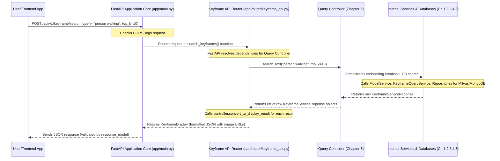

# Chapter 7: FastAPI Application Core

Welcome back! In [Chapter 6: Query Controller](06_query_controller_.md), we learned how our "concierge" (the Query Controller) efficiently orchestrates complex search requests by calling various specialized services and formatting the results. But how does a user or another application actually *send* a search request to our system in the first place? And how does our system listen for these requests, direct them to the right place, and then send back the answer across the internet?

This is where the **FastAPI Application Core** comes in! It's the central control center, like the "waiter and menu" of our entire web service. It's the front door that listens for all incoming requests (e.g., a user searching for keyframes), directs them to the right internal "chef" (our Query Controller), and then sends back structured responses, ensuring everyone understands each other.

### What Problem Are We Trying to Solve?

Imagine our entire `Image-Retrieval-System` is a powerful, high-tech kitchen. We have all the amazing "ingredients" (keyframes, embeddings), "recipes" (semantic search logic), and "specialist chefs" (ModelService, KeyframeQueryService) neatly organized and managed by our "kitchen manager" (Service Factory) and "concierge" (Query Controller).

But how do customers *order* their meals? How do they communicate what they want? And once the meal is prepared, how is it delivered back to them?

This is the problem the **FastAPI Application Core** solves. It provides:

1.  **A Menu (API Endpoints)**: A clear list of what services our system offers (like "search keyframes by text," "find similar images," etc.), each with its own specific "order form" (request format).
2.  **A Waiter (FastAPI Framework)**: Who listens for customer orders (incoming requests), takes them to the right chef (our Query Controller), waits for the food (search results), and then delivers it back to the customer.
3.  **A Host (CORS)**: Who ensures that customers from different "restaurants" (other websites or applications) are welcome and can safely communicate with our kitchen.
4.  **A Kitchen Manager (Lifespan Events)**: Who ensures the kitchen is fully set up and ready to serve *before* the first customer arrives (connecting databases, loading AI models) and cleans up gracefully when the restaurant closes.

Without the FastAPI Application Core, our powerful search system would be like a fantastic restaurant with no waiters, no menu, and no way for customers to order!

### Key Concepts of Our Application Core

Let's break down the essential ideas behind this core component.

1.  **FastAPI**: This is a modern, high-performance Python framework we use specifically for building web APIs. It's incredibly fast, easy to use, and a joy for developers because it automatically generates interactive documentation for your API!
2.  **API Endpoints (Routes)**: These are specific URLs on our server that perform particular actions. Think of them as individual menu items.
    *   `/api/v1/keyframe/search` is the endpoint for a text-based keyframe search.
    *   `/health` is a simple endpoint to check if our service is running correctly.
3.  **Requests & Responses**: When a client (like your web browser or another app) wants something, it sends a **request** to one of our API endpoints. Our FastAPI application processes this request and sends back a **response**, which usually contains the data the client asked for (like a list of keyframe results) or an error message.
4.  **CORS (Cross-Origin Resource Sharing)**: This is a security feature built into web browsers. When a website (e.g., your frontend app at `my-app.com`) tries to talk to an API on a *different* website (e.g., our API at `api.image-search.com`), browsers normally block this for security. CORS is a mechanism that allows us to explicitly tell browsers, "It's okay for `my-app.com` to talk to me!"
5.  **Lifespan Events**: These are special moments in our application's life: right before it starts accepting requests ("startup") and right after it stops ("shutdown"). We use these moments to set up crucial resources (like database connections and AI models) and clean them up afterward.

### Setting Up Our Main Application: `app/main.py`

The very heart of our FastAPI application lives in `app/main.py`. This file is responsible for creating the main FastAPI application instance and attaching all the necessary middleware and routes.

Here’s a simplified look at the crucial parts of `app/main.py`:

```python
# File: app/main.py (simplified)
from fastapi import FastAPI
from fastapi.middleware.cors import CORSMiddleware
from fastapi.staticfiles import StaticFiles # To serve actual images

from core.lifespan import lifespan # Our startup/shutdown handler
from router import keyframe_api # Our keyframe-specific routes

# 1. Create the main FastAPI application instance
app = FastAPI(
    title="Keyframe Search API",
    description="A powerful semantic search API for video keyframes...",
    version="1.0.0",
    lifespan=lifespan # Link to our startup/shutdown logic!
)

# 2. Configure CORS middleware (the "Host" welcoming other sites)
app.add_middleware(
    CORSMiddleware,
    allow_origins=["*"], # For simplicity, allow all. In production, list specific domains.
    allow_methods=["*"], # Allow all HTTP methods (GET, POST, etc.)
    allow_headers=["*"], # Allow all headers
)

# 3. Include our specific API routes (the "Menu" items)
app.include_router(keyframe_api.router, prefix="/api/v1") # All routes here start with /api/v1

# 4. Mount a directory to serve static image files
IMAGES_DIR = "images" # Assuming an 'images' folder in the project root
if os.path.exists(IMAGES_DIR):
    app.mount("/images", StaticFiles(directory=IMAGES_DIR), name="images")
    # This means images at 'images/L01/V005/123.webp' can be accessed via /images/L01/V005/123.webp
```

**Explanation:**

*   **`app = FastAPI(..., lifespan=lifespan)`**: This line creates our main `FastAPI` application. We give it a `title`, `description`, and `version` which FastAPI uses to automatically generate interactive documentation (`/docs` endpoint). Crucially, `lifespan=lifespan` tells FastAPI to run our special `lifespan` function (which we'll look at next) during startup and shutdown.
*   **`app.add_middleware(CORSMiddleware, ...)`**: This sets up our CORS "Host." By allowing `*` for `allow_origins`, we're saying "any website can talk to our API." In a real-world application, you would list the specific domain(s) of your frontend application(s) for better security.
*   **`app.include_router(keyframe_api.router, prefix="/api/v1")`**: This is how we organize our API. Instead of stuffing all routes into `main.py`, we put related routes (like all keyframe-specific searches) into a separate Python file (`app/router/keyframe_api.py`). The `prefix="/api/v1"` means all routes defined in `keyframe_api.router` will automatically start with `/api/v1/`.
*   **`app.mount("/images", StaticFiles(directory=IMAGES_DIR), name="images")`**: This tells FastAPI to serve actual image files. If you have an `images` folder in your project, any file inside it (e.g., `images/L01/V005/123.webp`) can be accessed directly by a web browser at a URL like `http://localhost:8000/images/L01/V005/123.webp`. This is how our frontend can display the actual keyframe images!

### Application Startup and Shutdown: `app/core/lifespan.py`

Before our FastAPI application can effectively serve search requests, it needs to perform some vital setup tasks. It must connect to databases, initialize our Keyframe Data Model, and get our `ServiceFactory` ready. This "behind-the-scenes" preparation and cleanup are handled by a special `lifespan` function.

```python
# File: app/core/lifespan.py (simplified)
from contextlib import asynccontextmanager
from fastapi import FastAPI
from motor.motor_asyncio import AsyncIOMotorClient # For MongoDB
from beanie import init_beanie # For ORM
from elasticsearch import AsyncElasticsearch # For Elasticsearch

from core.settings import MongoDBSettings, KeyFrameIndexMilvusSetting, AppSettings, ElasticsearchSettings
from models.keyframe import Keyframe # Our Keyframe model from Chapter 1
from factory.factory import ServiceFactory # Our Service Factory from Chapter 5

# Global variables to hold our connections and factory
mongo_client: AsyncIOMotorClient = None
es_client: AsyncElasticsearch = None
service_factory: ServiceFactory = None

@asynccontextmanager
async def lifespan(app: FastAPI):
    """
    FastAPI lifespan context manager for startup and shutdown events.
    This is like the "Kitchen Manager" preparing the kitchen.
    """
    print("Starting up application...")
    try:
        # 1. Load application settings (from Chapter 2)
        mongo_settings = MongoDBSettings()
        milvus_settings = KeyFrameIndexMilvusSetting()
        es_settings = ElasticsearchSettings()
        app_settings = AppSettings()
        
        # 2. Connect to MongoDB and initialize Beanie (our ORM)
        global mongo_client
        mongo_client = AsyncIOMotorClient(f"mongodb://{mongo_settings.MONGO_USER}:...")
        await mongo_client.admin.command('ping')
        await init_beanie(database=mongo_client[mongo_settings.MONGO_DB], document_models=[Keyframe])
        print("MongoDB and Beanie initialized.")

        # 3. Connect to Elasticsearch
        global es_client
        es_client = AsyncElasticsearch(hosts=[{"host": es_settings.ES_HOST, ...}])
        await es_client.ping()
        print("Elasticsearch connected.")
        
        # 4. Create our ServiceFactory (from Chapter 5)!
        global service_factory
        service_factory = ServiceFactory(
            milvus_collection_name=milvus_settings.COLLECTION_NAME,
            milvus_host=milvus_settings.HOST,
            model_checkpoint=r"path/to/model.pth", # Replace with actual path
            es_client=es_client, es_ocr_index_name=es_settings.ES_OCR_INDEX,
            app_settings=app_settings, # Pass necessary settings
            mongo_collection=Keyframe # Pass our keyframe model
        )
        print("Service factory initialized.")
        
        # 5. Store the factory and clients in app.state for other parts of the app to use
        app.state.service_factory = service_factory
        app.state.mongo_client = mongo_client
        app.state.es_client = es_client
        
        print("Application startup completed successfully.")
        
    except Exception as e:
        print(f"ERROR: Failed to start application: {e}")
        raise # Re-raise the exception to prevent the app from starting

    yield # This is where the application starts running and handling requests
    
    # --- Code below 'yield' runs during application shutdown ---
    print("Shutting down application...")
    try:
        if mongo_client: mongo_client.close()
        if es_client: await es_client.close()
        print("Application shutdown completed successfully.")
    except Exception as e:
        print(f"ERROR: Error during shutdown: {e}")
```

**Explanation:**

*   **`@asynccontextmanager def lifespan(app: FastAPI):`**: This special decorator tells FastAPI to run this `lifespan` function at the application's startup and shutdown.
*   **Startup (`try` block before `yield`)**:
    1.  **Load Settings**: It first loads all the necessary configuration settings (like database hosts and ports) using our `Pydantic Settings` from [Chapter 2: Configuration & Settings](02_configuration___settings__.md).
    2.  **Connect to Databases**: It establishes connections to MongoDB (using `AsyncIOMotorClient`) and Elasticsearch, testing them with a `ping`.
    3.  **Initialize Beanie**: It initializes `Beanie` (our Object-Relational Mapper for MongoDB), telling it about our `Keyframe` data model ([Chapter 1: Keyframe Data Model](01_keyframe_data_model__.md)) and which database to use.
    4.  **Create `ServiceFactory`**: This is a crucial step! It creates a *single instance* of our `ServiceFactory` ([Chapter 5: Service Factory & Dependency Management](05_service_factory___dependency_management__.md)). This factory, in turn, creates and wires together *all* our repositories and search services (like `ModelService` and `KeyframeQueryService`).
    5.  **Store in `app.state`**: The `service_factory`, `mongo_client`, and `es_client` are stored in `app.state`. This makes them easily accessible to any part of our application that needs them throughout its lifetime, ensuring we don't recreate expensive objects unnecessarily.
*   **`yield`**: This keyword signals that all startup tasks are complete, and the FastAPI application can now start accepting and processing incoming web requests.
*   **Shutdown (`try` block after `yield`)**: When the application is told to shut down, the code after `yield` is executed. This is where we gracefully close our database connections (`mongo_client.close()`, `es_client.close()`) to prevent resource leaks and ensure a clean exit.

### Defining Our Keyframe Search Routes: `app/router/keyframe_api.py`

With our core application set up and initialized, the next step is to define the actual API endpoints (the "menu items") that clients can call. Our project groups related endpoints into "routers," which helps keep the code organized. All our keyframe search-related routes are defined in `app/router/keyframe_api.py`.

```python
# File: app/router/keyframe_api.py (simplified for a basic search route)
from fastapi import APIRouter, Depends, Query
from typing import List

# Import our request/response models and the Query Controller
from schema.request import TextSearchRequest # Describes incoming search query
from schema.response import KeyframeDisplay, SingleKeyframeDisplay # Describes outgoing results
from controller.query_controller import QueryController # Our search orchestrator from Chapter 6
from core.dependencies import get_query_controller # How FastAPI gets the Query Controller

# 1. Create an API router for keyframe-related endpoints
router = APIRouter(
    prefix="/keyframe", # All routes in this router will start with /keyframe
    tags=["keyframe"],  # For API documentation grouping
)

# 2. Define a POST endpoint for semantic text search
@router.post(
    "/search", # This endpoint will be accessible at /api/v1/keyframe/search
    response_model=KeyframeDisplay, # FastAPI automatically validates outgoing data
    summary="Simple Semantic Search",
    description="Search keyframes using a natural language text query and semantic similarity."
)
async def search_keyframes(
    request: TextSearchRequest, # FastAPI automatically reads & validates the request body
    controller: QueryController = Depends(get_query_controller), # FastAPI injects our controller!
):
    """
    Handles a semantic text search request for keyframes.
    """
    print(f"Received text search request for query: '{request.query}'")
    
    # 3. Delegate the actual search logic to the Query Controller
    raw_results = await controller.search_text(
        query=request.query,
        top_k=request.top_k,
        score_threshold=request.score_threshold,
    )
    
    # 4. Format the raw results into displayable items with image URLs
    display_results = [
        SingleKeyframeDisplay(**controller.convert_to_display_result(result))
        for result in raw_results
    ]
    
    return KeyframeDisplay(results=display_results)

# ... (other search routes like image-to-image, OCR, ASR are defined similarly) ...
```

**Explanation:**

*   **`router = APIRouter(prefix="/keyframe", ...)`**: This creates a mini-FastAPI application specifically for keyframe-related routes. `prefix="/keyframe"` means that any route defined in this file (like `/search`) will automatically have `/keyframe` prepended to its path. (Combined with `main.py`'s `/api/v1` prefix, `/search` becomes `/api/v1/keyframe/search`.)
*   **`@router.post("/search", ...)`**: This Python "decorator" tells FastAPI that the `search_keyframes` function below it should be executed when a `POST` request is sent to the `/keyframe/search` endpoint.
    *   `response_model=KeyframeDisplay`: This is a powerful FastAPI feature. It tells FastAPI that the data returned by this function *must* conform to the `KeyframeDisplay` Pydantic model structure. FastAPI will automatically validate the outgoing data and generate accurate API documentation.
*   **`request: TextSearchRequest`**: This tells FastAPI to expect the incoming request body (the data sent by the client) to be structured like our `TextSearchRequest` Pydantic model. FastAPI automatically parses the JSON body and validates it against this model, giving us strong type safety!
*   **`controller: QueryController = Depends(get_query_controller)`**: This is FastAPI's elegant **dependency injection** in action! Instead of `search_keyframes` having to figure out how to create a `QueryController` itself, it simply declares: "I need a `QueryController`, and you can get it by calling `get_query_controller`." FastAPI handles the rest, ensuring that a fully configured `QueryController` (from our `ServiceFactory` as discussed in [Chapter 5: Service Factory & Dependency Management](05_service_factory___dependency_management__.md)) is provided to this function.
*   **`raw_results = await controller.search_text(...)`**: This line shows the beauty of separation of concerns. The API route's job is to receive the request and send the response. It delegates the *actual search logic* to our `controller` (our "concierge" from [Chapter 6: Query Controller](06_query_controller_.md)), keeping the API code clean and focused.
*   **`display_results = [...]`**: After getting the `raw_results` from the controller, the API route uses `controller.convert_to_display_result()` for each result. This method (from the Query Controller) is responsible for taking the raw database-level information and converting it into a user-friendly format, including generating the direct HTTP URL for the keyframe image that a web browser can display.

### How a Search Request Flows Through Our Application

Let's put all the pieces together and trace the entire journey of a simple text search request, from the user's browser to our backend and back.



1.  **Client Request**: A user or a frontend application sends a `POST` request to our FastAPI server at `http://localhost:8000/api/v1/keyframe/search`. The request body contains the search `query` (e.g., "person walking in park") and desired `top_k` results.
2.  **FastAPI Application Core Receives**: The `FastAPI_App` (defined in `app/main.py`) receives this request. It first processes any middleware (like CORS) and then looks at the URL path to determine which specific API route should handle it.
3.  **Route Matching**: The request is routed to the `search_keyframes` function within the `Keyframe_Router` (from `app/router/keyframe_api.py`).
4.  **Dependency Injection**: Before `search_keyframes` can execute, FastAPI sees that it `Depends(get_query_controller)`. It then efficiently retrieves the *already initialized* `QueryController` instance (which was created by our `ServiceFactory` during application startup in `lifespan.py`).
5.  **Controller Takes Over**: The `search_keyframes` function now has a fully prepared `controller` object and calls its `controller.search_text()` method, passing the user's query and parameters.
6.  **Internal Search Logic**: The `Query_Controller` (our "concierge" from [Chapter 6: Query Controller](06_query_controller_.md)) takes over. It orchestrates the entire complex search process:
    *   It asks the `ModelService` ([Chapter 4: Semantic Search Services](04_semantic_search_services__.md)) to convert the text query into a numerical vector embedding.
    *   It then passes this embedding to the `KeyframeQueryService` ([Chapter 4: Semantic Search Services](04_semantic_search_services__.md)), which uses our `KeyframeVectorRepository` to search Milvus for similar vectors and our `KeyframeRepository` to fetch full metadata from MongoDB ([Chapter 3: Data Access Layer (Repositories)](03_data_access_layer__repositories__.md)).
7.  **Raw Results Return**: The internal services return raw `KeyframeServiceReponse` objects back up to the `Query_Controller`.
8.  **Query Controller Formats**: The `Query_Controller` returns these raw results to the `Keyframe_Router`. The router then uses `controller.convert_to_display_result()` to format each result into `SingleKeyframeDisplay` objects, which include the generated web-accessible image URLs.
9.  **FastAPI Responds**: The `Keyframe_Router` finally passes the formatted `KeyframeDisplay` object back to the `FastAPI_App`, which serializes it into a JSON response and sends it back to the `Client`. The client can then use the image URLs to display the search results to the user.

### Conclusion

In this final chapter, we've connected all the dots by exploring the **FastAPI Application Core**. We've learned that it acts as the primary interface for our `Image-Retrieval-System-for-AIC2025` project, handling incoming requests and sending out structured responses.

We specifically covered:
*   The role of `app/main.py` in initializing the core `FastAPI` application, setting up **CORS** for secure communication, and **mounting static files** to serve keyframe images directly.
*   The critical function of `app/core/lifespan.py` in managing **application startup** (connecting to databases, initializing `Beanie`, creating the `ServiceFactory`) and **graceful shutdown** (closing connections).
*   How `app/router/keyframe_api.py` defines specific **API endpoints** (routes) like `/api/v1/keyframe/search` and leverages FastAPI's powerful **dependency injection** to seamlessly obtain and use our `QueryController`.
*   The complete journey of a search request, from the client's browser through the FastAPI core, router, Query Controller, and underlying services and databases, culminating in a formatted JSON response with clickable image URLs.

This robust FastAPI Application Core ensures that our intelligent `Image-Retrieval-System` is not just a collection of powerful components, but a fully functional, accessible, and high-performance web service ready to tackle the challenges of AIC2025!
