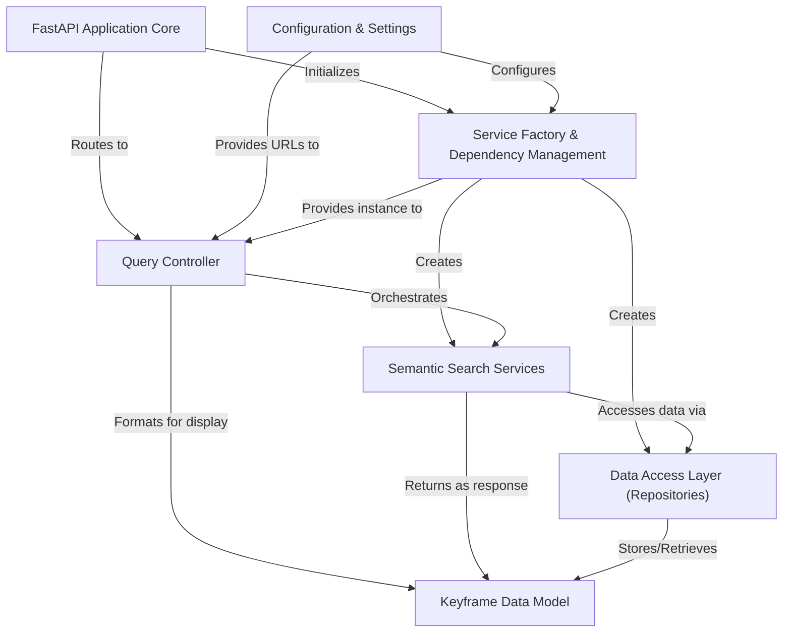

# Tutorial: Image-Retrieval-System-for-AIC2025

This project is an **Image Retrieval System** designed for AIC2025, enabling *intelligent search* for keyframes (important images) extracted from videos. It processes natural language queries or uploaded images to find relevant video moments by understanding their *meaning*, not just keywords. The system efficiently stores, searches, and presents these keyframes, including generating direct image URLs, making complex video content discoverable.

## Visual Overview

## Chapters

1. [Keyframe Data Model
](01_keyframe_data_model_.md)
2. [Configuration & Settings
](02_configuration___settings_.md)
3. [Data Access Layer (Repositories)
](03_data_access_layer__repositories__.md)
4. [Semantic Search Services
](04_semantic_search_services_.md)
5. [Service Factory & Dependency Management
](05_service_factory___dependency_management_.md)
6. [Query Controller
](06_query_controller_.md)
7. [FastAPI Application Core
](07_fastapi_application_core_.md)

---
