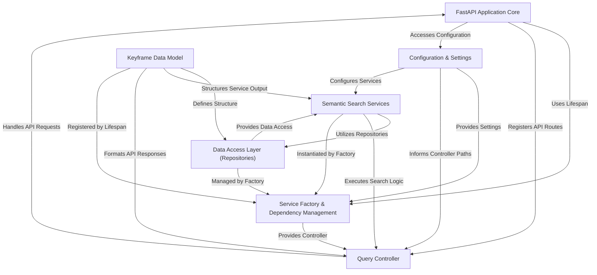

# Tutorial: HCMAI2025_Baseline

This project provides a **Keyframe Search API** designed to help users efficiently find specific *video keyframes*.
By inputting natural language queries, the system leverages advanced *semantic search* techniques
to understand the intent and retrieve the most relevant keyframes from a large dataset,
offering flexible filtering options by video groups or individual videos.

**Source Repository:** [None](None)

## Chapters

1. [Keyframe Data Model
](01_keyframe_data_model_.md)
2. [FastAPI Application Core
](02_fastapi_application_core_.md)
3. [Query Controller
](03_query_controller_.md)
4. [Configuration & Settings
](04_configuration___settings_.md)
5. [Semantic Search Services
](05_semantic_search_services_.md)
6. [Data Access Layer (Repositories)
](06_data_access_layer__repositories__.md)
7. [Service Factory & Dependency Management
](07_service_factory___dependency_management_.md)
